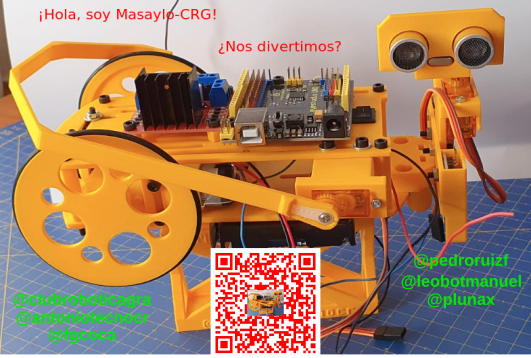
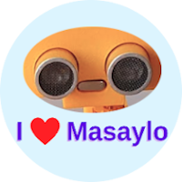
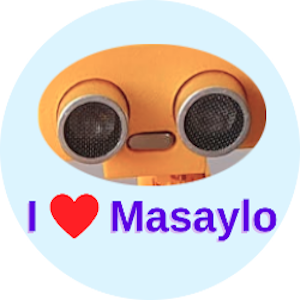
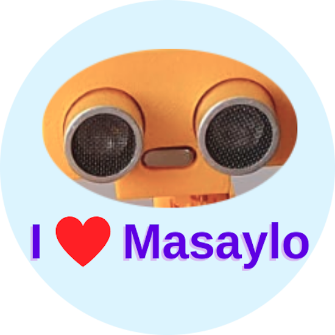
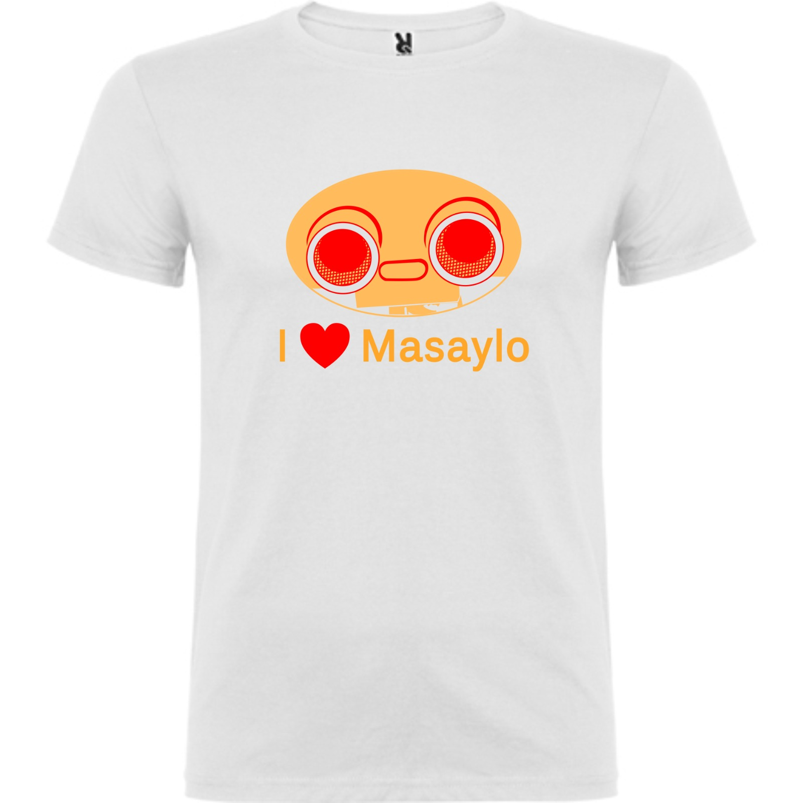

# Merchandising
En este apartado simplemente te queremos mostrar algunas de las cosillas que hemos ido haciendo en torno al robot para utilizar en las presentaciones y que los asistentes a las mismas puedan llevarse un pequeño recuerdo.

* **Pegatina rectangular**

Creada con una imagen de Masaylo incluye un código QR que enlaza con la web del proyecto. Su aspecto es el de la imagen siguiente:

| Archivo fuente | Aspecto |
|---|:-:|
| [Formato svg](../img/merchandising/pegatina-rectangular/pegatina.svg) |  |

* **Logotipo "I love Masaylo"**

Se crea el logotipo circular con la leyenda y se realizan pegatinas circulares con el mismo. A continuación tenemos la imágenes del mismo en distintas resoluciones.

| 200 px | 250 px | 300 px | 550 px |
|:-:|:-:|:-:|:-:|
|  |  |  |  |

* **Se imprime una primera tirada de camisetas como la de la imagen siguiente:**

