# Conexionado de los distintos elementos
Básicamente el conexionado es el mismo que el visto en la versión UNO salvo en lo referente al zumbador que ahora se va a conectar a un pin analógico, por ejemplo el A0, y el sensor de infrarrojos para detección de línea izquierdo lo llevaremos a uno de los dos extra que nos ofrece la placa Nano, por ejemplo el A6.

Cabría pensar en la posibilidad de conectar el buzzer en el pin A6 o A7, pero estos pines no se pueden configurar como salida ya que son de lectura analógica exclusivamente.

No obstante, describimos gráficamente el conexionado que debemos realizar entre los distintos elementos. En este caso vamos a utilizar el pinout mostrado en la imagen siguiente. La fuente de esta imagen la tenemos en este [archivo svg](../../img/conexionado-pruebas/Nano/Masaylo-Nano-shield-pinout.svg)

| Masaylo-CRG NANO pinout |
|:|
| 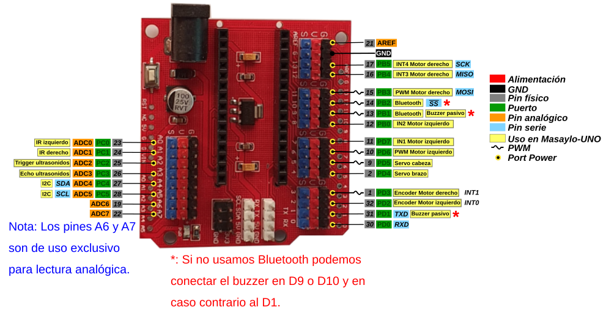 |

## **Alimentación**
Seguimos el mismo procedimiento que en la versión UNO. En la imagen siguiente tenemos el detalle de conexionado de la alimentación para ambas placas que debemos realizar de forma cuidadosa en especial y no cambiar la polaridad de la alimentación que se ha marcado y dibujado con los colores normalizados de la misma.

| Conexionado de alimentación |
|:-:|
| 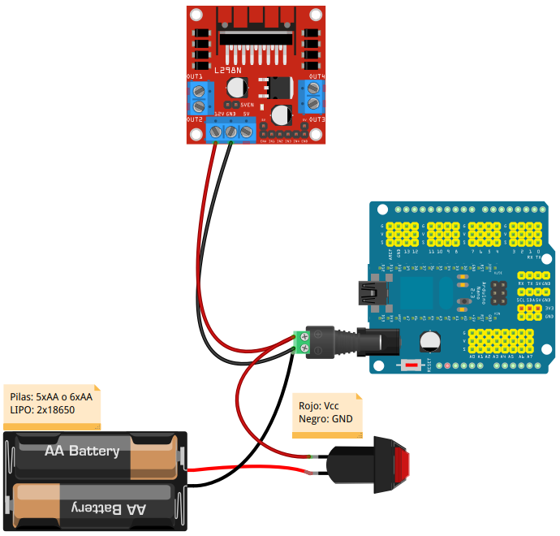 |

La forma más sencilla de conectar los elementos es utilizando un jack de alimentación con clema como el que se ve en la imagen anterior aunque también podemos utilizar un jack normal realizando las correspondientes soldaduras.

Se **recomienda** que una vez finalizadas las conexiones se revisen estas cuidadosamente, tanto en las conexiones en si mismas como en la polaridad, antes de alimentar el sistema o conectar el USB para grabar algún programa, así evitaremos en lo posible romper algo por mal conexionado.

## **Motores DC 3 a 6V**
Procedemos a conectar los motores en las bornas del driver L298 de forma que el motor izquierdo quede conectado a OUT1 - OUT2 y el derecho a OUT3 - OUT4. En la imagen siguiente tenemos el conexionado de forma gráfica.

| Conexionado de motores |
|:-:|
| 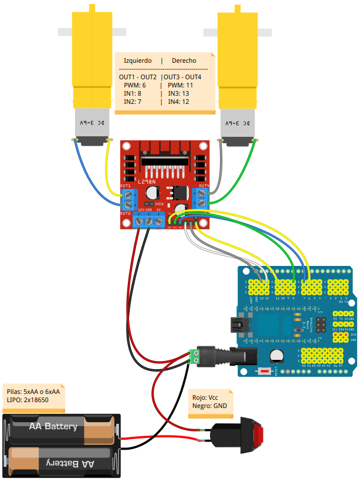 |

Los pines de control de cada motor se conectan como se indica en la imagen anterior y de idéntica forma a la descrita en la versión UNO.

## **Zumbador**
Al igual que en la versión UNO podemos usar el pin D1 o TxD y su Vcc asociado para conectarlo o alternativamente conectarlo a alguno de los pines reservados para Bluetooth en caso de no usar esta funcionalidad asignada en el pinout. En la imagen siguiente podemos ver el conexionado de estos elementos de forma gráfica junto con los conectados anteriormente.

| Conexionado de conjunto incluyendo zumbador |
|:-:|
| 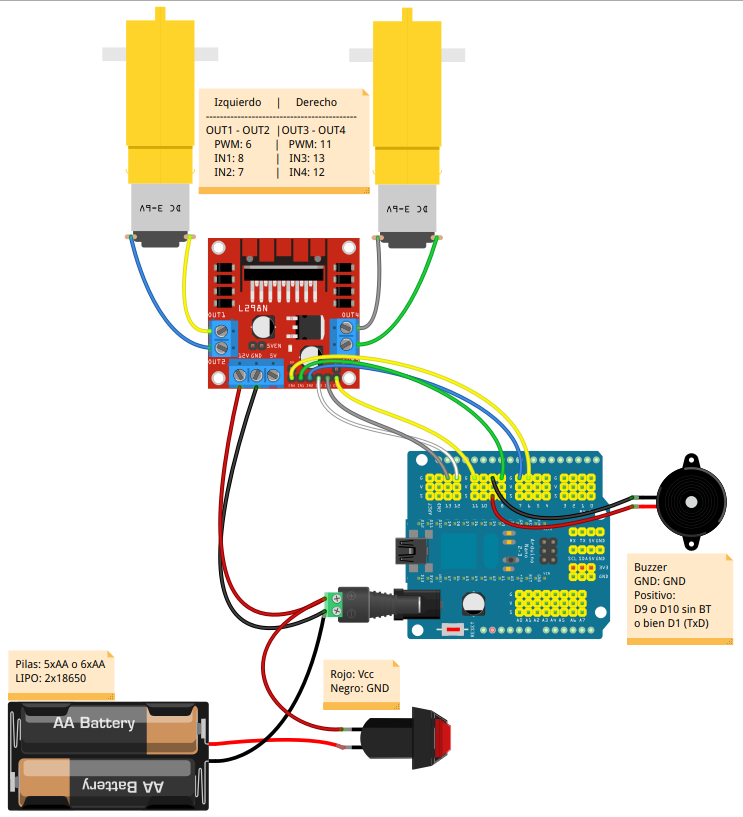 |

## **Pines de entrada analógica A0-A5**
Antes de conectar los sensores de infrarrojos, que irán a los pines analógicos (aunque su salida es digital), vamos a explicar como usar los pines analógicos como pines digitales en las placas Arduino. La explicación original en inglés la podemos encontrar en el [enlace "Analog Input Pins"](https://www.arduino.cc/en/Tutorial/Foundations/AnalogInputPins#.U0mLZ_l_tyU).

**Convertidor A/D**

Los controladores ATmega utilizados para Arduino contienen un convertidor de analógico a digital integrado de 6 canales (8 canales en el Mini y Nano y 16 en el Mega) con una resolución de 10 bits, devolviendo números enteros de 0 a 1023. Si bien la función principal de los pines analógicos para la mayoría de los usuarios es leer sensores analógicos, los pines analógicos también tienen toda la funcionalidad de los pines de entrada/salida de propósito general (GPIO) (lo mismo que los pines digitales 0-13).

Por tanto, si necesitamos más pines de entrada y salida de propósito general, y todos los pines analógicos no están en uso, estos pueden usarse para GPIO.

**Mapeo de pines**

Los pines analógicos, excepto A6 y A7, se pueden usar de manera idéntica a los pines digitales, usando los alias A0 (para la entrada analógica 0), A1, etc. Por ejemplo, el código para configurar el pin A0 como salida y poner en alto sería:

~~~
pinMode(A0, OUTPUT); //Solo pines A0 a A5
digitalWrite(A0, HIGH);
~~~

**Resistencias de pull-up**

Los pines analógicos también tienen resistencias pull-up, que funcionan de manera idéntica a las de los pines digitales. Se habilitan emitiendo un comando del tipo:

`pinMode(A0, INPUT_PULLUP);  // set pull-up on analog pin 0`.

Hay que tener en cuenta que activar un pull-up afectará a los valores entregados por `analogRead()`.

**Advertencias**

El comando `analogRead()` no funcionará correctamente si el pin lo hemos configurado previamente como salida.
Si hemos puesto el pin en estado alto estando configurado como salida, la resistencia de pull-up se configurará de nuevo cuando se vuelva a cambiar a entrada.

La hoja de datos de ATmega advierte que el cambio de pines analógicos a digitales puede introducir [jitter o ruido no deseado](https://es.wikipedia.org/wiki/Jitter#:~:text=Se%20denomina%20jitter%20o%20fluctuaci%C3%B3n,se%C3%B1al%20de%20ruido%20no%20deseada.&text=El%20jitter%20es%20la%20primera%20consecuencia%20de%20un%20retraso%20de%20la%20se%C3%B1al.) en las lecturas analógicas del resto de pines. Se aconseja, después de poner los pines analógicos en modo digital, agregar un retardo corto antes de usar `analogRead()`.

## **Sensores de infrarrojos**
Una vez vista la explicación sobre pines analógicos utilizados como digitales diremos que vamos a conectar el sensor de infrarrojos izquierdo al pin A0 y el derecho al pin A1. Hay que tener especial cuidado en que los pines marcados con VCC y GND se conecten a los pines V y G respectivamente de la shield. En la imagen siguiente podemos ver el conexionado de estos elementos de forma gráfica junto con los conectados anteriormente.

| Conexionado del conjunto incluyendo los sensores de infrarrojos  |
|:-:|
| 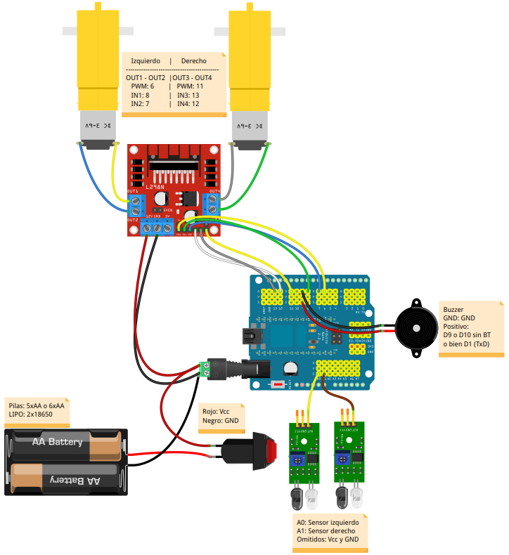 |

En la imagen siguiente vemos el detalle de conexionado de los sensores de infrarrojos.

| Detalle del conexionado de los sensores de infrarrojos  |
|:-:|
| 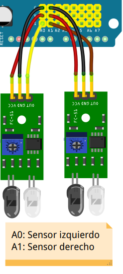 |

## **Sensor de distancia HC-SR04**
De nuevo utilizamos dos pines analógicos como digitales por lo que debemos tener en cuenta lo referido anteriormente sobre el tema. Vamos a conectar el Trigger del sensor al pin A2 que deberemos configurar como salida y el pin Echo a A3 que deberemos configurar como entrada. En caso de utilizar MasayloBlockly o la librería descrita en este tutorial estas definiciones estarán ya realizadas. En la imagen siguiente podemos ver el conexionado de estos elementos de forma gráfica junto con los conectados anteriormente.

| Conexionado del conjunto incluyendo el sensor de ultrasonidos HC-SR04 |
|:-:|
| 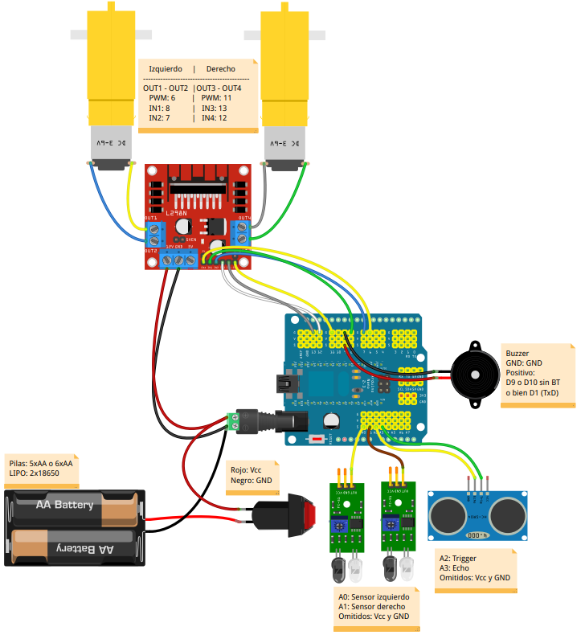 |

En la imagen siguiente vemos el detalle de conexionado del sensor de ultrasonidos HC-SR04.

| Detalle del conexionado del sensor de ultrasonidos HC-SR04 |
|:-:|
| 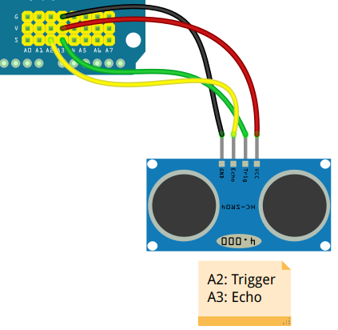 |

## **Servomotores**
En este caso los pines que utilizaremos son los digitales 4 y 5, el primero para el brazo y el segundo para la cabeza. En la imagen siguiente podemos ver el conexionado de estos elementos de forma gráfica junto con los conectados anteriormente.

| Conexionado del conjunto incluyendo los servos de brazo y cabeza |
|:-:|
| 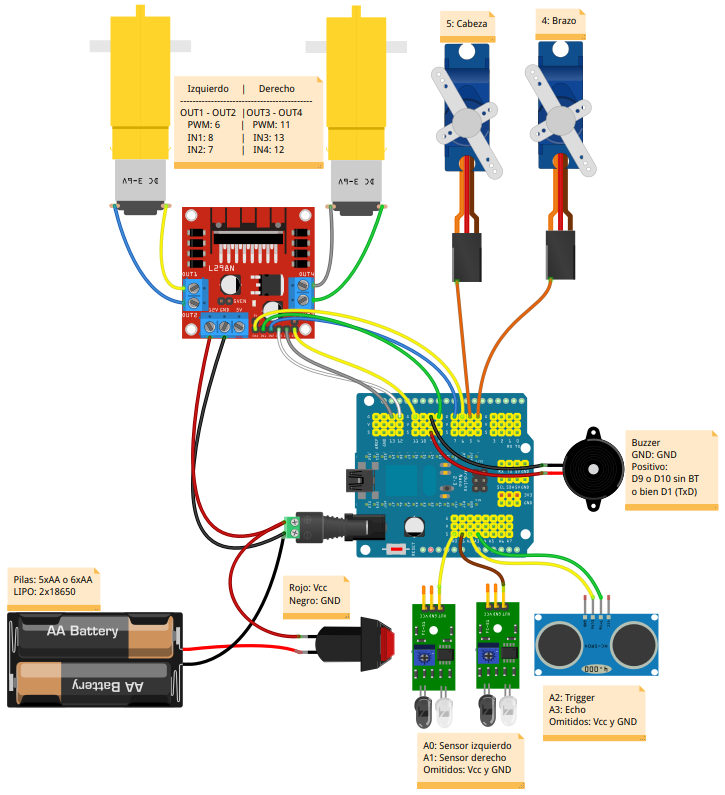 |

En la imagen siguiente vemos el detalle de conexionado de los dos servos SG90.

| Detalle del conexionado de los servos de brazo y cabeza |
|:-:|
| 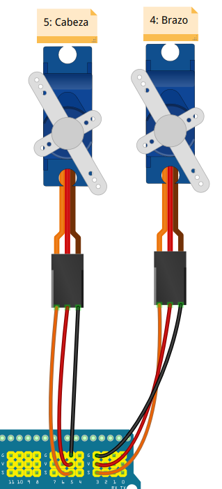 |

## **Encoder infrarrojos FC-03**
En este caso los pines que utilizaremos son los digitales 2 y 3, que son los pines que admiten interrupciones en las placas tipo UNO, Nano, Mega, Mini y Leonardo. En la imagen siguiente podemos ver el conexionado de estos elementos de forma gráfica junto con los conectados anteriormente.

| Conexionado del conjunto incluyendo los encoders |
|:-:|
| 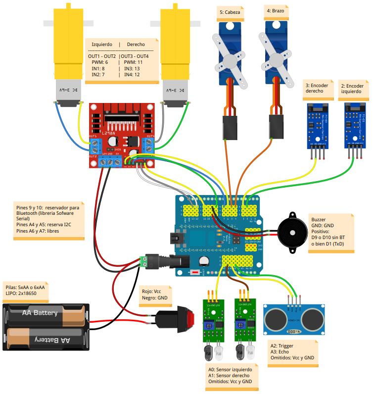 |

En la imagen siguiente vemos el detalle de conexionado de los dos encoder FC-03.

| Detalle del conexionado de los encoder FC-03 |
|:-:|
| 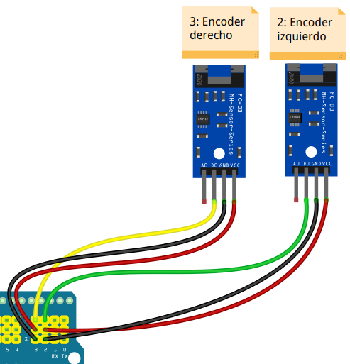 |

