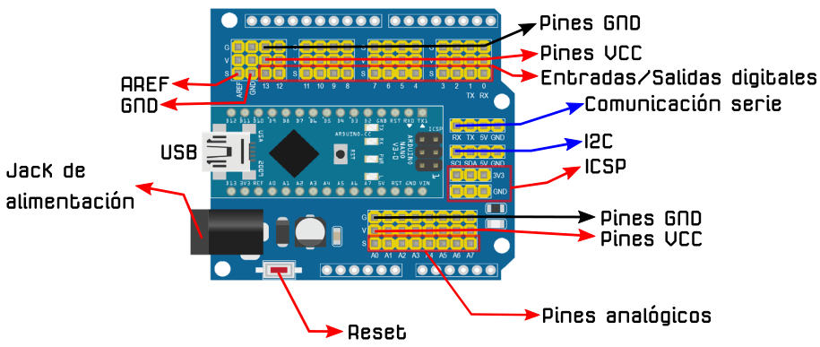
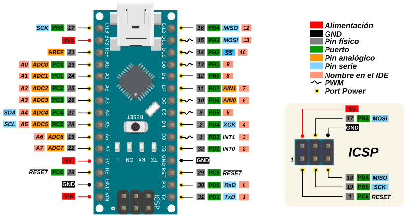
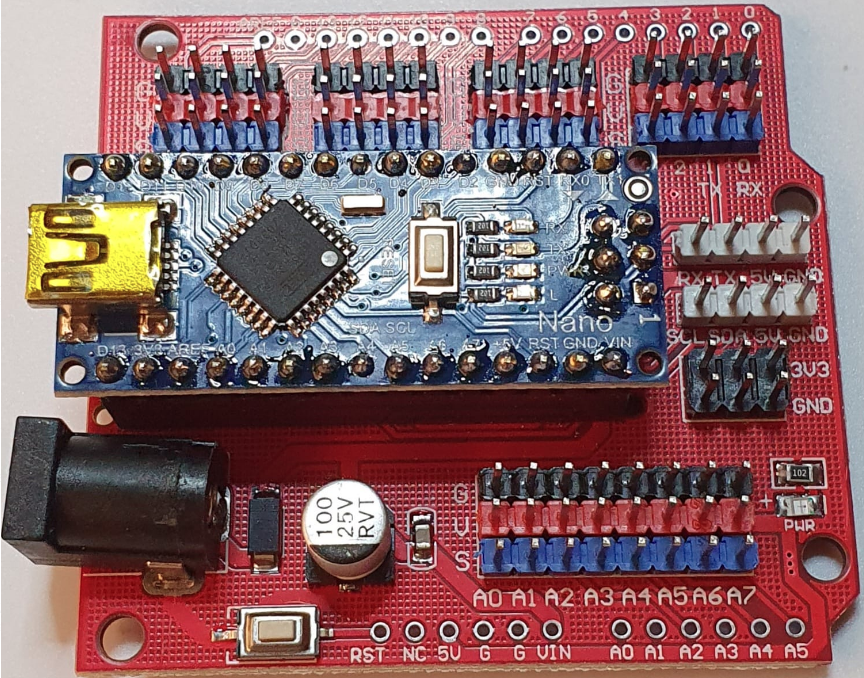

# Descripción de placas y sensores
En este apartado vamos a realizar una descripción básica de las distintas placas que se utilizan para esta versión del robot y que sean diferentes a los elementos ya descritos en la entrada de índice correspondiente a la versión UNO.

Indicar también que el montaje del robot sigue las mismas pautas que las descritas en los ensamblados y que se utilizan exactamente las mismas piezas 3D.

## **Placa Shield para Nano V3.0**
Se trata de una placa que básicamente lo que hace es transformar a formato UNO la versión de placa Nano V3. La placa incorpora conectores de 3 pines que incluyen la patilla asociada y la alimentación y que facilita el conexionado de elementos sin necesidad de utilizar protoboard. En la imagen siguiente podemos ver esta placa con sus descripciones básicas y este es el [enlace al archivo fuente](../../img/conexionado-pruebas/Nano/Nano-IO-Shiled.svg).

| Placa Shield Nano V3.0 |
|:-:|
|  |

También es importante tener disponible un gráfico con la funcionalidad de cada pin o diagrama pinout como el que vemos en la imagen siguiente correspondiente a la placa Nano. En este [enlace tenemos su archivo fuente](../../img/conexionado-pruebas/Nano/Nano-v3-pinout.svg)

| Pinout de la Placa Nano V3.0 |
|:-:|
|  |

En la imagen siguiente podemos observar la shield con la placa Nano montada y vemos como tiene el mismo formato que una placa UNO.

| Shield para la placa Nano V3.0 |
|:-:|
|  |

## **Elementos descritos en la versión UNO**
Los elementos que se relacionan a continuación son exactamente los mismo que los usados en la versión UNO:

* Placa Drivers L298
* Motores DC 3 a 6V
* Zumbador
* Sensores de infrarrojos
* Sensor de distancia HC-SR04
* Servomotores
* Encoder infrarrojos FC-03
