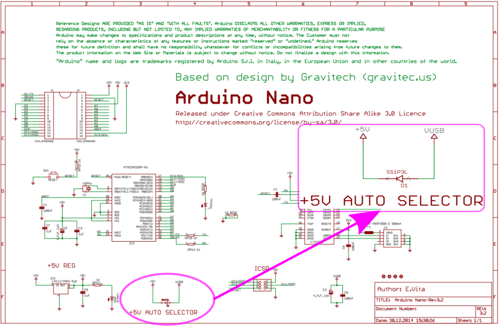
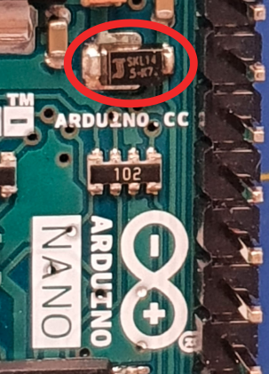
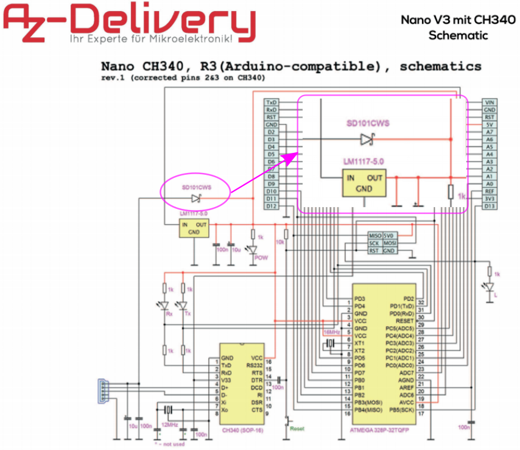
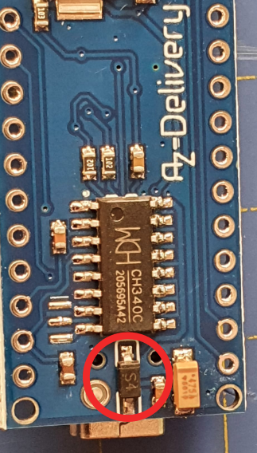
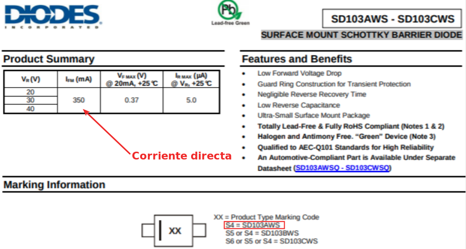
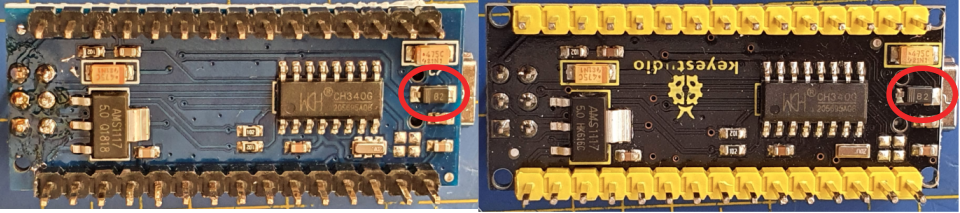
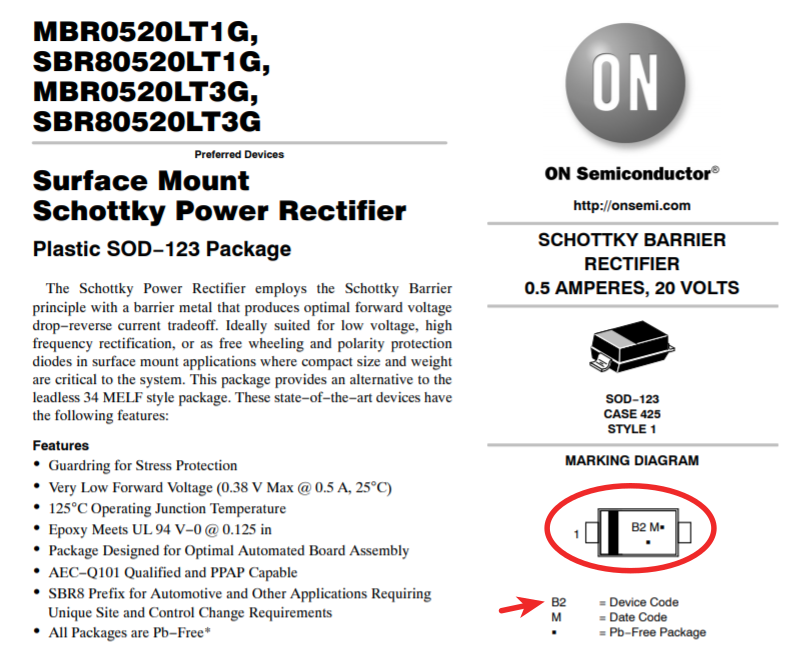

# **Aclaraciones sobre placas Nano**
Vamos a analizar y establecer las diferencias entre un Arduino Nano original y las versiones económicas de este, al menos en dos versiones de estas.

Si vamos a trabajar con placas [Arduino Nano](https://search.arduino.cc/search?tab=&q=nano) originales podemos omitir la lectura de este apartado, pero si vamos a trabajar con clones (las conocidas como nanos chinos) es **MUY IMPORTANTE** que leamos detenidamente este apartado con el fin de averiguar que placa nano es la que tenemos en nuestras manos y así poder actuar en consecuencia.

Si hay que aclarar que este estudio se realiza para la versión nano convencional implementada con microcontroladores ATMega y no para la nueva línea de productos cuyo cerebro se implementa con dispositivos microcontroladores SAMD21G18A.

## **Análisis del problema**
Conocemos que la alimentación de la placas nano se puede hacer por mini-USB, por el conector 5V o por la entrada de alimentación externa VIN, que se aconseja que esté entre 7V y 12V de corriente continua. Aconsejamos consultar el tutorial [Alimentar el Arduino: La guía definitiva](https://www.geekfactory.mx/tutoriales/tutoriales-arduino/alimentar-el-arduino-la-guia-definitiva/) de [Geek factory](https://www.geekfactory.mx/) si no sabes bien de lo que estamos hablando.

Cuando descendemos a nivel de esquema, las placas tipo Nano utilizan un diodo Schottky (diodo semiconductor que proporciona conmutaciones de menos de 1ns entre los estados de conducción directa e inversa) entre la alimentación USB y Vcc que tiene como misión evitar que pueda pasar corriente desde la placa Nano al ordenador al que la tengamos conectada a través del puerto USB cuando alimentamos con una fuente externa 6 a 12V en el pin VIN, que podría provocar daños en el mismo.

En la imagen siguiente podemos ver este diodo en el esquema de un Arduino Nano original

| Diodo Schottky USB en Arduino Nano original |
|:-:|
|  |
| Imagen obtenida a partir del [esquema](https://www.arduino.cc/en/uploads/Main/Arduino_Nano-Rev3.2-SCH.pdf) encontrado en [arduino.cc](https://www.arduino.cc/) |

En la imagen anterior vemos que el diodo es un SS1P3L, en algunas versiones podemos encontrar que el diodo es un MBR0520 (ya obsoleto) y en una placa real como la de la imagen siguiente que este diodo es un SKL14 de Diotec.

| Diodo Schottky USB SKL14 en Arduino Nano original |
|:-:|
|  |

Si consultamos los datasheet de estos diodos nos vamos a encontrar con los valores de corriente directa media que vemos en la tabla siguiente:

| Parámetro | SS1P3L | MBR0520 | SKL14 |
|---|:-:|:-:|:-:|
| Average Forward Rectified Current | 1A | 500mA | 1A |

Si hacemos el mismo análisis para un clon como el de AZ-Delivery nos encontramos que ese diodo es un SD101CWS, tal y como vemos en la imagen siguiente:

| Diodo Schottky USB en Nano clon |
|:-:|
|  |
| Imagen obtenida a partir del [esquema](https://cdn.shopify.com/s/files/1/1509/1638/files/Nano_V3_mit_CH340_Schematic.pdf?17911342447424002070) encontrado en [AZ-Delivery](https://www.az-delivery.de/es) |

Si consultamos el datasheet de este diodo nos vamos a encontrar con el valor de corriente directa media que vemos en la tabla siguiente:

| Parámetro | SD101CWS |
|---|:-:|
| Average Forward Current | 30mA |

Un poco mas de investigación la podemos ver en la imagen siguiente, que se corresponde con la fotografía de una placa Nano de AZ-Delivery.

| Diodo Schottky USB S4 en una Nano de AZ-Delivery |
|:-:|
|  |

Una búsqueda del datasheet de este componente nos lleva a obtenerla de [Diodes](https://www.diodes.com/) y en este pdf obtenemos los datos que vemos en la imagen siguiente:

| Datasheet del diodo S4 |
|:-:|
|  |
| Imagen obtenida a partir del datasheet de [Diodes](https://www.diodes.com/assets/Datasheets/ds30101.pdf) |

Observamos claramente que la corriente directa del diodo está por debajo de las especificaciones requeridas para una placa Nano por lo que debemos asegurarnos, cuando adquirimos este tipo de placas, del diodo que llevan y que al menos presente las especificaciones de 500mA en adelante.

La experiencia indica que, aunque con estas placas podemos trabajar grabando el firmware, desconectando el USB y alimentándola con una fuente externa, tarde o temprano dejaremos conectado el USB, accionaremos la alimentación externa y provocaremos una circulación de corriente (si tenemos conectados suficientes dispositivos a la placa) mayor a la que soporta el diodo que se quemará y dejará la placa inservible.

## **Recomendaciones**
Lógicamente la primera va a ser trabajar con placas originales que nos ofrecerán todas las garantías por su contrastada calidad y su precio tampoco es demasiado elevado. Por ejemplo [BricoGeek](https://tienda.bricogeek.com/arduino/12-arduino-nano-8058333490342.html) es un distribuidor que envía con bastante rapidez a precios muy razonables.

En segundo lugar la recomendación sería la placa de Keyestudio ks0173 que distribuye oficialmente para España [Innova Didactic](https://shop.innovadidactic.com/es/standard-placas-shields-y-kits/691-keyestudio-nano-3-0-chip-ch340-cable-usb.html) por un precio de unos 7€ y que también tiene una distribución muy rápida.

En tercer lugar, aunque lógicamente existen otros muchos fabricantes de clones, sería Elegoo que en España podemos comprar a través de [Amazon](https://www.amazon.es/dp/B0716T2L77) un kit de tres placas muy bien embaladas y por unos 14€.

Las versiones de Keyestudio (derecha) y Elegoo (izquierda) se construyen con un diodo tipo B2 tal y como vemos destacado en la imagen siguiente:

| Placas con diodo B2 |
|:-:|
|  |

B2 es el código de dispositivo de los diodos tipo MBR0520LT1G, SBR80520LT1G, MBR0520LT3G, SBR80520LT3G tal y como podemos observar en la siguiente imagen:

| Datasheet diodo tipo B2 |
|:-:|
|  |
| Imagen obtenida a partir del datasheet de [On Semiconductor](https://www.onsemi.com/pdf/datasheet/mbr0520lt1-d.pdf) |

En esta hoja de datos podemos comprobar que la corriente directa de este diodo es la que se indica a continuación:

| Parámetro | MBR0520LT1G B2 |
|---|:-:|
| Average Forward Current | 500mA |

***
Es decir, la recomendación final sería que antes de comprar a la ligera este tipo de producto no nos guiemos solamente por su precio y miremos también la calidad.
***
