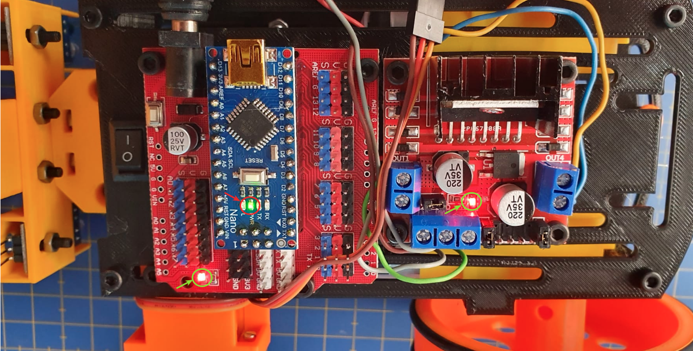
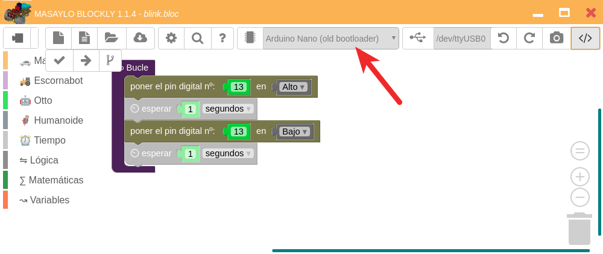

# Pruebas básicas de funcionamiento
Básicamente los ejemplos que utilizaremos para esta versión Nano son los mismos que los utilizados para la versión UNO realizando los cambios a la placa adecuada, que en nuestro caso va a ser una Nano con Old bootloader.

## **Alimentación**
Colocamos las pilas AA en su lugar respetando la polaridad de las mismas y accionamos el interruptor. Si todo es correcto en la placa shield y en la del driver L298 se debe encender un diodo LED rojo y en la placa Nano un LED verde, todos ellos indicativos de que están alimentadas, tal y como observamos en la imagen siguiente:

| Primer encendido |
|:-:|
|  |

Reutilizamos el programa [blink.bloc](../UNO/tests/blink.bloc) para probar también que se graba correctamente firmware en la placa NANO. Para ello debemos seleccionar la placa adecuada, tal y como vemos en la imagen siguiente.

| Programa blink.bloc |
|:-:|
|  |

Si cargamos el programa y dejamos sin accionar el interruptor observaremos como parpadea el LED asociado al pin 13, de color rojo, en la placa Nano pero la placa del driver no está alimentada y por tanto su LED permanece apagado. En la animación siguiente vemos el parpadeo del LED y el resultado de accionar el interruptor.

| Animación que muestra el funcionamiento del programa blink.bloc y del interruptor |
|:-:|
|  |

Este GIF se ha creado a partir de un video en formato mp4 utilizando FFMPEG y GIMP y la información obtenida en [este enlace](https://ubunlog.com/gif-animados-vlc-ffmpeg-gimp/).

## **Pruebas idénticas a las realizadas en la versión UNO**
Para las pruebas siguientes podemos simplemente cargar los ejemplos dados para la versión UNO y simplemente cambiando el tipo de placa ya podemos proceder a cargarlos y comprobar el funcionamiento de los elementos en cuestión.

* Motores
* Zumbador
* Sensores de infrarrojos
* Sensor de distancia HC-SR04
* Servomotores
* Encoder infrarrojos FC-03
