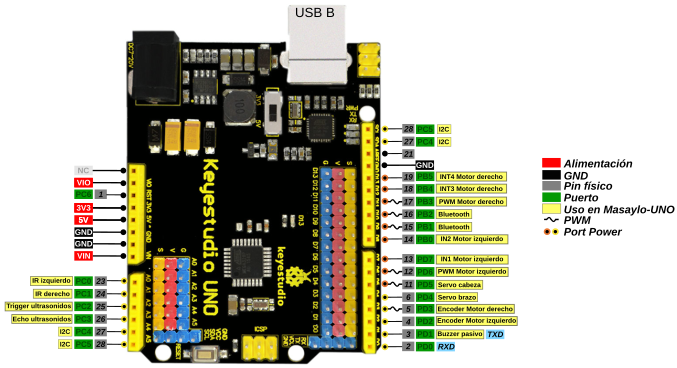
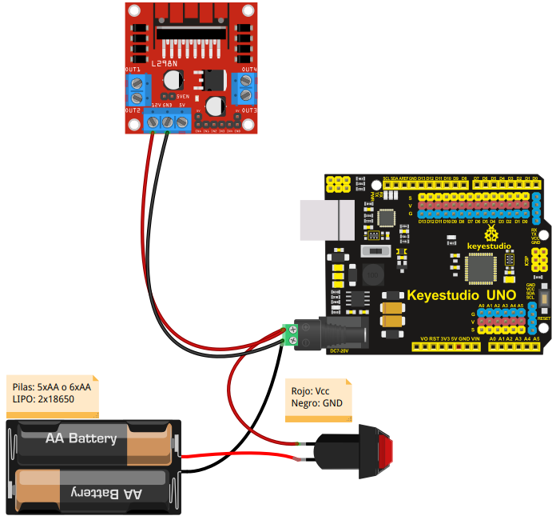
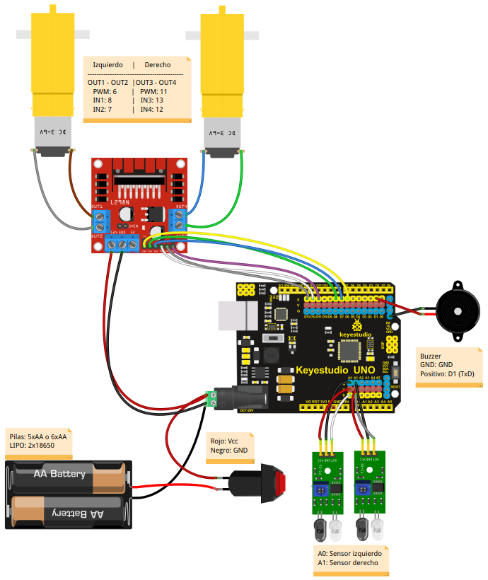

# Conexionado de los distintos elementos
Describimos el conexionado que debemos realizar entre los distintos elementos, y lo haremos fundamentalmente en forma de gráfico y utilizando el pinout mostrado en la imagen siguiente. La fuente de esta imagen la tenemos en este [archivo svg](../../img/conexionado-pruebas/UNO/Masaylo-UNO-pinout.svg)

| Masaylo-CRG UNO pinout |
|:|
|  |

## **Alimentación**
Antes de nada vamos a resolver las conexiones de alimentación de nuestra placa UNO y del driver de motores L298 junto con el portapilas y el interruptor. El resto de elementos se alimentarán directamente de la placa UNO. El conexionado es válido si sustituimos las cinco (o seis) pilas AA por dos baterías tipo 18650.

Para que la placa UNO y el driver queden conectados con el interruptor utilizaremos una clema de la que sacaremos un cable para el jack de alimentación del UNO y otro para el positivo del driver, siendo este cable el que previamente pasa por el interruptor procedente del portapilas. El negativo es un cable doble que va al UNO y al driver sin pasar por el interruptor.

En estas condiciones el junper *Regulador* del driver debe estar colocado en su lugar y debemos tener en cuenta que la tensión de entrada caerá en 0.7V debido al diodo protector de inversión de polaridad que lleva la placa. Esto lo podemos evitar utilizando el pin Vin de la tira de pines de alimentación, pero debemos tener en cuenta que así no hay protección y que se recomienda no usar tensiones superiores a 6V. En nuestro caso usamos 5 pilas AA con lo que partimos de una tensión de 7.5V que bajará aproximadamente a 6.8V y si usamos 2x18650 tendremos 7.2V que se quedarán en 6.5V.

En la imagen siguiente tenemos el detalle de conexionado de la alimentación para ambas placas que debemos realizar de forma cuidadosa en especial y no cambiar la polaridad de la alimentación que se ha marcado y dibujado con los colores normalizados de la misma.

| Conexionado de alimentación |
|:-:|
|  |

La forma más sencilla de conectar los elementos es utilizando un jack de alimentación con clema como el que se ve en la imagen anterior aunque también podemos utilizar un jack normal realizando las correspondientes soldaduras.

Se **recomienda** que una vez finalizadas las conexiones se revisen estas cuidadosamente, tanto en las conexiones en si mismas como en la polaridad, antes de alimentar el sistema o conectar el USB para grabar algún programa, así evitaremos en lo posible romper algo por mal conexionado.

## **Motores DC 3 a 6V**
Procedemos a conectar los motores en las bornas del driver L298 de forma que el motor izquierdo quede conectado a OUT1 - OUT2 y el derecho a OUT3 - OUT4. Por ahora no nos preocupamos de la polaridad ya que lo haremos en las pruebas y si algún motor girar en sentido contario al esperado bastará con intercambiar sus conexiones de posición. En la imagen siguiente tenemos el conexionado de forma gráfica.

| Conexionado de motores |
|:-:|
|  |

## **Zumbador**
Usamos el pin D1 o TxD y su Vcc asociado para conectarlo. En principio esta conexión no debe interferir en la grabación de programas en la placa que siempre se realiza utilizando los pines D0 y D1 de la placa, pero si nos da algún problema basta con que desconectemos el pin D0 del sensor en uno de sus extremos, procedamos a grabar el programa correspondiente y una vez cargado este volvemos a conectar el pin en su lugar. Si no queremos estar escuchando pitidos de manera continuada cuando subimos código a la placa o cuando usamos el monitor serie también debemos desconectar esta patilla. En la imagen siguiente podemos ver el conexionado de estos elementos de forma gráfica junto con los conectados anteriormente.

| Conexionado de conjunto incluyendo zumbador |
|:-:|
|  |

En la imagen siguiente observamos una pareja de cables, uno blanco que va al pin D1 y uno negro que va a GND.

| Conexionado del zumbador |
|:-:|
|  |

## **Pines de entrada analógica**
Antes de conectar los sensores de infrarrojos, que irán a los pines analógicos (aunque su salida es digital), vamos a explicar como usar los pines analógicos como pines digitales en las placas Arduino. La explicación original en inglés la podemos encontrar en el [enlace "Analog Input Pins"](https://www.arduino.cc/en/Tutorial/Foundations/AnalogInputPins#.U0mLZ_l_tyU).

**Convertidor A/D**

Los controladores ATmega utilizados para Arduino contienen un convertidor de analógico a digital integrado de 6 canales (8 canales en el Mini y Nano y 16 en el Mega) con una resolución de 10 bits, devolviendo números enteros de 0 a 1023. Si bien la función principal de los pines analógicos para la mayoría de los usuarios es leer sensores analógicos, los pines analógicos también tienen toda la funcionalidad de los pines de entrada/salida de propósito general (GPIO) (lo mismo que los pines digitales 0-13).

Por tanto, si necesitamos más pines de entrada y salida de propósito general, y todos los pines analógicos no están en uso, estos pueden usarse para GPIO.

**Mapeo de pines**

Los pines analógicos se pueden usar de manera idéntica a los pines digitales, usando los alias A0 (para la entrada analógica 0), A1, etc. Por ejemplo, el código para configurar el pin A0 como salida y poner en alto sería:

~~~
pinMode(A0, OUTPUT);
digitalWrite(A0, HIGH);
~~~

**Resistencias de pull-up**

Los pines analógicos también tienen resistencias pull-up, que funcionan de manera idéntica a las de los pines digitales. Se habilitan emitiendo un comando del tipo:

`pinMode(A0, INPUT_PULLUP);  // set pull-up on analog pin 0`.

Hay que tener en cuenta que activar un pull-up afectará a los valores entregados por `analogRead()`.

**Advertencias**

El comando `analogRead()` no funcionará correctamente si el pin lo hemos configurado previamente como salida. 
Si hemos puesto el pin en estado alto estando configurado como salida, la resistencia de pull-up se configurará de nuevo cuando se vuelva a cambiar a entrada.

La hoja de datos de ATmega advierte que el cambio de pines analógicos a digitales puede introducir [jitter o ruido no deseado](https://es.wikipedia.org/wiki/Jitter#:~:text=Se%20denomina%20jitter%20o%20fluctuaci%C3%B3n,se%C3%B1al%20de%20ruido%20no%20deseada.&text=El%20jitter%20es%20la%20primera%20consecuencia%20de%20un%20retraso%20de%20la%20se%C3%B1al.) en las lecturas analógicas del resto de pines. Se aconseja, después de poner los pines analógicos en modo digital, agregar un retardo corto antes de usar `analogRead()`.

## **Sensores de infrarrojos**
Una vez vista la explicación sobre pines analógicos utilizados como digitales diremos que vamos a conectar el sensor de infrarrojos izquierdo al pin A0 y el derecho al pin A1. Hay tener especial cuidado en que los pines marcados con VCC y GND se conecten a los pines V y G respectivamente de la placa UNO. En la imagen siguiente podemos ver el conexionado de estos elementos de forma gráfica junto con los conectados anteriormente.

| Conexionado del conjunto incluyendo los sensores de infrarrojos  |
|:-:|
|  |

En la imagen siguiente vemos el detalle de conexionado de los sensores de infrarrojos.

| Detalle del conexionado de los sensores de infrarrojos  |
|:-:|
|  |

Una fotografía del detalle del conexionado en el robot la vemos a continuación.

| Fotografía del conexionado de los sensores de infrarrojos  |
|:-:|
|  |

## **Sensor de distancia HC-SR04**
De nuevo utilizamos dos pines analógicos como digitales por lo que debemos tener en cuenta lo referido anteriormente sobre el tema. Vamos a conectar el Trigger del sensor al pin A2 que deberemos configurar como salida y el pin Echo a A3 que deberemos configurar como entrada. En caso de utilizar MasayloBlockly o la librería descrita en este tutorial estas definiciones estarán ya realizadas. En la imagen siguiente podemos ver el conexionado de estos elementos de forma gráfica junto con los conectados anteriormente.

| Conexionado del conjunto incluyendo el sensor de ultrasonidos HC-SR04 |
|:-:|
|  |

En la imagen siguiente vemos el detalle de conexionado del sensor de ultrasonidos HC-SR04.

| Detalle del conexionado del sensor de ultrasonidos HC-SR04 |
|:-:|
|  |

Una fotografía del detalle del conexionado en el robot la vemos a continuación.

| Fotografía del conexionado del sensor de ultrasonidos HC-SR04 |
|:-:|
|  |

## **Servomotores**
