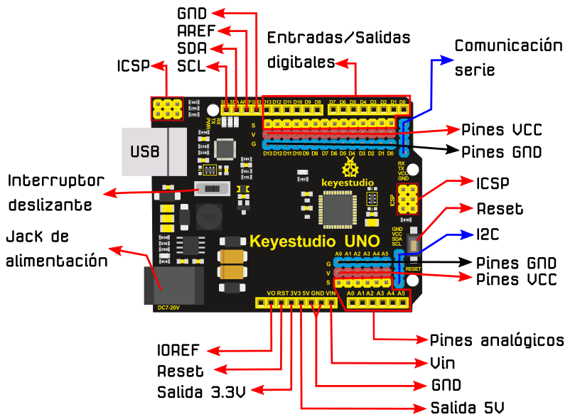
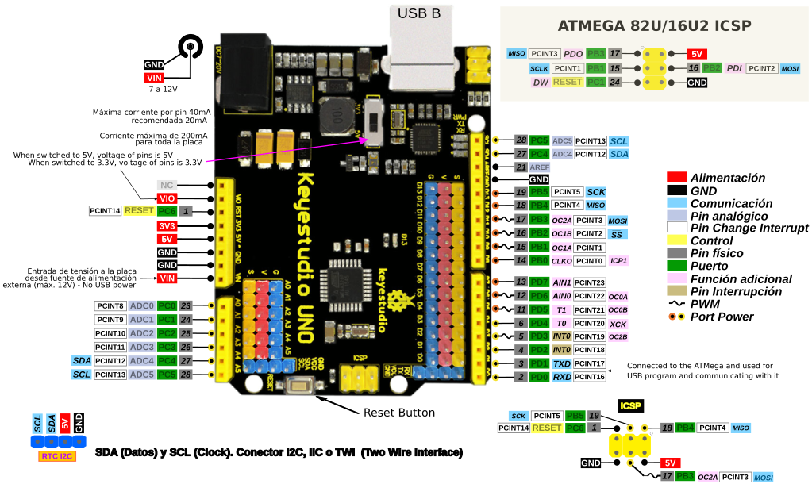
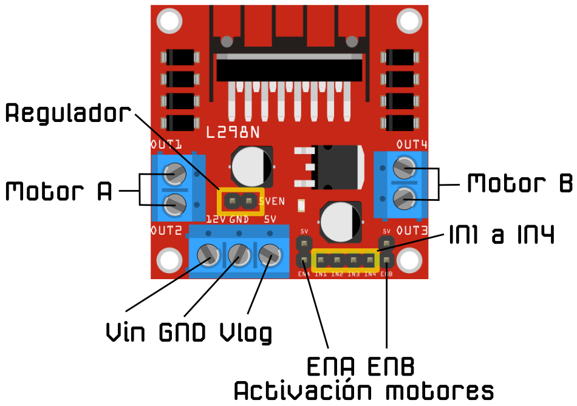
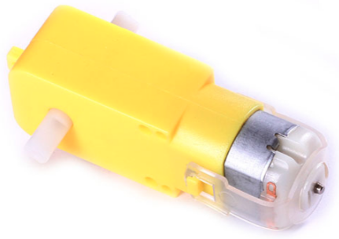
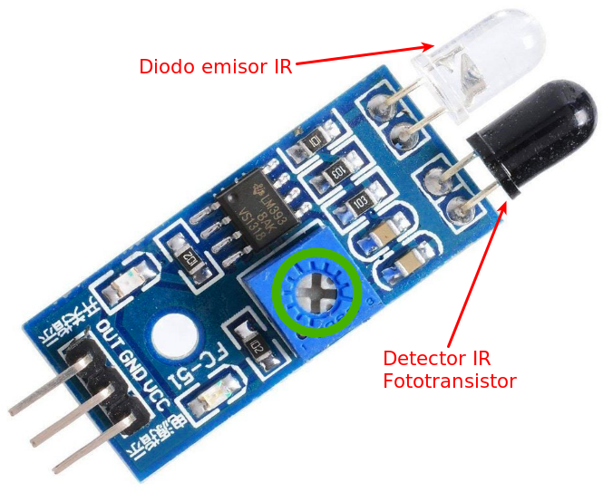
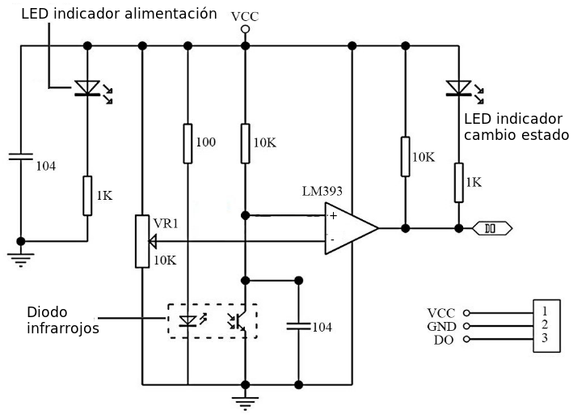

# Descripción de placas y sensores
En este apartado vamos a realizar una descripción básica de las distintas placas, sensores y elementos que se utilizan en la construcción del robot.

## **Placa Keyestudio UNO Ks0172**
Se trata de la placa [Ks0172](https://wiki.keyestudio.com/Ks0172_keyestudio_UNO_with_Pin_Header_Interface) basada en Arduino UNO con el microcontrolador ATmega328P que incorpora conectores de 3 pines que incluyen la patilla asociada y la alimentación y que facilita el conexionado de elementos sin necesidad de utilizar protoboard. En la imagen siguiente podemos ver esta placa con sus descripciones básicas y este es el [enlace al archivo fuente](../../img/conexionado-pruebas/UNO/uno.svg).

| Placa Keyestudio UNO Ks0172 |
|:-:|
|  |

 IMPORTANTE:

El interruptor deslizante permite escoger entre las alimentaciones de 5V o 3.3V. En nuestro caso nos aseguraremos de que está en la **posición 5V**.

También es importante tener disponible un gráfico con la funcionalidad de cada pin o diagrama pinout como el que vemos en la imagen siguiente y este es el [enlace a su archivo fuente](../../img/conexionado-pruebas/UNO/Ks0172-keyestudio-UNO-pinout.svg)

| Pinout de la Placa Keyestudio UNO Ks0172 |
|:-:|
|  |

## **Placa Drivers L298**
Esta placa está basada en el chip L298N y permite controlar la velocidad y el sentido de giro de dos motores de corriente continua o un motor paso a paso bipolar con un consumo máximo de dos amperios. Cuenta con diodos de protección y un regulador LM7805 que suministra 5V a la parte lógica del integrado L298N. Se disponen jumpers de selección para habilitar cada una de las salidas del módulo (A y B). La salida A esta conformada por OUT1 y OUT2 y la salida B por OUT3 y OUT4. Los pines de habilitación son ENA y ENB (Enable A y Enable B) respectivamente. En la siguiente imagen vemos esta placa con sus descripciones básicas y este es el [enlace al archivo fuente](../../img/conexionado-pruebas/UNO/L298.svg).

| Placa L298 |
|:-:|
|  |

Este módulo con el L298N nos permite alimentar nuestro Arduino a partir de la salida de 5V con un límite de 500 mA. Debemos también tener presente que el módulo entrega una tensión a los motores en torno a 3V menor que la tensión a la que lo alimentamos.

Los pines *Vin* y *GND* son los de alimentación del módulo con una tensión que puede ir de 3V a 35V. El pin *Vlog* (Vlógico) tiene dos modos de funcionamiento dependiendo de que el jumper *Regulador* esté o no colocado. Las condiciones de funcionamiento son:

* **Jumper colocado:** El regulador LM7805 está activado y en Vlog habrá una tensión de 5V siempre que el módulo esté alimentado con una tensión máxima de hasta 12V. Si lo alimentamos con mas tensión tendremos que quitar el jumper y alimentar con 5V la lógica del módulo a través de este pin.
* **Jumper sin colocar:** El regulador LM7805 está desactivado y tenemos que alimentar la lógica del módulo a través de Vlog.

Debemos tener ¡Cuidado! si introducimos corriente por Vog con el jumper de regulación colocado podemos provocar daños en el módulo.

El resto de conexiones se utilizan para el control de motores y para el caso de motores DC su utilización es la siguiente:

* **Salidas para motores:** Entregan la energía para mover los motores y debemos conectarlo de forma que cuando marquemos, por ejemplo, mover adelante ambos motores giren en el mismo sentido. Si no lo hacen basta con invertir la polaridad de la conexión.
* **Pines IN1 a IN4:** IN1 e IN2 permiten controlar el sentido de giro del motor A mientras que IN3 e IN4 lo hacen con el del motor B. En la tabla siguiente se resume el funcionamiento de estos pines.

| IN1 | IN2 | IN3 | IN4 | Sentido de Giro |
|:-:|:-:|:-:|:-:|---|
| High | Low | High | Low | Directo |
| Low | High | Low | High | Inverso |
| Low | Low | Low | Low | Paro |

* **Velocidad de giro:** Tenemos que quitar los jumpers y usar los pines ENA y ENB. Estos pines debemos conectarlos a dos salidas PWM de la placa Arduino para poder enviarle un valor entre 0 y 255 que controle la velocidad de giro. Con los jumpers colocados, los motores girarán siempre a la misma velocidad.

## **Motores DC 3 a 6V**
Motor de continua de 3V a 6V con doble eje y caja reductora. El doble eje facilita la colocación de un encoder óptico para realizar un control de velocidad en lazo cerrado.

En la tabla siguiente se resumen los principales parámetros de estos motores con una reductora 48:1 para distintas tensiones de alimentación.

| | 3V | 5V | 6V |
|---|:-:|:-:|:-:|
| Velocidad sin carga | 125 rpm | 200 rpm | 230 rpm |
| velocidad con carga | 95 rpm | 160 rpm | 175 rpm |
| Torque | 7.8 Ncm | 9.8 Ncm  | 10.8 Ncm |
| Consumo | 100 a 130 mA | 120 a 140 mA | 130 a 150 mA |

El aspecto físico de estos motores lo vemos en la imagen siguiente.

| Motores DC 3 a 6V |
|:-:|
|  |

## **Zumbador**
Si queremos reproducir sonidos de forma sencilla y económica debemos sutilizar un zumbador o buzzer pasivo como el que vemos en la imagen siguiente.

| Zumbador pasivo |
|:-:|
|  |

El dispositivo suele venir con una pegatina que debemos retirar para que el sonido salga con toda su potencia del mismo. Esta pegatina tiene utilidad en procesos de fabricación automatizada para proteger al buzzer en la fase de lavado.

Normalmente no tienen polaridad, pero si está marcada en la carcasa o es distinguible por la diferente longitud de los pines lo mejor es respetarla, siendo normalmente el pin marcado el positivo o patilla mas larga.

El buzzer pasivo, a diferencia del activo, no tiene un oscilador interno y esto obliga a generar la frecuencia desde Arduino, para ello disponemos de la función [tone()](https://www.arduino.cc/reference/en/language/functions/advanced-io/tone/) que implementa el IDE.

## **Sensores de infrarrojos**
Hemos optado por poner al robot una pareja de sensores de reflexión fotoeléctrica con distancia de detección ajustable entre 2 y 30cm, conocido como sensor de infrarrojos FC-51, como el que vemos en la imagen siguiente, donde se indica el potenciometro de ajuste de distancia, el diodo emisor de IR y el fototransistor o detector de reflexión.

| Modelo de sensor IR escogido |
|:-:|
|  |

Recordemos el funcionamiento básico del sistema. El LED infrarrojo emite luz infrarroja, o sea, de menor frecuencia (o mayor longitud de onda) que la nuestros ojos nos permiten ver, es decir, para nosotros es invisible. El sensor que hemos elegido funciona cuando esta luz choca contra una superficie negra que la reflejará reflejará y llegará al fototransistor. Existen muchas clases de sensores de este tipo y hemos escogido este por su amplio rango de ajuste y su posibilidad de montaje vertical. Utilizando un par de estos sensores podemos seguir una linea detectando si se sale a derecha o izquierda de la línea y redireccionarlo de nuevo a la linea. 

Este sensor tiene 3 pines de conexión, Vcc o 5V y GND para la alimentación y D0 u OUT como salida de señal que indicará si está llegando o no el reflejo del LED al fototransistor. En el esquema de la imagen siguiente se puede estudiar el funcionamiento electrónico de esta plaquita.

| Esquema sensor infrarrojos |
|:-:|
|  |

El LM393 está configurado como comparador entre el nivel de tensión ajustado mediante VR1 que es entregado al terminal inversor y el nivel de entrada en el terminal no inversor, que va a depender de si el fototransistor recibe o no reflexión del infrarrojo emitido por el LED, si está recibiendo reflexión el fototransistor se encenderá el LED indicador de estado y tenemos el estado bajo o LOW en D0. Si no se recibe reflexión el LED no se iluminará y se envía un estado alto o HIGH a D0.

Mediante el potenciómetro ajustamos la sensibilidad del fotorreceptor.

## **Servomotores**