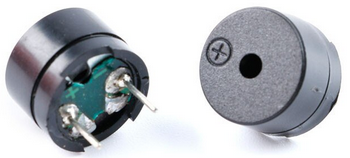

# Descripción de placas y sensores
En este apartado vamos a realizar una descripción básica de las distintas placas, sensores y elementos que se utilizan en la construcción del robot.

## **Placa Keyestudio UNO Ks0172**
Se trata de la placa [Ks0172](https://wiki.keyestudio.com/Ks0172_keyestudio_UNO_with_Pin_Header_Interface) basada en Arduino UNO con el microcontrolador ATmega328P que incorpora conectores de 3 pines que incluyen la patilla asociada y la alimentación y que facilita el conexionado de elementos sin necesidad de utilizar protoboard. En la imagen siguiente podemos ver esta placa con sus descripciones básicas y este es el [enlace al archivo fuente](../../img/conexionado-pruebas/UNO/uno.svg).

| Placa Keyestudio UNO Ks0172 |
|:-:|
|  |

 IMPORTANTE:

El interruptor deslizante permite escoger entre las alimentaciones de 5V o 3.3V. En nuestro caso nos aseguraremos de que está en la **posición 5V**.

También es importante tener disponible un gráfico con la funcionalidad de cada pin o diagrama pinout como el que vemos en la imagen siguiente y este es el [enlace a su archivo fuente](../../img/conexionado-pruebas/UNO/Ks0172-keyestudio-UNO-pinout.svg)

| Pinout de la Placa Keyestudio UNO Ks0172 |
|:-:|
|  |

## **Placa Drivers L298**
Esta placa está basada en el chip L298N y permite controlar la velocidad y el sentido de giro de dos motores de corriente continua o un motor paso a paso bipolar con un consumo máximo de dos amperios. Cuenta con diodos de protección y un regulador LM7805 que suministra 5V a la parte lógica del integrado L298N. Se disponen jumpers de selección para habilitar cada una de las salidas del módulo (A y B). La salida A esta conformada por OUT1 y OUT2 y la salida B por OUT3 y OUT4. Los pines de habilitación son ENA y ENB (Enable A y Enable B) respectivamente. En la siguiente imagen vemos esta placa con sus descripciones básicas y este es el [enlace al archivo fuente](../../img/conexionado-pruebas/UNO/L298.svg).

| Placa L298 |
|:-:|
|  |

Este módulo con el L298N nos permite alimentar nuestro Arduino a partir de la salida de 5V con un límite de 500 mA. Debemos también tener presente que el módulo entrega una tensión a los motores en torno a 3V menor que la tensión a la que lo alimentamos.

Los pines *Vin* y *GND* son los de alimentación del módulo con una tensión que puede ir de 3V a 35V. El pin *Vlog* (Vlógico) tiene dos modos de funcionamiento dependiendo de que el jumper *Regulador* esté o no colocado. Las condiciones de funcionamiento son:

* **Jumper colocado:** El regulador LM7805 está activado y en Vlog habrá una tensión de 5V siempre que el módulo esté alimentado con una tensión máxima de hasta 12V. Si lo alimentamos con una tensión superior tendremos que quitar el jumper y alimentar con 5V la lógica del módulo a través de este pin.
* **Jumper sin colocar:** El regulador LM7805 está desactivado y tenemos que alimentar la lógica del módulo a través de Vlog.

Debemos tener ¡Cuidado! si introducimos corriente por Vlog con el jumper de regulación colocado podemos provocar daños en el módulo.

El resto de conexiones se utilizan para el control de motores y para el caso de motores DC su utilización es la siguiente:

* **Salidas para motores:** Entregan la energía para mover los motores y debemos conectarlo de forma que cuando marquemos, por ejemplo, mover adelante ambos motores giren en el mismo sentido. Si no lo hacen basta con invertir la polaridad de la conexión.
* **Pines IN1 a IN4:** IN1 e IN2 permiten controlar el sentido de giro del motor A mientras que IN3 e IN4 lo hacen con el del motor B. En la tabla siguiente se resume el funcionamiento de estos pines.

| IN1 | IN2 | IN3 | IN4 | Sentido de Giro |
|:-:|:-:|:-:|:-:|---|
| High | Low | High | Low | Directo |
| Low | High | Low | High | Inverso |
| Low | Low | Low | Low | Paro |

* **Velocidad de giro:** Tenemos que quitar los jumpers y usar los pines ENA y ENB. Estos pines debemos conectarlos a dos salidas PWM de la placa Arduino para poder enviarle un valor entre 0 y 255 que controle la velocidad de giro. Con los jumpers colocados, los motores girarán siempre a la misma velocidad.

## **Motores DC 3 a 6V**
Motor de continua de 3V a 6V con doble eje y caja reductora. El doble eje facilita la colocación de un encoder óptico para realizar un control de velocidad en lazo cerrado.

En la tabla siguiente se resumen los principales parámetros de estos motores con una reductora 48:1 para distintas tensiones de alimentación.

| | 3V | 5V | 6V |
|---|:-:|:-:|:-:|
| Velocidad sin carga | 125 rpm | 200 rpm | 230 rpm |
| velocidad con carga | 95 rpm | 160 rpm | 175 rpm |
| Torque | 7.8 Ncm | 9.8 Ncm  | 10.8 Ncm |
| Consumo | 100 a 130 mA | 120 a 140 mA | 130 a 150 mA |

El aspecto físico de estos motores lo vemos en la imagen siguiente.

| Motores DC 3 a 6V |
|:-:|
|  |

## **Zumbador**
Si queremos reproducir sonidos de forma sencilla y económica podemos utilizar un zumbador o buzzer pasivo como el que vemos en la imagen siguiente.

| Zumbador pasivo |
|:-:|
|  |

El dispositivo suele venir con una pegatina que debemos retirar para que el sonido salga con toda su potencia del mismo. Esta pegatina tiene utilidad en procesos de fabricación automatizada para proteger al buzzer en la fase de lavado.

Normalmente no tienen polaridad, pero si está marcada en la carcasa o es distinguible por la diferente longitud de los pines lo mejor es respetarla, siendo normalmente el pin marcado el positivo o patilla mas larga.

El buzzer pasivo, a diferencia del activo, no tiene un oscilador interno y esto obliga a generar la frecuencia desde Arduino, para ello disponemos de la función [tone()](https://www.arduino.cc/reference/en/language/functions/advanced-io/tone/) que implementa el IDE.

## **Sensores de infrarrojos**
Hemos optado por poner al robot una pareja de sensores de reflexión fotoeléctrica con distancia de detección ajustable entre 2 y 30cm (20 y 300mm), conocido como sensor de infrarrojos FC-51, como el que vemos en la imagen siguiente, donde se indica el potenciómetro de ajuste de distancia, el diodo emisor de IR y el fototransistor o detector de reflexión. Respecto a la distancia de detección indicar que la citada anteriormente es la que la inmensa mayoría de vendedores ponen y, aunque hay algunos que reducen esta distancia bastante, es algo que debemos experimentar nosotros mismos teniendo en cuenta las condiciones de luminosidad en las que estemos trabajando.

| Modelo de sensor IR escogido |
|:-:|
|  |

Recordemos el funcionamiento básico del sistema. El LED infrarrojo emite luz infrarroja, o sea, de menor frecuencia (o mayor longitud de onda) que la que nuestros ojos nos permiten ver, es decir, para nosotros es invisible. El sensor que hemos elegido funciona cuando esta luz choca contra una superficie negra que la reflejará y llegará al fototransistor. Existen muchas clases de sensores de este tipo y hemos escogido este por su amplio rango de ajuste y su posibilidad de montaje vertical. Utilizando un par de estos sensores podemos seguir una linea detectando si se sale por la derecha o por la izquierda de la misma y rectificar la dirección de avance hasta conseguir estar de nuevo en la línea.

Este sensor tiene 3 pines de conexión, Vcc o 5V y GND para la alimentación y D0 u OUT como salida de señal que indicará si está llegando o no el reflejo del LED al fototransistor. En el esquema de la imagen siguiente se puede estudiar el funcionamiento electrónico de esta plaquita.

| Esquema sensor infrarrojos |
|:-:|
|  |

El LM393 está configurado como comparador entre el nivel de tensión ajustado mediante VR1 que es entregado al terminal inversor y el nivel de entrada en el terminal no inversor, que va a depender de si el fototransistor recibe o no reflexión del infrarrojo emitido por el LED, si está recibiendo reflexión el fototransistor se encenderá el LED indicador de estado y tenemos el estado bajo o LOW en D0. Si no se recibe reflexión el LED no se iluminará y se envía un estado alto o HIGH a D0.

Mediante el potenciómetro ajustamos la sensibilidad del fotorreceptor.

## **Sensor de distancia HC-SR04**
El sensor genera y emite una serie de tonos de ultrasonidos a una frecuencia de 40 kHz (no perceptibles al oído humano) que si rebotan en una superficie vuelven y son captados por un micrófono receptor de ultrasonidos que incorpora el propio sensor. Midiendo el tiempo que tardan en volver los tonos enviados podemos calcular la distancia a la que se encuentra el objeto sobre el que han rebotado. El propio circuito realiza los cálculos necesarios para determinar la distancia a la que está la superficie. El sistema es similar al que usan algunos animales como ballenas, murciélagos y delfines, para localizar obstáculos y presas.

El HC-SR04 es un sensor de distancia de baja precisión, en teoría con un rango de medición de 2cm a 400 cm, con una resolución de 0.3cm, pero en la práctica se limita a un rango entre 20cm y 2 metros.

El aspecto del HC-SR04 es muy característico y se reconoce con facilidad porque tiene dos "ojos" que realmente son los dispositivos de emisión y recepción de ultrasonidos que integra este módulo, y es justo por esto por lo que hemos dotado al robot de una cabeza giratoria que en el funcionamiento parecerá que el robot mira a un lado y otro.

En la imagen siguiente vemos el aspecto real del sensor y el principio de funcionamiento de forma gráfica.

| Aspecto del HC-SR04 y principio de funcionamiento |
|:-:|
|  |

Las características técnicas más relevantes del HC-SR04 son:

* Dispone de 4 pines, dos son para alimentación (Vcc) y masa (GND), disparador (Trigger) y receptor (Echo). En la imagen siguiente se aprecian claramente como están distribuidos estos pines en el sensor.

| Pinout del HC-SR04 |
|:-:|
|  |
| Imagen basada en la publicada en [theengineeringprojects](https://www.theengineeringprojects.com/) |

* Alimentación: 5v
* Frecuencia de ultrasonidos: 40 Khz
* Consumos: en stand-by menor de 2mA y trabajando en torno a 15mA
* Ángulo: menor de 15º

Veamos ahora en que se basan los cálculos que realiza el sensor. En principio lo que hace, como ya se ha indicado, es contar el tiempo desde que se envia el pulso hasta que se recibe respuesta con lo que se puede determinar la distancia. Recordemos que:

$velocidad=\dfrac{espacio}{tiempo}\Rightarrow espacio=velocidad\cdot tiempo$

La velocidad es la del sonido es de 343 m/s a 20 ºC y un 50% de humedad relativa. A nosotros nos va a interesar expresar esta velocidad en cm/us, para lo que hacemos lo siguiente:

$343\dfrac{m}{s}\cdot 100\dfrac{cm}{m}\cdot \dfrac{1}{1000000}\dfrac{s}{\mu s}=0.0343\dfrac{cm}{\mu s}\Rightarrow espacio-ida=0.0343\cdot tiempo$

Es decir, el sonido tarda 0.0343 microsegundos en recorrer un centímetro, que será el tiempo que tarda el sonido en ir desde el amisor al objeto en el que rebota. Teniendo en cuenta que desde que se emite el pulso, rebota y es recibido el espacio recorrido será aproximadamente el doble que el calculado podemos expresar la distancia o espacio recorrido como:

$espacio=\dfrac{espacio-ida}{2}=0.01715\cdot tiempo$

Ecuación que nos permite saber la distancia a la que se encuentra un determinado objeto.

## **Servomotores**
Los servomotores, abreviado servos, son motores de corriente continua que además tienen una reductora con el fin de disminuir su velocidad de giro y aumentar el par motor en el eje. También incorporan sistema electrónico de control que permite hacerlos girar un determinado ángulo. Esa electrónica permite al servo saber en todo momento cual es su posición. Generalmente giran menos de una vuelta completa, 180º es bastante común, aunque tienen un ángulo variable según el modelo, pero existen ya servos de rotación continua que giran 360 grados.

Existen infinidad de modelos de servomotor y en nuestro caso vamos a utilizar Micro Servos del tipo 9g SG90. En la imagen siguiente vemos el aspecto y los elementos que incorporan este tipo de servos.

| Aspecto y elementos de los servos 9g SG90 |
|:-:|
|  |

Los servos tienen un funcionamiento muy parecido y la programación suele variar muy poco de unos a otros, aunque siempre es conveniente mirar el [datasheet](../../img/conexionado-pruebas/UNO/9g-sg90-datasheet.pdf) del que vamos a utilizar para mayor seguridad.

Debido a que la resolución de la señal PWM que podemos conseguir con una placa tipo UNO el ángulo de giro que podremos mover un servo será mayor de un grado, aunque el servo puede moverse con una resolución mayor.  Las características de la señal PWM nos indican que debemos generar un pulso de trabajo entre 1 ms y 2 ms y con un periodo de 20 ms (50 Hz), es decir, solamente podremos cambiar de posición del servo cada 20 ms.

Los microservos se pueden alimentar directamente de la placa UNO dado que su consumo es lo suficientemente bajo para ello, pero si es necesario, dependiendo del modelo de servo, habrá que alimentarlo con una fuente externa teniendo siempre la precaución de que las GNDs de la placa UNO y del servo queden interconectadas.

Los colores usuales de los tres cables que salen del servo son los siguientes:

* Negro o Marrón: GND
* Rojo: Alimentación
* Blanco o Naranja: Señal de control del servo (pulso enviado al servomotor)

En la imagen siguiente se corrobora esta información.

| Colores de los cables en los servos 9g SG90 |
|:-:|
|  |

## **Encoder infrarrojos FC-03**
Se trata de elementos basados en fotointerruptores de ranura como los que vemos en la imagen izquierda siguiente. A partir de estos se fabrican placas preparadas para conectar a Arduino como las que se ven en la imagen de la derecha siguiente.

| Izquierda: fotointerruptor de ranura - Derecha: sensor FC-03 |
|:-:|
|  |

Los dispositivos basados en optointerruptores son ampliamente utilizados como encoders para detectar la velocidad de giro y la posición del eje de motores. Para realizar esta tarea se emplean discos opacos ranurados que se acoplan al eje del motor, aunque también se pueden emplear elementos translucidos sobre los que se dibujan franjas negras. En la imagen siguiente vemos algunos de estos discos.

| Diferentes tipos de discos para encoder óptico |
|:-:|
|  |

Con el sensor FC-03, que incluye comparador [LM393](https://www.ti.com/lit/ds/symlink/lm393-n.pdf?ts=1626748827397&ref_url=https%253A%252F%252Fwww.google.com%252F), podemos calcular la velocidad de rotación de las ruedas de un robot. El funcionamiento básico del sensor es el siguiente; Si hacemos pasar una rueda dentada entre la ranura del sensor, este crea un pulso digital TTL en el pin D0, que podemos leer sin ningún problema en nuestra placa UNO. En la imagen siguiente vemos detalladas las diferentes partes del encoder.

| Pinout y partes del sensor FC-03 |
|:-:|
|  |

Los pines de conexión del encoder FC-03 de la imagen anterior los podemos describir de la siguiente forma:

- Vcc: Tensión de alimentación del módulo de 3,3V a 12V. Se recomienda 3,3V
- GND: Masa o referencia 0V
- D0: Salida de señal digital de pulsos TTL 
- A0: Salida de señal analógica de los pulsos de salida. Se trata de la señal de salida en tiempo real que usualmente no se utiliza

Como principales características técnicas definimos las siguientes:

- Anchura de la ranura: 5mm
- LED indicador de alimentación
- LED indicador de los pulsos de salida del pin D0.

Este tipo de encoder suele dar problemas a la hora de leer los pulsos digitales generados por el comparador LM393, y estos consisten en que la placa UNO lee más pulsos de los que se generan realmente, en la práctica del orden de cuatro veces más. En la imagen siguiente vemos el esquema del circuito que monta este encoder FC-03.

| Esquema interno del sensor FC-03 |
|:-:|
|  |

Podemos observar en este esquema como el comparador LM393 está configurado como de lazo abierto (no existe realimentación) lo que hace que el mismo sea extremadamente sensible a los cambios que se producen en la entrada, bien sean provocados por el sensor de ranura (los deseados) o bien por ruidos generados por la propia alimentación del sensor, los motores u otros elementos (pulsos no deseados) que puedan afectar a la señal de salida. Es decir, que la señal TTL presentará tanto en los flancos de subida como de bajada una serie de pulsos o rebotes que la placa UNO es capaz de leer e interpretar.

La solución al problema de los pulsos no deseados puede implementarse por hardware o por software.

* **Por hardware:** Una primera solución puede ser alimentar el FC-03 con 3,3V, pero no siempre es sencillo ni darnos una buena señal. La otra opción, mucho más eficaz y definitiva, es soldar un condensador de entre 10 y 100 nF entre los pines D0 y GND que filtrará dichos pulsos no deseados.
*  **Por software:** Lo normal cuando usamos este tipo de sensores es que empleemos las interrupciones de Arduino, de ahí que los pines reservados para estos sensores sean los digitales 2 y 3, que es donde se implementan las interrupciones en la placa UNO. El punto en contra de esto es que tendremos que implementar un sistema antirrebotes (debounce) para estas dos entradas. En lo que respecta a hacer funcionar al robot no debemos preocuparnos por el tema ya que la librería incorpora la implementación del debounce por software. Si queremos entender algo mejor el tema del debounce podemos recurrir a multitud de tutoriales existente en la red siendo el que recomendamos el que aparece en el [blog de Luis Llamas](https://www.luisllamas.es/debounce-interrupciones-arduino/).
