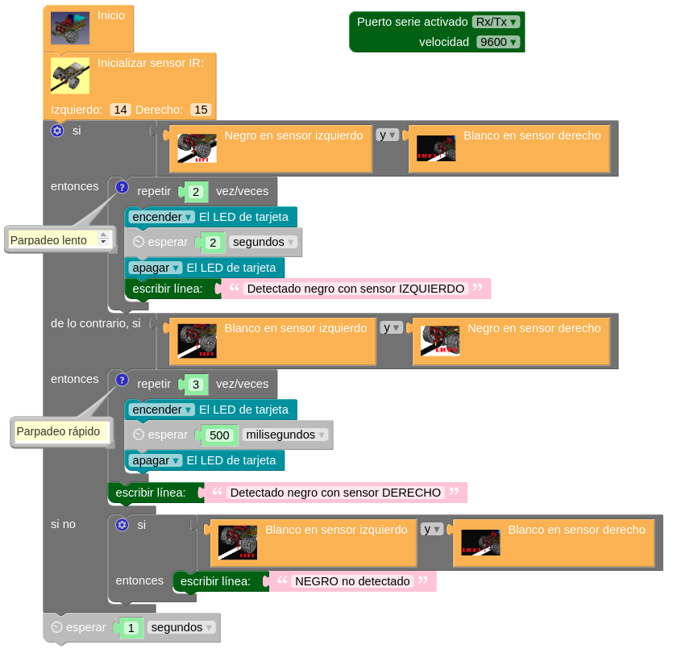
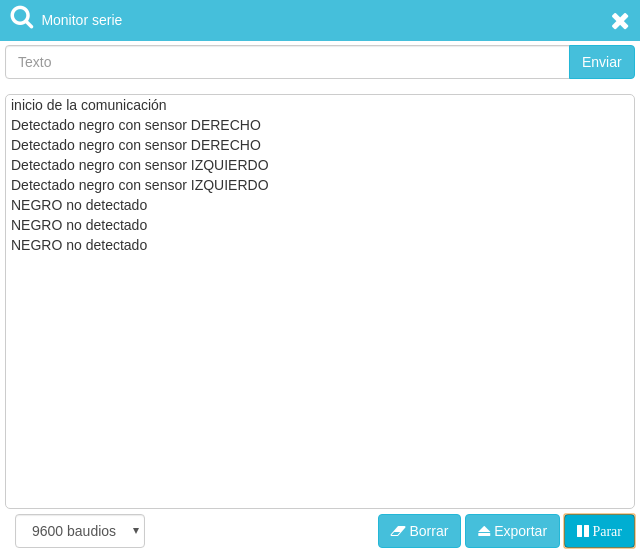
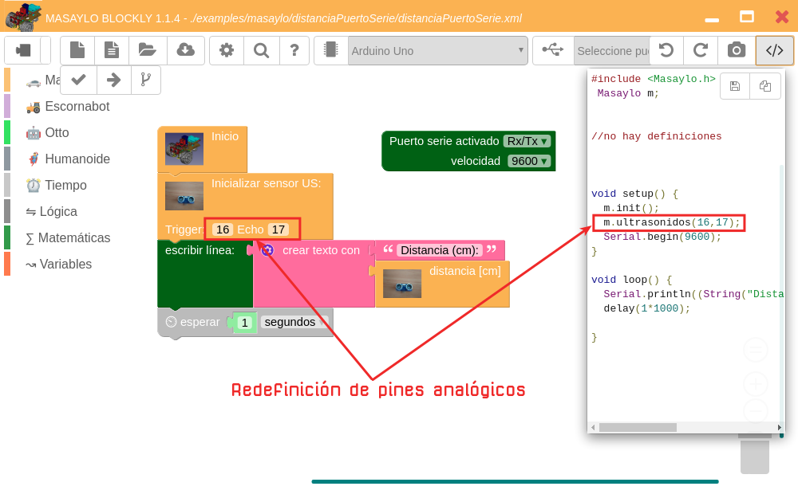
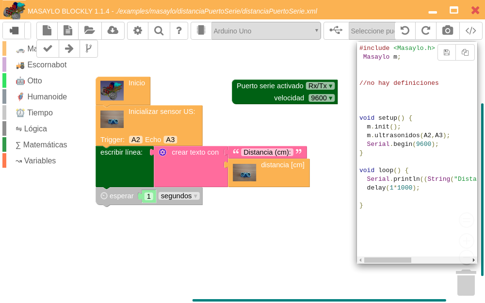
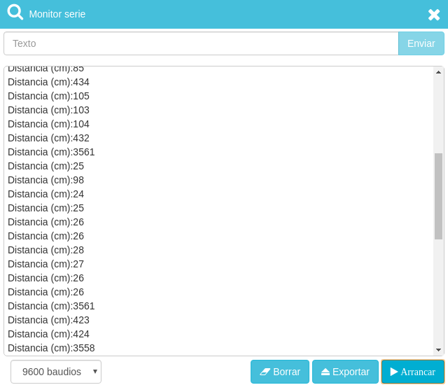
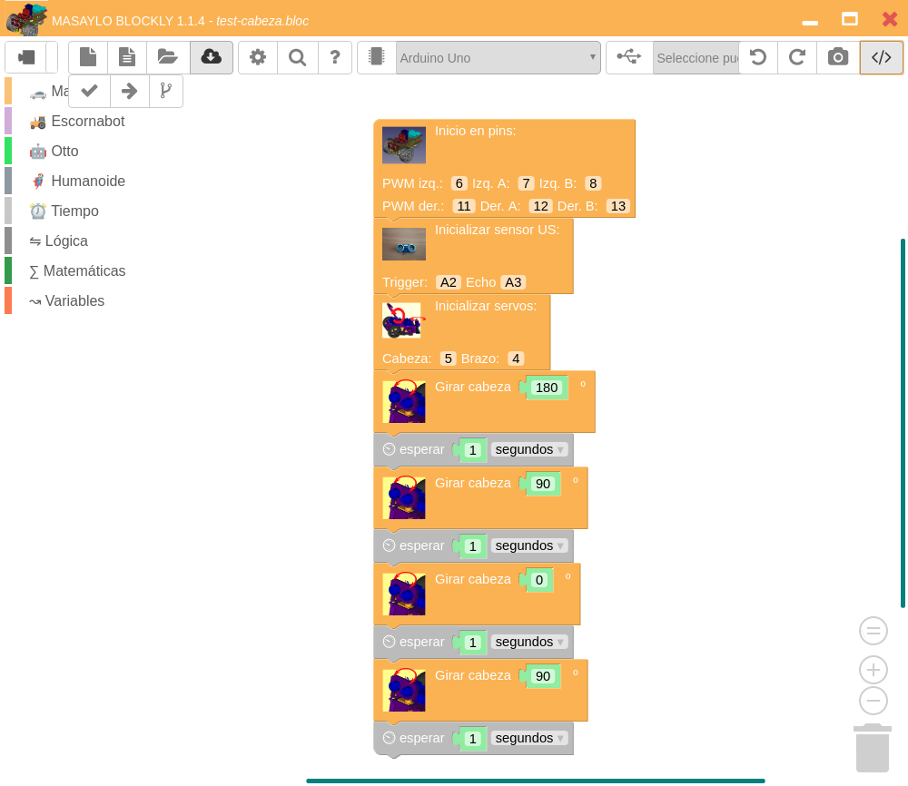
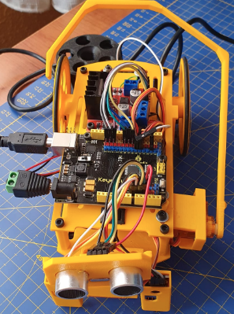
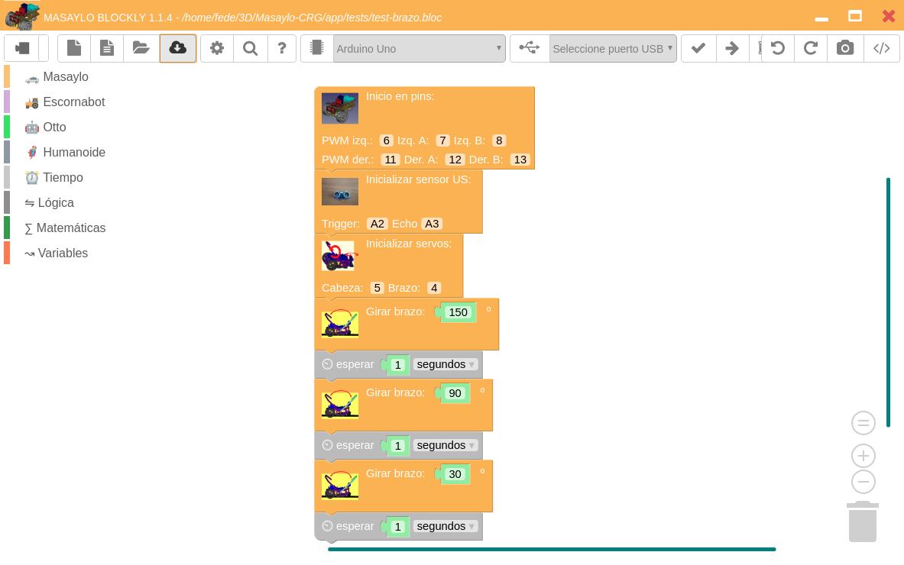
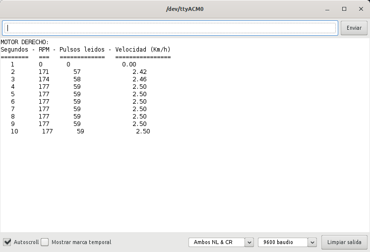

# Pruebas básicas de funcionamiento
Una vez analizados y conectados los distintos elementos iremos haciendo pequeños programas bien mediante la aplicación `Masaylo Blockly` basada en `Blocklino de Fontaine Jean Philippe`, y pensada para programar robots utilizando un entorno gráfico o de programación por bloques, o bien utilizando el IDE de Arduino. En el apartado de software se pueden encontrar los enlaces de descarga y toda la información de la aplicación.

## **Alimentación**
Colocamos las pilas AA en su lugar respetando la polaridad de las mismas y accionamos el interruptor. Si todo es correcto en ambas placas se debe encender un diodo LED rojo indicativo de que están alimentadas, tal y como observamos en la imagen siguiente:

| Primer encendido |
|:-:|
|  |

En este punto vamos a probar también que se graba correctamente firmware en la placa UNO a partir de `Masaylo Blockly 1.1.1 Beta o posterior`. Para ello hemos creado y almacenado el programa [blink.bloc](../UNO/tests/blink.bloc) que vemos en la imagen siguiente.

| Programa blink.bloc |
|:-:|
|  |

Si cargamos el programa y dejamos sin accionar el interruptor observaremos como parpadea el LED asociado al pin 13 en la placa UNO pero la placa del driver no está alimentada y por tanto su LED permanece apagado. En la animación siguiente vemos el parpadeo del LED y el resultado de accionar el interruptor.

| Animación que muestra el funcionamiento del programa blink.bloc y del interruptor |
|:-:|
|  |

Este GIF se ha creado a partir de un video en formato mp4 utilizando FFMPEG y GIMP y la información obtenida en [este enlace](https://ubunlog.com/gif-animados-vlc-ffmpeg-gimp/).

## **Motores**
Vamos a realizar una primera prueba del funcionamiento de los motores a partir de los ejemplos suministrados con la librería y disponibles en la aplicación `Masaylo Blockly` que estamos usando en estas pruebas de funcionamiento. En la imagen siguiente tenemos cargado el ejemplo *Aprende a controlar los movimientos básicos del robot Masaylo* y hemos destacado el icono desde el que podemos seleccionarlo de la lista que se abre en una ventana emergente y que al hacer clic nos lo carga en el entorno de la aplicación.

| Ejemplo Aprende a controlar los movimientos básicos del robot Masaylo cargado |
|:-:|
|  |

Si conectamos la placa al puerto USB del ordenador y cargamos el ejemplo en la placa, cuando accionemos el interruptor (o con este accionado pulsemos el botón de reset) se producirá la secuencia de movimiento establecida en el programa que podemos apreciar en la animación siguiente.

| Animación que muestra el funcionamiento del programa motores-ej1.bloc |
|:-:|
|  |

El ejemplo siguiente está basado en *Utiliza PWM para controlar la velocidad de movimientos del Masaylo* suministrado con la aplicación pero ligeramente modificado ([motores-ej2.bloc](../UNO/tests/motores-ej2.bloc)) para poner todos los valores de PWM al 50% y todos los retardos a 3 segundos.

| Ejemplo con control PWM de Masaylo |
|:-:|
|  |

El funcionamiento es muy similar al de la animación anterior pero a la mitad de velocidad. Anímate y prueba el ejemplo y haz cambios para analizar lo que está ocurriendo.

## **Zumbador**
En esta ocasión vamos a programar el robot desde el IDE de Arduino, en concreto utilizando la versión 1.8.13 o posterior. Para la prueba del zumbador vamos a utilizar la información que podemos ver en la web de *Input makers* con el título [Programar melodía de Star Wars con Arduino y zumbador](https://inputmakers.com/componentes/melodia-de-star-wars-con-arduino-y-zumbador).

El código que vamos a grabar en la placa lo vemos a continuación y basta con utilizar el botón copiar para seleccionarlo y ponerlo en el portapapeles desde el que lo podemos llevar al IDE de Arduino. Este botón se hace mas visible al pasar el cursor por el cuadro del código en la zona superior derecha del mismo. También puedes descargar el programa comprimido haciendo clic en el enlace [buzzer-star-wars](../UNO/tests/buzzer-star-wars.zip) que puedes descomprimir y utilizar a conveniencia.

~~~
int pin = 1; // definimos el pin al que conectaremos el zumbador.
 
/* Definimos cada una de las frecuencias de las notas musicales.
 * Cuando van acompañadas de la letra S significa que esa nota es sostenido.
 * Cuando van acompañadas de la letra H significa que esa nota está en una octava superior (High). */
 
int c=261; int d=294; int e=329; int f=349; int g=391; int gS=415; int a=440; 
int aS=455; int b=466; int cH=523; int cSH=554; int dH=587; int dSH=622; 
int eH=659; int fH=698; int fSH=740; int gH=783; int gSH=830; int aH=880;

void setup()    
{    
  pinMode(pin, OUTPUT); // Hacemos que el pin 1 sea salida.
}     
void loop() {   
/* Utilizamos la función tone incluida en el IDE con el formato: tone(Nº-pin, nota, duracion) */
    tone(pin, a, 500);  delay(550);
    tone(pin, a, 500);  delay(550);     
    tone(pin, a, 500);  delay(550);
    tone(pin, f, 350);  delay(350);
    tone(pin, cH, 150); delay(200); 
    tone(pin, a, 500);  delay(550);
    tone(pin, f, 350);  delay(350);
    tone(pin, cH, 150); delay(200);
    tone(pin, a, 1000); delay(1050);
    tone(pin, eH, 500); delay(550);
    tone(pin, eH, 500); delay(550);
    tone(pin, eH, 500); delay(550);   
    tone(pin, fH, 350); delay(350); 
    tone(pin, cH, 150); delay(200);
    tone(pin, gS, 500); delay(550);
    tone(pin, f, 350);  delay(350);
    tone(pin, cH, 150); delay(200);
    tone(pin, a, 1000); delay(1050);
    tone(pin, aH, 500); delay(550);
    tone(pin, a, 350);  delay(350); 
    tone(pin, a, 150);  delay(200);
    tone(pin, aH, 500); delay(550);
    tone(pin, gSH, 250);delay(250);
    tone(pin, gH, 250); delay(250);
    tone(pin, fSH, 125);delay(150);
    tone(pin, fH, 125); delay(150);    
    tone(pin, fSH, 250);delay(250);
    delay(250);
    tone(pin, aS, 250); delay(250);    
    tone(pin, dSH, 500);delay(550); 
    tone(pin, dH, 250); delay(250); 
    tone(pin, cSH, 250);delay(250);  
        
    tone(pin, cH, 125); delay(150);  
    tone(pin, b, 125);  delay(150); 
    tone(pin, cH, 250); delay(250);     
    delay(250);
    tone(pin, f, 125);  delay(150); 
    tone(pin, gS, 500); delay(550); 
    tone(pin, f, 375);  delay(375+50); 
    tone(pin, a, 125);
    delay(150); 
    tone(pin, cH, 500); delay(550);
    tone(pin, a, 375);  delay(400);
    tone(pin, cH, 125); delay(150);
    tone(pin, eH, 1000);delay(1050);
    tone(pin, aH, 500); delay(550);
    tone(pin, a, 350);  delay(350);
    tone(pin, a, 150);  delay(200);
    tone(pin, aH, 500); delay(550);
    tone(pin, gSH, 250);delay(250); 
    tone(pin, gH, 250); delay(250);
    tone(pin, fSH, 125);delay(150);
    tone(pin, fH, 125); delay(150);  
    tone(pin, fSH, 250);delay(250);
    delay(250);
    tone(pin, aS, 250); delay(250);  
    tone(pin, dSH, 500);delay(550);
    tone(pin, dH, 250); delay(250);
    tone(pin, cSH, 250);delay(250);  
    tone(pin, cH, 125); delay(150);
    tone(pin, b, 125);  delay(150);
    tone(pin, cH, 250); delay(250);      
    delay(250);
    tone(pin, f, 250);  delay(250); 
    tone(pin, gS, 500); delay(550); 
    tone(pin, f, 375);  delay(400);
    tone(pin, cH, 125); delay(150);
    tone(pin, a, 500);  delay(550);           
    tone(pin, f, 375);  delay(400);          
    tone(pin, c, 125);  delay(150);  
    tone(pin, a, 1000); delay(1050);       
    delay(5000); 
}
~~~

En el video "prueba del zumbador en Masaylo-CRG" que tenemos a continuación podemos escuchar el resultado de grabar el código anterior en el robot.

<iframe width="560" height="315" src="https://www.youtube.com/embed/laqXu4w0ZEk" title="YouTube video player" frameborder="0" allow="accelerometer; autoplay; clipboard-write; encrypted-media; gyroscope; picture-in-picture" allowfullscreen></iframe>

## **Sensores de infrarrojos**
Para probar y ajustar los sensores de infrarrojos vamos a realizar un sencillo programa en MasayloBlockly como el que vemos en la imagen siguiente.

| Ejemplo para prueba de los sensores de infrarrojos |
|:-:|
|  |

Si es necesario retocaremos la posición del cursor del potenciometro de ajuste de sensibilidad teniendo en cuenta que es extremadamente sensible y que debemos dejarlo en una posición tal que al situar el sensor sobre una superficie negra el sensor onboard se apague y cuando lo sacamos del negro se encienda.

El programa [sensores-IR.bloc](../UNO/tests/sensores-IR.bloc) es muy sencillo y simplemente comprueba si el sensor izquierdo está sobre negro estándo el derecho sobre blanco, si esta condición es cierta el LED onboard del UNO hará un parpadeo que repetirá dos veces de forma lenta y nos mostrará un mensaje en el monitor serie. Un proceso similar se realiza con el sensor derecho sobre negro siendo esta vez el parpadeo rápido y lo hará tres veces. Si ninguno de los sensores detecta negro mostrará el correspondiente mensaje permaneciendo el LED apagado. 

En la imagen siguiente vemos el resultado que muestra el monitor serie al hacer que los sensores lean negro.

| Resultados obtenidos con el programa de prueba de los sensores de infrarrojos |
|:-:|
|  |

## **Sensor de distancia HC-SR04**
El datasheet del sensor nos indica que debemos generar un pulso de al menos 10us en el pin Trigger o disparador. Si queremos asegurar un trigger bueno podemos poner el pin a nivel bajo durante 4us antes de general el pulso en si. En código esto es algo como lo siguiente:

~~~
digitalWrite(Pin_Trigger, LOW);  
delayMicroseconds(4);
digitalWrite(Pin_Trigger, HIGH); 
delayMicroseconds(10);
digitalWrite(Pin_Trigger, LOW);
~~~

Este código ya está implementado en la librería que se describe en estas notas y, por supuesto lo está en Masaylo Blockly por lo que no debemos preocuparnos por ello.

En este caso como ejemplo vamos a utilizar el que viene con la versión 1.1.4 de Masaylo Blockly titulado "Envía la distancia al obstáculo detectado al puerto serie de tu ordenador" y que podemos ver cargado en la imagen siguiente.

| Ejemplo "Envía la distancia al obstáculo detectado al puerto serie de tu ordenador" |
|:-:|
|  |

En la imagen siguiente vemos este mismo ejemplo con la definición de pines que se da en el pinout.

| Ejemplo "Envía la distancia al obstáculo detectado al puerto serie de tu ordenador" con A2 y A3 |
|:-:|
|  |

Se puede utilizar una u otra nomenclatura de forma indiferente y en cualquier caso lo que hace el ejemplo es enviarnos al puerto serie la distancia en centímetros que está midiendo el sensor una vez por segundo.

En la imagen siguiente vemos una ventana con resultados de diferentes distancias medidas por el sensor.

| Ejemplo "Envía la distancia al obstáculo detectado al puerto serie de tu ordenador" resultados |
|:-:|
|  |

## **Servomotores**
En nuestro caso el robot va dotado de dos servos SG90, uno para accionar el brazo aparta obstáculos y el otro para accionar la cabeza y que el robot "mire" a un lado y otro. Para ambos servos vamos a crear unos programas muy simples que nos sirvan para verificar su funcionamiento.

* **Prueba de funcionamiento del servo de cabeza**. Implementamos, o [descargamos](../UNO/tests/test-cabeza.bloc) el programa que vemos en la imagen siguiente:

| Ejemplo básico de funcionamiento del servo de cabeza |
|:-:|
|  |

En los ejemplos que acompañan a la librería y que se incluyen en Masaylo Blockly encontramos otras muchas funcionalidades de este servo.

En la animación siguiente vemos el resultado de programar el robot con el ejemplo anterior y como realiza movimientos de izquierda a derecha pasando por la posición central o mirar al frente.

| Animación del ejemplo básico de funcionamiento del servo de cabeza |
|:-:|
|  |

* **Prueba de funcionamiento del servo del brazo**. 

En el caso del brazo hay que tener en cuenta que, si posicionamos la placa UNO como hemos ido viendo en las distintas imágenes, al grabar este programa (o cualquier otro que trabaje con el servo del brazo) y mientras mantegamos conectado el cable USB, este va a molestar a los movimientos del brazo porque chocará con el mismo. Las opciones que tenemos para evitar que esto ocurra son:

- girar la placa UNO 180º sobre la posición indicada hasta ahora
- retirar el brazo en tanto trabajamos con la conexión USB y colocarlo en el robot para su funcionamiento autónomo
- colocar el servo junto con el brazo en el otro costado del robot

En la imagen siguiente vemos el robot con el servo cambiado de costado.

| Servo del brazo posicionado a la izquierda |
|:-:|
|  |

Implementamos, o [descargamos](../UNO/tests/test-brazo.bloc) el programa que vemos en la imagen siguiente:

| Ejemplo básico de funcionamiento del servo del brazo |
|:-:|
|  |

En los ejemplos que acompañan a la librería y que se incluyen en Masaylo Blockly encontramos otras muchas funcionalidades de este servo.

En la animación siguiente vemos el resultado de programar el robot con un ejemplo en el que el brazo está colocado en el costado derecho y como realiza movimientos de posicionado del brazo envolviendo al objeto que supuestamente habría delante y retracción del brazo a su posición de replegado pasando por la posición central o posición vertical del brazo.

| Animación del ejemplo básico de funcionamiento del servo del brazo |
|:-:|
|  |

## **Encoder infrarrojos FC-03**
Para probar el funcionamiento de los encoders vamos a recurrir de nuevo al IDE 1.8.15 de Arduino montando dos ejemplos totalmente similares pero probando cada encoder por separado. Estos ejemplos están inspirados en la implementación que se hace de los mismos en el [robot Andromina OFF ROAD](https://androminarobot.blogspot.com.es/2014/04/andromina-y-mando-distancia.html) y los detalles analizados en el [blog Andromina robot V.2.0](http://androminarobot.blogspot.com/2016/07/en-este-tutorial-mostramos-como-usar-el.html)  Posteriormente podremos probar distintos ejemplos integrados en la librería que lógicamente utilizarán ambos encoders simultáneamente.

* **Encoder izquierdo**

A continuación vemos el código comentado de la prueba que vamos a realizar y que puedes [descargar](../UNO/tests/test-encoder-izdo.zip) o copiar para grabarlo en tu robot y así comprobar que el encoder izquierdo funciona correctamente.

~~~
const int pwm_izdo = 6; //pines y variables motor y encoder izquierdo 
const int IN1 = 7;
const int IN2 = 8;
int encoder_izdo = 2;     
unsigned int rpm_izdo = 0;
float vel_izdo = 0; //en Km/h
volatile byte pulsos_leidos = 0; // Número de pulsos leidos en un segundo
unsigned long tiempo_anterior = 0;  // Tiempo 
unsigned int muescas = 20; //número de muescas del disco del encoder.
const int diametro_rueda = 75; //Diámetro de las ruedas en mm
static volatile unsigned long debounce = 0; //Tiempo del rebote.
void setup(){
  pinMode(pwm_izdo,OUTPUT);
  pinMode(IN1,OUTPUT); 
  pinMode(IN2,OUTPUT);
  Serial.begin(9600); 
  pinMode(encoder_izdo, INPUT);
  attachInterrupt(0, contador, RISING); //Configuración de la interrupción 0 
  pulsos_leidos = 0;
  rpm_izdo = 0;
  tiempo_anterior = 0;
  Serial.println("MOTOR IZQUIERDO:");
  Serial.print("Segundos - ");
  Serial.print("RPM - ");
  Serial.print("Pulsos leidos - ");
  Serial.println("Velocidad (Km/h)");
  Serial.println("========   ===   =============   ================");
}
 void loop(){
  if (millis() - tiempo_anterior >= 1000){  //Se actualiza cada segundo
    noInterrupts(); // Desconectamos la interrupción para que no actué en esta parte del programa.
    digitalWrite(IN1,HIGH);
    digitalWrite(IN2,LOW);
    analogWrite(pwm_izdo,255); //a máxima velocidad
    rpm_izdo = (60 * 1000 / muescas )/ (millis() - tiempo_anterior)* pulsos_leidos; //Cálculo de las revoluciones por minuto
    vel_izdo = rpm_izdo * 3.1416 * diametro_rueda * 60 / 1000000; //Cálculo de la vel_izdo en Km/h 
    tiempo_anterior = millis(); //Almacenamos el tiempo actual.
    Serial.print("   "); Serial.print(millis()/1000); Serial.print("       ");
    Serial.print(rpm_izdo,DEC); Serial.print("       ");
    Serial.print(pulsos_leidos,DEC); Serial.print("               ");
    Serial.println(vel_izdo,2); 
    pulsos_leidos = 0;  //Inicializamos los pulsos
    interrupts(); //Reiniciamos la interrupción
  }
}
//La función contador se encarga de contar los pulsos buenos
void contador(){
  if(digitalRead(encoder_izdo) && (micros()-debounce > 500) && digitalRead (encoder_izdo)){ 
    debounce = micros(); //para comprobar que no contamos rebotes 
    pulsos_leidos++;}  //Cuen ta el pulso como bueno
} 
~~~

En la imagen siguiente tenemos una captura del terminal serie con los resultados para el encoder izquierdo.

| Resultados del ejemplo básico para prueba del encoder izquierdo |
|:-:|
|  |

* **Encoder derecho**

A continuación vemos el código comentado de la prueba que vamos a realizar y que puedes [descargar](../UNO/tests/test-encoder-dcho.zip) o copiar para grabarlo en tu robot y así comprobar que el encoder derecho funciona correctamente.

~~~
const int pwm_dcho = 11; //pines y variables motor y encoder derecho 
const int IN3 = 12;
const int IN4 = 13;
int encoder_dcho = 3;     
unsigned int rpm_dcho = 0;
float vel_dcho = 0; //en Km/h
volatile byte pulsos_leidos = 0; // Número de pulsos leidos en un segundo
unsigned long tiempo_anterior = 0;  // Tiempo 
unsigned int muescas = 20; //número de muescas del disco del encoder.
const int diametro_rueda = 75; //Diámetro de las ruedas en mm
static volatile unsigned long debounce = 0; //Tiempo del rebote.
void setup(){
  pinMode(pwm_dcho,OUTPUT);
  pinMode(IN3,OUTPUT); 
  pinMode(IN4,OUTPUT);
  Serial.begin(9600); 
  pinMode(encoder_dcho, INPUT);
  attachInterrupt(1, contador, RISING); //Configuración de la interrupción 1
  pulsos_leidos = 0;
  rpm_dcho = 0;
  tiempo_anterior = 0;
  Serial.println("MOTOR DERECHO:");
  Serial.print("Segundos - ");
  Serial.print("RPM - ");
  Serial.print("Pulsos leidos - ");
  Serial.println("Velocidad (Km/h)");
  Serial.println("========   ===   =============   ================");
}
 void loop(){
  if (millis() - tiempo_anterior >= 1000){  //Se actualiza cada segundo
    noInterrupts(); // Desconectamos la interrupción para que no actué en esta parte del programa.
    digitalWrite(IN3,HIGH);
    digitalWrite(IN4,LOW);
    analogWrite(pwm_dcho,255); //a máxima velocidad
    rpm_dcho = (60 * 1000 / muescas )/ (millis() - tiempo_anterior)* pulsos_leidos; //Cálculo de las revoluciones por minuto
    vel_dcho = rpm_dcho * 3.1416 * diametro_rueda * 60 / 1000000; //Cálculo de la vel_dcho en Km/h 
    tiempo_anterior = millis(); //Almacenamos el tiempo actual.
    Serial.print("   "); Serial.print(millis()/1000); Serial.print("       ");
    Serial.print(rpm_dcho,DEC); Serial.print("       ");
    Serial.print(pulsos_leidos,DEC); Serial.print("               ");
    Serial.println(vel_dcho,2); 
    pulsos_leidos = 0;  //Inicializamos los pulsos
    interrupts(); //Reiniciamos la interrupción
  }
}
//La función contador se encarga de contar los pulsos buenos
void contador(){
  if(digitalRead(encoder_dcho) && (micros()-debounce > 500) && digitalRead (encoder_dcho)){ 
    debounce = micros(); //para comprobar que no contamos rebotes 
    pulsos_leidos++;}  //Cuen ta el pulso como bueno
} 
~~~

En la imagen siguiente tenemos una captura del terminal serie con los resultados para el encoder derecho.

| Resultados del ejemplo básico para prueba del encoder derecho |
|:-:|
|  |

