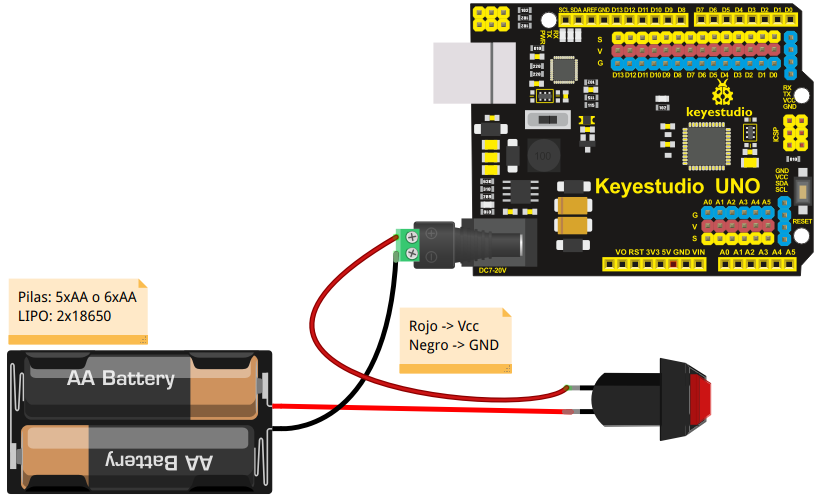
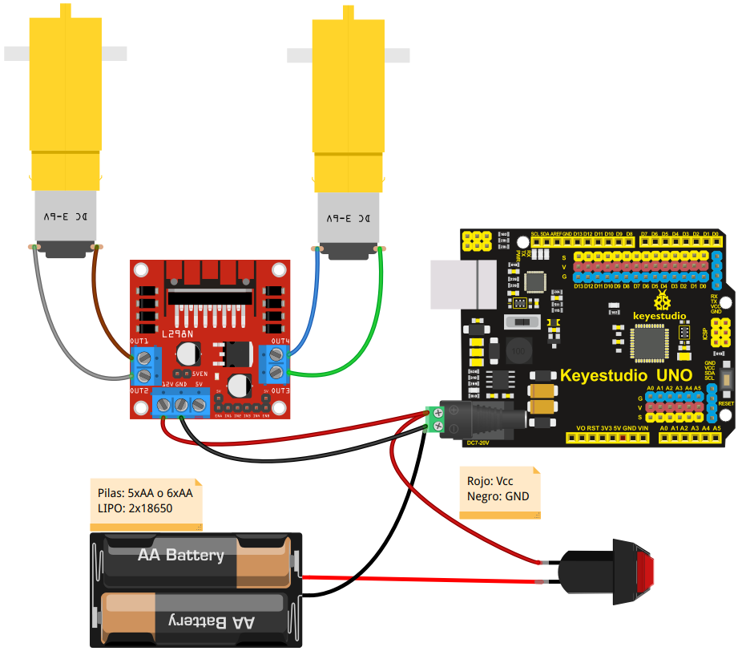

# Conexionado de los distintos elementos
Describimos el conexionado que debemos realizar entre los distintos elementos, lo que haremos fundamentalmente en forma de gráfico o pinout.

## **Alimentación**
Antes de nada vamos a resolver las conexiones de alimentación de nuestra placa UNO y del driver de motores L298 junto con el portapilas y el interruptor. El resto de elementos se alimentarán directamente de la placa UNO. El conexionado es válido si sustituimos las cinco (o seis) pilas AA por dos baterías tipo 18650.

Para que la placa UNO y el driver queden conectados con el interruptor utilizaremos una clema de la que sacaremos un cable para el jack de alimentación del UNO y otro para el positivo del driver, siendo este cable el que previamente pasa por el interruptor procedente del portapilas. El negativo es un cable doble que va al UNO y al driver sin pasar por el interruptor.

En estas condiciones el junper *Regulador* del driver debe estar colocado en su lugar y debemos tener en cuenta que la tensión de entrada caerá en 0.7V debido al diodo protector de inversión de polaridad que lleva la placa. Esto lo podemos evitar utilizando el pin Vin de la tira de pines de alimentación, pero debemos tener en cuenta que así no hay protección y que se recomienda no usar tensiones superiores a 6V. En nuestro caso usamos 5 pilas AA con lo que partimos de una tensión de 7.5V que bajará aproximadamente a 6.8V y si usamos 2x18650 tendremos 7.2V que se quedarán en 6.5V.

En la imagen siguiente tenemos el detalle de conexionado de la alimentación para ambas placas que debemos realizar de forma cuidadosa en especial y no cambiar la polaridad de la alimentación que se ha marcado y dibujado con los colores normalizados de la misma.

| Conexionado de alimentación |
|:-:|
|  |

La forma más sencilla de conectar los elementos es utilizando un jack de alimentación con clema como el que se ve en la imagen anterior aunque también podemos utilizar un jack normal realizando las correspondientes soldaduras.

Se **recomienda** que una vez finalizadas las conexiones se revisen estas cuidadosamente, tanto en las conexiones en si mismas como en la polaridad, antes de alimentar el sistema o conectar el USB para grabar algún programa, así evitaremos en lo posible romper algo por mal conexionado.

## **Motores DC 3 a 6V**
Procedemos a conectar los motores en las bornas del driver L298 de forma que el motor izquierdo quede conectado a OUT1 - OUT2 y el derecho a OUT3 - OUT4. Por ahora no nos preocupamos de la polaridad ya que lo haremos en las pruebas y si algún motor girar en sentido contario al esperado bastará con intercambiar sus conexiones de posición. En la imagen siguiente tenemos el conexionado de forma gráfica.

| Conexionado de motores |
|:-:|
|  |

