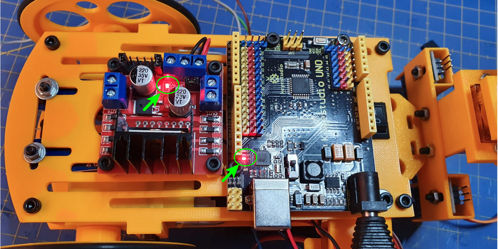
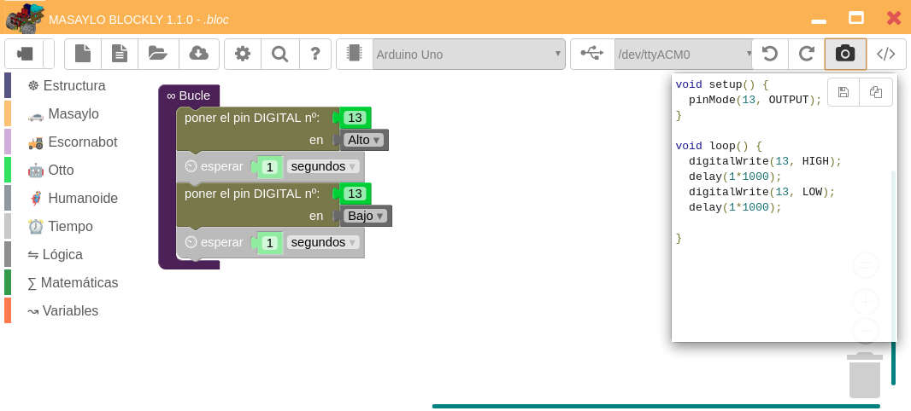
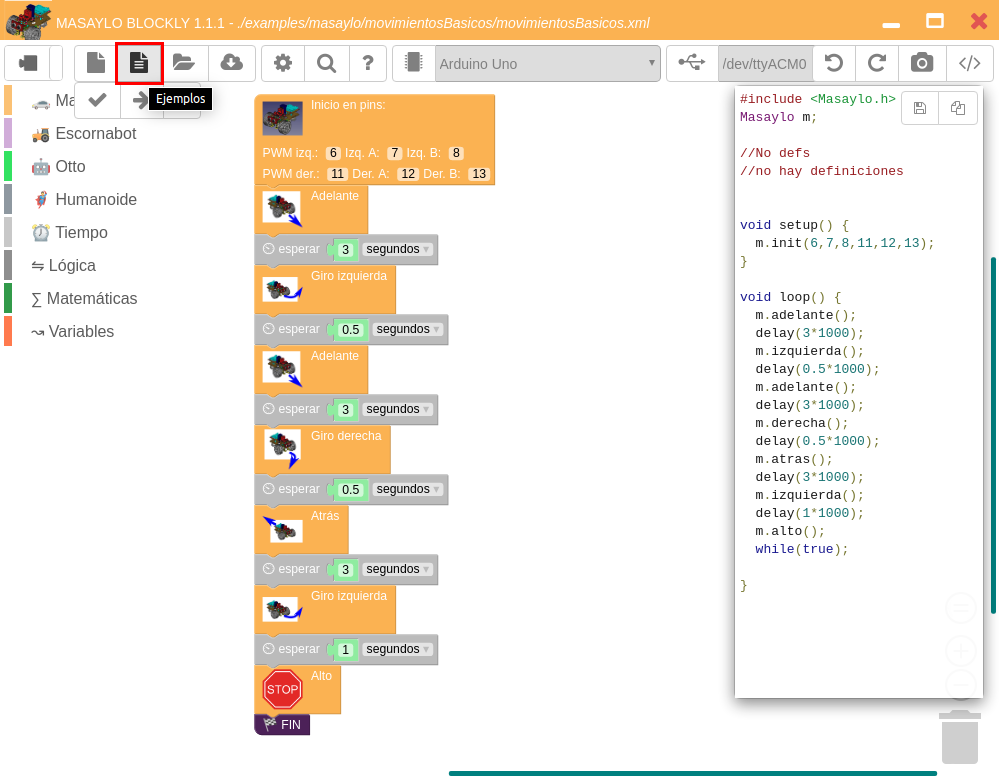
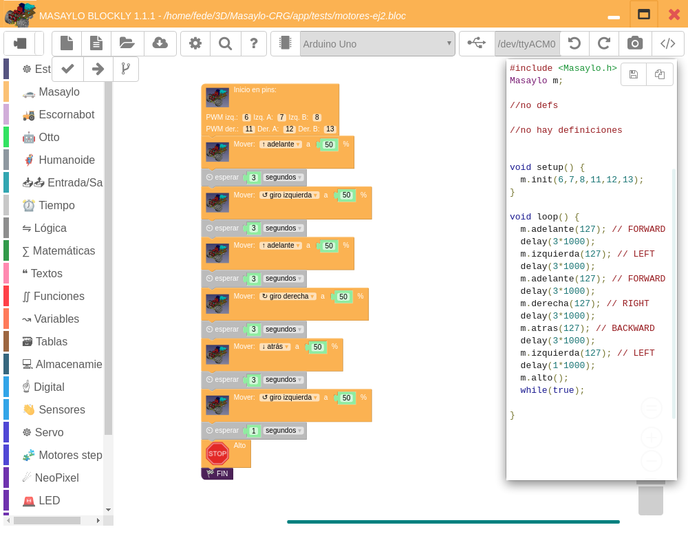

# Pruebas básicas de funcionamiento
Una vez analizados y conectados los distintos elementos iremos, de forma progresiva, haciendo un pequeño programa mediante la aplicación `Masaylo Blockly` basada en `Blocklino de Fontaine Jean Philippe`, y pensada para programar robots utilizando un entorno gráfico o de programación por bloques. En el apartado de software se pueden encontrar los enlaces de descarga y toda la información de la aplicación.

## **Alimentación**
Colocamos las pilas AA en su lugar respetando la polaridad de las mismas y accionamos el interruptor. Si todo es correcto en ambas placas se debe encender un diodo LED rojo indicativo de que están alimentadas, tal y como observamos en la imagen siguiente:

| Primer encendido |
|:-:|
|  |

En este punto vamos a probar también que se graba correctamente firmware en la placa UNO a partir de `Masaylo Blockly 1.1.0`. Para ello hemos creado y almacenado el programa [blink.bloc](../conexionado-pruebas/tests/blink.bloc) que vemos en la imagen siguiente.

| Programa blink.bloc |
|:-:|
|  |

Si cargamos el programa y dejamos sin accionar el interruptor observaremos como parpadea el LED asociado al pin 13 en la placa UNO pero la placa del driver no está alimentada y por tanto su LED permanece apagado. En la animación siguiente vemos el parpadeo del LED y el resultado de accionar el interruptor.

| Animación que muestra el funcionamiento del programa blink.bloc y del interruptor |
|:-:|
|  |

Este GIF se ha creado a partir de un video en formato mp4 utilizando FFMPEG y GIMP y la información obtenida en [este enlace](https://ubunlog.com/gif-animados-vlc-ffmpeg-gimp/).

## **Motores**
Vamos a realizar una primera prueba del funcionamiento de los motores a partir de los ejemplos suministrados con la librería y disponibles en la aplicación `Masaylo Blockly` que estamos usando en estas pruebas de funcionamiento. En la imagen siguiente tenemos cargado el ejemplo *Aprende a controlar los movimientos básicos del robot Masaylo* y hemos destacado el icono desde el que podemos seleccionarlo de la lista que se abre en una ventana emergente y que al hacer clic nos lo carga en el entorno de la aplicación.

| Ejemplo Aprende a controlar los movimientos básicos del robot Masaylo cargado |
|:-:|
|  |

Si conectamos la placa al puerto USB del ordenador y cargamos el ejemplo en la placa, cuando accionemos el interruptor (o con este accionado pulsemos el botón de reset) se producirá la secuencia de movimiento establecida en el programa que podemos apreciar en la animación siguiente.

| Animación que muestra el funcionamiento del programa motores-ej1.bloc |
|:-:|
|  |

El ejemplo siguiente está basado en *Utiliza PWM para controlar la velocidad de movimientos del Masaylo* suministrado con la aplicación pero ligeramente modificado ([motores-ej2.bloc](../conexionado-pruebas/tests/motores-ej2.bloc)) para poner todos los valores de PWM al 50% y todos los retardos a 3 segundos.

| Ejemplo con control PWM de Masaylo |
|:-:|
|  |

El funcionamiento es muy similar al de la animación anterior pero a la mitad de velocidad.
