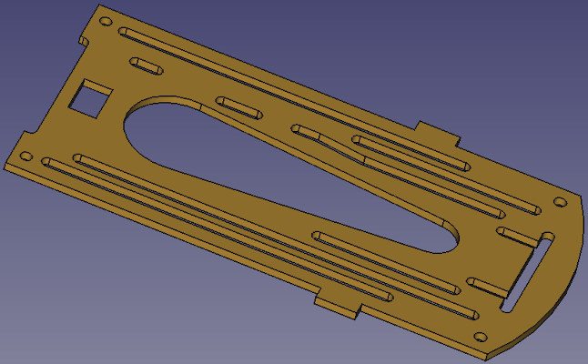
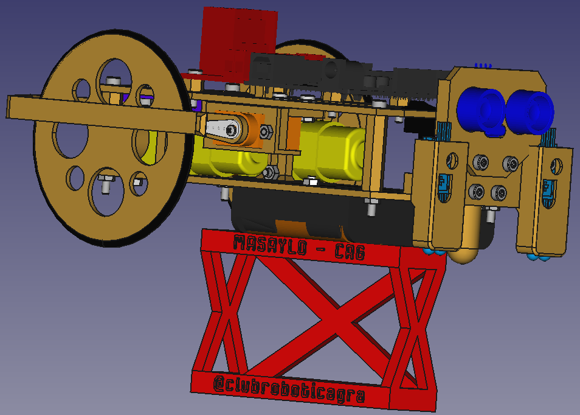
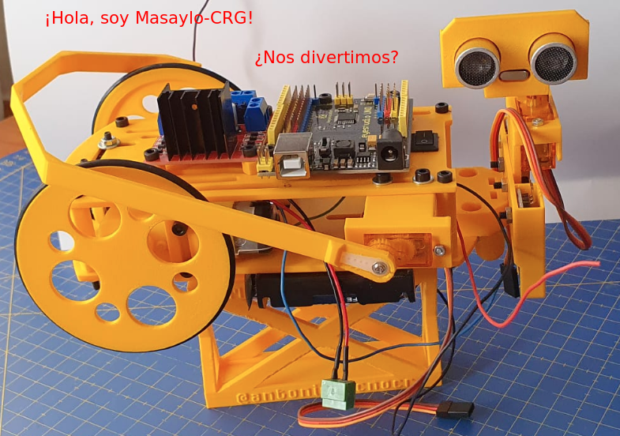

# Materiales necesarios y ensamblado plataforma superior

***

## **Plataforma superior**
En esta pieza es donde vamos a colocar el servo para el brazo aparta objetos y los elementos de electrónica correspondientes a cada versión. El brazo lo podemos color tanto a la derecha como a la izquierda y recordemos que de forma opcional podemos poner también el soporte del zumbador o un sensor fijo de ultrasonidos. El aspecto de la pieza denominada plataforma superior lo vemos en la imagen siguiente.

| Plataforma superior en fase de diseño | Plataforma superior |
|:-:|:-:|
|  |  |

## **Brazo aparta objetos**
Se trata de una especie de gancho accionado por un servo SG-90 que nos va a servir para apartar objetos detectado por el sensor HC-SR04 de nuestro camino. La idea es que el brazo estará normalmente replegado hacia las ruedas y que, cuando vamos siguiendo una línea o resolviendo un laberinto o simplemente desplazándonos con el robot y detectamos enfrente un objeto del tamaño de una lata de refresco, se accione el brazo para envolverlo, el robot realice un giro arrastrando el objeto fuera de su trayectoria, posteriormente deshaga el giro, retraiga el brazo y continue su camino. El aspecto del brazo en fase de diseño e impreso lo vemos en la imagen siguiente.

| Brazo en fase de diseño | Brazo impreso |
|:-:|:-:|
|  |  |

| **P7. Brazo aparta objetos** | Imágenes |
|---|:-:|
|  Necesitamos:  - 1 brazo impreso  - 1 soporte para servo impreso  - 1 pala de un brazo para el servo  - 1 tornillo de rosca chapa de los que vienen con el servo  - 1 servo SG-90  - 2 tornillos M2x10mm  - 2 tuercas M2  - 2 tornillos M3x10mm  - 2 tuercas M3  Montamos el servo en su soporte y lo sujetamos con los tornillos M2x10. Colocamos la pala en el alojamiento del brazo y atornillamos este conjunto al servo con el tornillo de rosca chapa. El conjunto anterior lo montamos sobre la plataforma superior en el lugar escogido para ello que deberá estar lo mas cercano posible a la parte delantera del robot si imprimimos el brazo a su tamaño original. 
 
En las imágenes vemos el aspecto de las piezas tanto en fase de diseño como impresas -->
  Es conveniente realizar el posicionamiento del engranaje del servo de forma adecuada antes de continuar. Teniendo en cuenta que el servo puede girar 180º colocamos el engranaje con la mano o con ayuda de una de las palas del servo en tal posición que permita el movimiento correcto del brazo o del sensor de ultrasonidos.  |     |

En las imagenes siguientes vemos la plataforma superior con el brazo colocado.

| Plataforma superior con brazo en fase de diseño | Plataforma superior con brazo |
|:-:|:-:|
|  |  |

## **Interruptor, Placa UNO y driver motores**
Introducimos el interruptor en el orificio rectangular de la plataforma superior destinado para ello y ejerciendo un poco de presión lo encajamos en su lugar.

| **P8. Placa UNO y driver motores** | Imágenes |
|---|:-:|
|  Necesitamos:  - 7 separadores M3x5mm impresos  - 7 tornillos M3x12mm  - 7 tuercas M3  - 1 placa UNO con pines extendidos  - 1 placa driver de motores L298  Utilizando separadores M3x5mm impresos y tornillos M3x12mm con sus tuercas, colocamos tanto la placa UNO como la placa de drivers en su lugar, que con el interruptor ya colocado nos deja la plataforma superior acabada. 
 
En la imágen vemos el aspecto del separador en fase de diseño -->
  |   |

En la imagen siguiente vemos la plataforma superior en el estado actual.

| Plataforma superior finalizada en fase de diseño |
|:-:|
|  |

## **Ensamble de las dos plataformas**

| **P9. Ensamble de las dos plataformas** | Imágenes |
|---|:-:|
|  Necesitamos:  - 4 separadores M3x28mm impresos  - 4 tornillos M3x40mm  - 4 tuercas M3  Utilizando los separadores M3x28mm impresos y tornillos M3x40mm con sus tuercas, sujetamos la plataforma superior a la inferior. 
 
En la imágen vemos el aspecto del separador en fase de diseño -->
  |   |

En la imagen siguiente vemos las dos plataformas montadas.

| Plataformas superior e inferior montadas en fase de diseño | Plataformas superior e inferior montadas |
|:-:|:-:|
|  | |

## **Sensores de ranura**
El último paso a realizar es colocar los sensores de ranura sujetos a la plataforma superior y alineados con los discos ranurados de forma que estos giren libremente.

| **P10. Sensores de ranura** | 
|---|
|  Necesitamos:  - 2 sensores de ranura  - 2 tornillos M3x10mm  - 2 tuercas M3  - 2 arandelas M3  Sujetamos ambos sensores en su lugar. 
 |

En las imagenes siguientes vemos mas en detalle el aspecto de estos sensores montados en su lugar.

| Sensores de ranura en fase de diseño | Sensores de ranura montados |
|:-:|:-:|
|  | |

## **Aspecto final del robot**
Una vez finalizado el montaje de todos los elementos el robot presenta, en fase de diseño, el aspecto que vemos en las imágenes siguientes.

| Robot ensamblado en fase de diseño | Robot ensamblado en fase de diseño sobre el soporte de pruebas |
|:-:|:-:|
|  | |

En las imágenes siguientes vemos el robot con el ensamblado finalizado.

| Robot ensamblado | Robot ensamblado |
|:-:|:-:|
|  | |

En la imagen siguiente vemos el robot ensamblado colocado sobre el soporte de pruebas listo para comenzar el conexionado y pruebas del montaje.

| Robot ensamblado sobre su soporte |
|:-:|
|  |

