# Materiales necesarios y ensamblado

***

Vamos a realizar el paso a paso de montaje del robot utilizando para ellos la versión **MASAYLO-CRG-UNO**. El montaje de las otras versiones es totalmente similar y la única diferencia va a estar en la placa de control teniendo la plataforma superior habilitadas orificios para las distintas placas. En cada uno de los pasos iremos indicando los materiales necesarios para su consecución.

Las herramientas necesarias para llevar a cabo el proceso van a depender del tipo de cabeza de tornillo que utilicemos, pero en cualquier caso necesitaremos destornilladores adecuados y unos alicates de punta plana por si es necesario sujetar algún tornillo.

Para los motores y el interruptor necesitaremos unos trozos de cable de distintos colores (rojo y negro a ser posible para distinguir bien la alimentación) de entre 10 y 15 cm de longitud. Estos cables irán directamente soldados a las patillas correspondientes de los motores y del interruptor. En el apartado correspondiente se detalla el proceso.

## Motores, Portapilas e interruptor

**Materiales para los motores:** Si partimos de la base que los motores no vienen ya preinstalados con cables, necesitamos

* 2 motores DC de 3 a 6V con reductora
* 4 trozos de hilos de diferentes colores
* Tijeras o pelacables.
* Soldador para electrónica.
* Se aconseja usar estaño de 1mm sin plomo con núcleo de resina y composición del 99% de Sn, 3% de Ag y 0.7% de Cu.

En la imagen 1 podemos ver los motores y los cables y observamos que los extremos de los cables que están pelados son de cobre sin estañar, por lo que antes de soldarlos en los terminales de los motores habrá que proceder a su estañado.

| Imagen 1 |
|:-:|
| 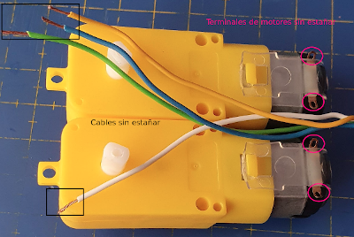 |
| Motores y cables sin soldar |

En la imagen 2 vemos el aspecto de los motores una vez cableados. Es evidente que si adquirimos los motores con los cables ya preparados nos ahorramos este paso.

| Imagen 2 |
|:-:|
| 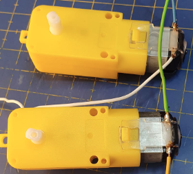 |
| Motores cableados |

**Materiales necesarios para el portapilas:** Lo ideal es adquirirlo con los cables ya instalados, tal y como vemos en la imagen 3, aunque existen otras opciones que tendremos que analizar en cada caso. Para este paso necesitamos

* 1 portapilas 5xAA

| Imagen 3 |
|:-:|
|  |
| Portapilas con cables |

**Materiales para el interruptor:** necesitamos

* 1 mini interruptor basculante de 2 Pines tipo SPST de 10.5x15mm.
* 2 trozos de hilos de diferentes colores, idealmente rojo y negro, para mantener el estándar de colores de alimentación.

En la imagen 4 tenemos el interruptor preparado para la instalación. Debemos tener presente que con los cables soldados y la forma de colocación del interruptor (por presión en la plataforma superior) no podemos tener realizadas las conexiones a priori, es mas interesante realizar estas conexiones mediante, por ejemplo una clema, que permite un montaje cómodo y que podemos quitar si es necesario en el futuro.

| Imagen 4 |
|:-:|
| 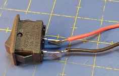 |
| Interruptor cableado |

## Motores, Portapilas e interruptor (otra opción)

| **Previo. Materiales para los motores** | Imágenes |
|---|:-:|
|  Si partimos de la base que los motores no vienen ya preinstalados con cables, necesitamos:  - 2 motores DC de 3 a 6V con reductora  - 4 trozos de hilos de diferentes colores  - Tijeras o pelacables  - Soldador para electrónica  - Se aconseja usar estaño de 1mm sin plomo con núcleo de resina y composición del 99% de Sn, 3% de Ag y 0.7% de Cu  
En la imagen superior vemos los motores y los cables sin soldar -->
  |  |
|   
En la imagen inferior vemos los motores con los cables soldados -->
   |  |

| **Previo. Materiales necesarios para el portapilas** | Imágenes |
|---|:-:|
|  Lo ideal es adquirirlo con los cables ya instalados, aunque existen otras opciones que tendremos que analizar en cada caso. Para este paso necesitamos  - 1 portapilas 5xAA    Aunque sobresaldrá un poco por los laterales también nos puede valer un portapilas 6xAA  
En la imagen vemos el portapilas preparado con los cables -->
  |  |

| **Previo. Materiales para el interruptor** | Imágenes |
|---|:-:|
|  Necesitamos:    - 1 mini interruptor basculante de 2 Pines tipo SPST de 10.5x15mm  - 2 trozos de hilos de diferentes colores, idealmente rojo y negro, para mantener el estándar de colores de alimentación   Debemos tener presente que con los cables soldados y la forma de colocación del interruptor (por presión en la plataforma superior) no podemos tener realizadas las conexiones a priori, es mas interesante realizar estas conexiones mediante, por ejemplo una clema, que permite un montaje cómodo y que podemos quitar si es necesario en el futuro.  
En la imagen tenemos el interruptor preparado para la instalación -->
  |  |

## Plataforma base

**Materiales:** necesitamos

* 1 plataforma base impresa
* 1 portapilas
* 2 motores DC de 3 a 6V con reductora ya cableados
* 2 tornillos M3x8mm de cabeza avellanada
* 4 tornillos M3x30mm
* 6 tuercas M3

En la imagen 5a vemos el aspecto de la plataforma base en fase de diseño y en la imagen 5b una vez impresa.

| Imagen 5a | Imagen 5b |
|:-:|:-:|
| 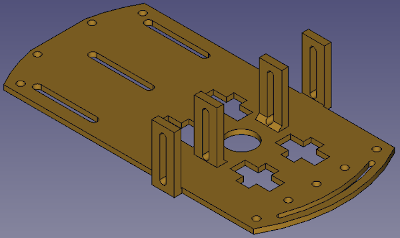 | 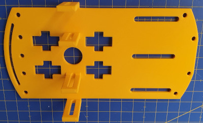 |
| Plataforma base en fase de diseño | Plataforma base impresa |

Sujetamos el portapilas a la base utilizando los dos tornillos M3x8 y dos tuercas. Debe queda como observamos en la imagen 6. La posición del portapilas es tal que queda bajo la base.

| Imagen 6a | Imagen 6b |
|:-:|:-:|
| 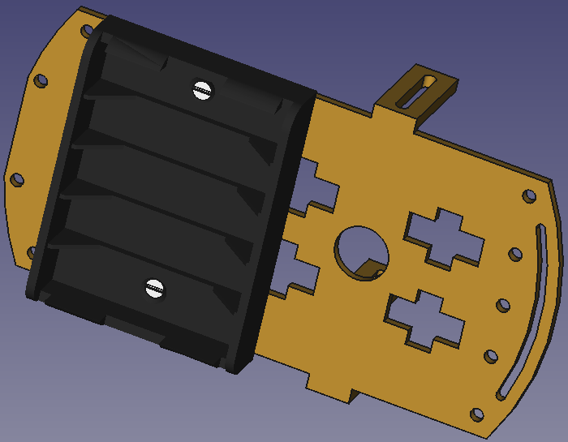 | 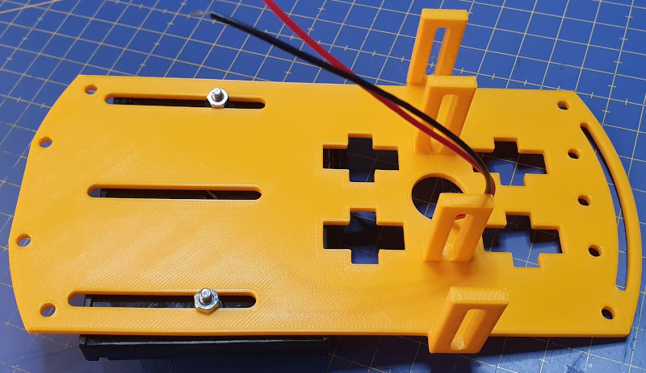 |
| Plataforma base con portapilas en fase de diseño | Plataforma base y portapilas |

Utilizando dos tornillos M3x30 y dos tuercas por cada motor los colocamos y atornillamos tal y como observamos en la imagen 7, teniendo cuidado de que los motores queden bien pegados a la base. La posición exacta de los motores viene determinada por los orificios existentes en su carcasa y las ranuras de las pestañas verticales de la pieza impresa, que deben quedar alineadas. En esta etapa es conveniente, tal y como se aprecia en las imágenes, que el disco perforado del encoder esté situado en el eje del motor y que situaremos de manera que quede mas o menos centrado en la ranura de la base.

| Imagen 7a | Imagen 7b |
|:-:|:-:|
| 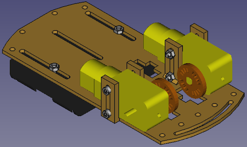 | 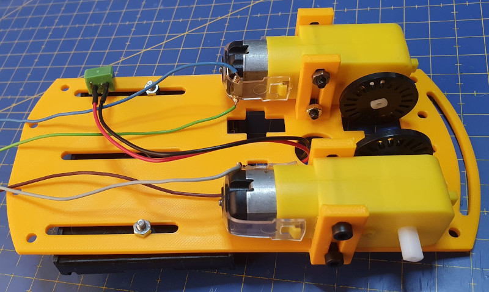 |
| Plataforma base con motores en fase de diseño | Plataforma base con motores |

## Opción buzzer en la base

Si optamos por colocar el zumbador pasivo en la plataforma base seguimos con este apartado, cuyo proceso es el mismo si finalmente colocamos el dispositivo en la plataforma superior.

| Imagen 8a | Imagen 8b |
|:-:|:-:|
| 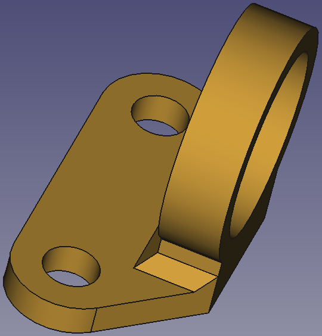 | 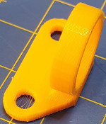 |
| Soporte para buzzer en fase de diseño | Soporte para buzzer impreso |

**Materiales:** necesitamos

* 1 soporte para buzzer como el de la imagen 8 impreso
* 1 zumbador pasivo
* 2 tornillos M3x8mm
* 2 tuercas M3
* 2 cables tipo dupont H-H de 20 cm

En la imagen 9 vemos la plataforma base con el soporte para buzzer colocado.

| Imagen 9a | Imagen 9b |
|:-:|:-:|
| 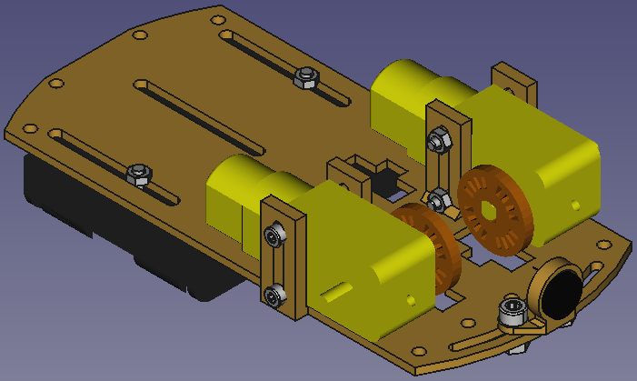 | 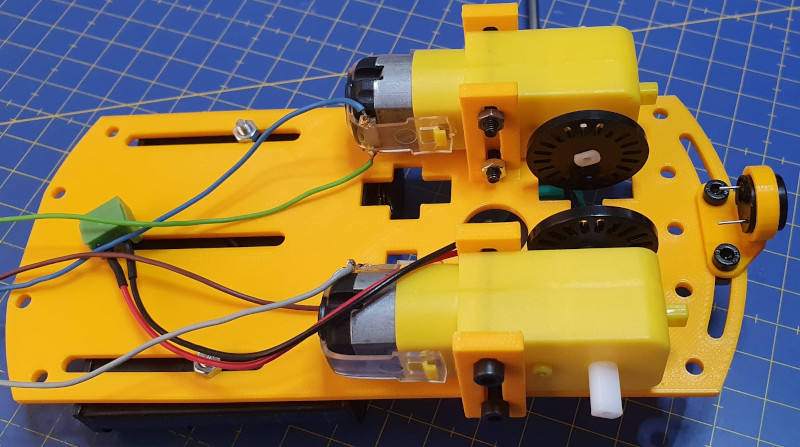 |
| Plataforma base con buzzer en fase de diseño | Plataforma base con buzzer |

## Ballcaster y porta sensores IR

