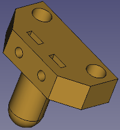
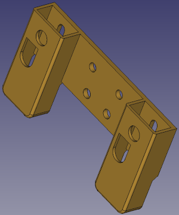
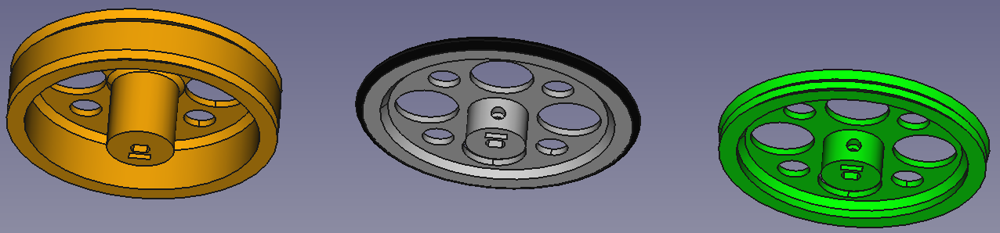
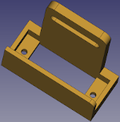

# Materiales necesarios y ensamblado plataforma base

***

Vamos a realizar el paso a paso de montaje del robot utilizando para ellos la versión **MASAYLO-CRG-UNO**. El montaje de las otras versiones es totalmente similar y la única diferencia va a estar en la placa de control teniendo la plataforma superior habilitadas orificios para las distintas placas. En cada uno de los pasos iremos indicando los materiales necesarios para su consecución.

Las herramientas necesarias para llevar a cabo el proceso van a depender del tipo de cabeza de tornillo que utilicemos, pero en cualquier caso necesitaremos destornilladores adecuados y unos alicates de punta plana por si es necesario sujetar algún tornillo.

Para los motores y el interruptor necesitaremos unos trozos de cable de distintos colores (rojo y negro a ser posible para distinguir bien la alimentación) de entre 10 y 15 cm de longitud. Estos cables irán directamente soldados a las patillas correspondientes de los motores y del interruptor. En el apartado correspondiente se detalla el proceso.

## Motores, Portapilas e interruptor

| **P0. Motores** | Imágenes |
|---|:-:|
|  Si partimos de la base que los motores no vienen ya preinstalados con cables, necesitamos:  - 2 motores DC de 3 a 6V con reductora  - 4 trozos de hilos de diferentes colores  - Tijeras o pelacables  - Soldador para electrónica  - Se aconseja usar estaño de 1mm sin plomo con núcleo de resina y composición del 99% de Sn, 3% de Ag y 0.7% de Cu  
En la imagen vemos los motores y los cables sin soldar -->
  |  |
|   
En la imagen vemos los motores con los cables soldados -->
   |  |

| **P0. Portapilas** | Imágenes |
|---|:-:|
|  Lo ideal es adquirirlo con los cables ya instalados, aunque existen otras opciones que tendremos que analizar en cada caso. Para este paso necesitamos  - 1 portapilas 5xAA    Aunque sobresaldrá un poco por los laterales también nos puede valer un portapilas 6xAA  
En la imagen vemos el portapilas preparado con los cables -->
  |  |

| **P0. Interruptor** | Imágenes |
|---|:-:|
|  Necesitamos:    - 1 mini interruptor basculante de 2 Pines tipo SPST de 10.5x15mm  - 2 trozos de hilos de diferentes colores, idealmente rojo y negro, para mantener el estándar de colores de alimentación   Debemos tener presente que con los cables soldados y la forma de colocación del interruptor (por presión en la plataforma superior) no podemos tener realizadas las conexiones a priori, es mas interesante realizar estas conexiones mediante, por ejemplo una clema, que permite un montaje cómodo y que podemos quitar si es necesario en el futuro.  
En la imagen tenemos el interruptor preparado para la instalación -->
  |  |

## Plataforma base
En fase de diseño el aspecto de la plataforma base lo vemos en la imagen siguiente.

| **P1. Plataforma base** | Imágenes |
|---|:-:|
|  Necesitamos:  - 1 plataforma base impresa   - 1 portapilas  - 2 motores DC de 3 a 6V con reductora ya cableados  - 2 tornillos M3x8mm de cabeza avellanada  - 4 tornillos M3x30mm  - 6 tuercas M3   
En la imagen vemos el aspecto de la plataforma base una vez impresa -->
  |  |
| Sujetamos el portapilas a la base utilizando los dos tornillos M3x8 y dos tuercas.   
Debe queda como observamos en la imagen quedando el portapilas bajo la base -->
  |  |
| Utilizando dos tornillos M3x30 y dos tuercas por cada motor los colocamos y atornillamos a la plataforma base, teniendo cuidado de que los motores queden bien pegados a la base. La posición exacta de los motores viene determinada por los orificios existentes en su carcasa y las ranuras de las pestañas verticales de la pieza impresa, que deben quedar alineadas. En esta etapa es conveniente, tal y como se aprecia en la imágen, que el disco perforado del encoder esté situado en el eje del motor y que este quede mas o menos centrado en la ranura de la base.   
En la imagen vemos como debe quedar -->
  |  |

En las imágenes siguientes vemos los pasos anteriores en fase de diseño

| Plataforma base con portapilas | Plataforma base con motores |
|:-:|:-:|
|  |  |

## Opción zumbador pasivo

Podemos optar por colocar el zumbador pasivo en la plataforma base o bien colocarlo en la plataforma superior. A continuación vemos el aspecto de la pieza en fase de diseño.

| **P2. Zumbador pasivo** | Imágenes |
|---|:-:|
|  Necesitamos:  - 1 soporte para buzzer impreso   - 1 zumbador pasivo  - 2 tornillos M3x8mm  - 2 tuercas M3  - 2 cables tipo dupont H-H de 20 cm   
En la imagen vemos el aspecto de la pieza impresa -->
  |  |

En la imagen siguiente vemos la plataforma base con el soporte para zumbador colocado en su lugar, tanto en fase de diseño como en la realidad.

| Plataforma base con buzzer en fase de diseño | Plataforma base con buzzer |
|:-:|:-:|
|  |  |

## Ballcaster y porta sensores IR
En realidad esta pieza podría ser una solamente pero se ha dividido en dos para evitar el uso de soportes en la impresión. El aspecto en tiempo de diseño de ambas piezas lo vemos en las imagenes siguientes: 

| | |

| **P3. Rueda loca y porta sensores de infrarrojos** | Imágenes |
|---|:-:|
|  Necesitamos:  - 1 ballcaster impreso  - 1 portasensores IR impreso  - 2 tornillos M3x8mm  - 4 tornillos M3x10mm  - 6 tuercas M3  - 2 sensores IR de distancia ajustable detección 2 a 30cm  - 6 cables tipo dupont H-H de 20 cm  Colocamos y atornillamos los sensores IR con los tornillos M3x8. Empotramos dos tuerca M3 en la pieza ballcaster y colocamos esta pieza en la parte posterior del porta sensores alineando con los agujeros inferiores y atornillando con dos tornillos M3x10. Finalmente atornillamos el conjunto a la plataforma base utilizando dos tornillos M3x10 y alineando con los agujeros centrales de la base en la parte que muestra un trozo plano 
En la imagen vemos el aspecto del conjunto montado sobre las piezas impresas -->
  |     |

En la imagen siguiente vemos la plataforma base con el soporte para sensores de infrarrojos y rueda loca colocados en su lugar, tanto en fase de diseño como en la fase montaje real.

| Plataforma base con sensor IR en fase de diseño | Plataforma base con sensor IR |
|:-:|:-:|
|  |  |

## Ruedas
Nuestra propuesta va a incluir tres diseños que van a tener como diferencia el número y la posición de juntas tóricas. Las ruedas van a tener un radio exterior de 38 mm con una ranura que permite alojar una junta tórica de 75 mm de diámetro exterior y sección transversal de 3mm de diámetro. En la imagen siguiente vemos a la izquierda el modelo para dos juntas con separación de 10 mm entre ambas, en el centro la de una sola con la junta colocada y a la derecha tenemos el modelo de dos juntas sin distancia entre las mismas. Observamos como los diseños interiores de las ruedas son iguales en cuanto a geometría e indicaremos que el número y la posición de las juntas se establece para dar solución a las diferentes adherencias de superficies y evitar en lo posible que las ruedas derrapen cuando giran.

El orificio con la forma del eje del motor está dimensionado para que la rueda quede bien acoplada simplemente presionando sobre el eje, pero somos conscientes de que las impresoras 3D tienen ciertas tolerancias y no todas van a darnos exactamente las mismas dimensiones, por ello hemos previsto la posibilidad de realizar la sujeción mediante tornillo que ejerza presión contra el eje del motor y tuerca empotrada en el cilindro de la rueda. Este paso de montaje va a depender de la opción escogida y de si usamos o no tornillo prisionero.

| **P4. Ruedas** | Imágenes |
|---|:-:|
|  Necesitamos:  - 2 ruedas impresas del modelo escogido  - 2 (o 4) juntas tóricas de 75x3mm  - 2 tornillos M3x10mm  - 2 tuercas M3  Colocamos haciendo presión si es necesario una rueda en cada eje de motor. Si es necesario porque el encaje anterior tiene holgura, empotramos una tuerca M3 en cada rueda y fijamos la posición de la rueda utilizando el tornillo prisionero. En la imagen inferior vemos el detalle del tornillo prisionero. 
  
 
En la imagen vemos el aspecto del conjunto montado con las ruedas de una junta -->
  | |

En las imagenes siguientes vemos la plataforma base con cada tipo de ruedas en fase de diseño.

| Plataforma base con ruedas una junta | Plataforma base con ruedas dos juntas | Plataforma base con ruedas dos juntas separadas |
|:-:|:-:|:-:|
|  |  |  |

## Soporte para servo SG-90
En esta pieza es donde colocamos y atornillamos el servo motor tanto para el brazo aparta objetos como para el sensor de ultrasonidos móvil. Si vamos a optar por la opción de ultrasonidos fijo solamente debemos montar un servo pero si optamos por la opción con sensor de ultrasonidos móvil debemos montar dos conjuntos.

| **P5. Servo SG-90** | Imágenes |
|---|:-:|
|  Necesitamos:  - 1 (o 2) soporte para servo impreso  - 1 (o 2) servomotores SG-90  - 2 (o 4) tornillos M2x10mm  - 2 (o 4) tuercas M2  Colocamos el servo en la pieza y lo sujetamos utilizando los tornillos M2x10. 
 
En las imágenes vemos el aspecto de la pieza tanto en fase de diseño como impresa -->
  Es conveniente realizar el posicionamiento del engranaje del servo de forma adecuada antes de continuar. Teniendo en cuenta que el servo puede girar 180º colocamos el engranaje con la mano o con ayuda de una de las palas del servo en tal posición que permita el movimiento correcto del brazo o del sensor de ultrasonidos.  |     |

En las imagenes siguientes vemos el soporte con el servo colocado.

| Portaservo con servo en fase de diseño | Portaservo impreso con servo |
|:-:|:-:|
|  |  |

## Soporte sensor de ultrasonidos HC-SR04
Tenemos dos opciones disponibles, un soporte fijo que podemos colocar tanto en la parte superior del porta sensores IR o utilizando alguna de las ranuras de las plataformas superior o inferior, y un soporte móvil accionado por un servo pensado para colocarlo a modo de *cabeza giratoria* también en la parte superior del porta sensores de IR. En ambos casos el sensor se coloca presionando ligeramente para que encaje en las pestañas del porta sensores. En las imágenes siguientes tenemos ambos tipos de soportes tanto en modo diseño como impresos.

| Porta HC-SR04 fijo fase diseño | Porta HC-SR04 fijo impreso | Porta HC-SR04 móvil fase diseño | Porta HC-SR04 móvil impreso |
|:-:|:-:|:-:|:-:|
|  |  | | |

| **P6. Sensor de ultrasonidos HC-SR04** | Imágenes |
|---|:-:|
|  Necesitamos:  - 1 soporte fijo para sensor HC-SR04 impreso  - 1 soporte móvil para sensor HC-SR04 impreso  - 1 (o 2) pala de un brazo para el servo  - 1 (o 2) tornillos de rosca chapa de los que vienen con el servo  - 1 servo montado en su soporte  - 2 tornillos M3x10mm  - 2 tuercas M3  Colocamos el sensor de ultrasonidos en su alojamiento en el soporte fijo o móvil elegido. Si hemos escogido soporte fijo sujetamos este con dos tornillos M3x10 en el lugar escogido y si hemos escogido el soporte móvil sujetamos el soporte del sensor al servo con el tornillo de rosca chapa colocando la pala en la cabeza del servo. 
 
En las imágenes vemos el aspecto de las piezas tanto en fase de diseño como impresas -->
  Es conveniente realizar el posicionamiento del engranaje del servo de forma adecuada antes de continuar. Teniendo en cuenta que el servo puede girar 180º colocamos el engranaje con la mano o con ayuda de una de las palas del servo en tal posición que permita el movimiento correcto del brazo o del sensor de ultrasonidos.  |         |

En las imagenes siguientes vemos la plataforma base finalizada con todas sus opciones colocadas.

| Plataforma base finalizada en fase de diseño | Plataforma base finalizada |
|:-:|:-:|
|  |  |

