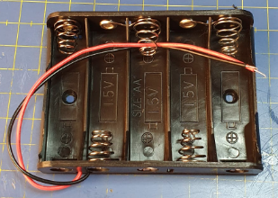
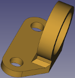

# Materiales necesarios y ensamblado

***

Vamos a realizar el paso a paso de montaje del robot utilizando para ellos la versión **MASAYLO-CRG-UNO**. El montaje de las otras versiones es totalmente similar y la única diferencia va a estar en la placa de control teniendo la plataforma superior habilitadas orificios para las distintas placas. En cada uno de los pasos iremos indicando los materiales necesarios para su consecución.

Las herramientas necesarias para llevar a cabo el proceso van a depender del tipo de cabeza de tornillo que utilicemos, pero en cualquier caso necesitaremos destornilladores adecuados y unos alicates de punta plana por si es necesario sujetar algún tornillo.

Para los motores y el interruptor necesitaremos unos trozos de cable de distintos colores (rojo y negro a ser posible para distinguir bien la alimentación) de entre 10 y 15 cm de longitud. Estos cables irán directamente soldados a las patillas correspondientes de los motores y del interruptor. En el apartado correspondiente se detalla el proceso.

## Motores, Portapilas e interruptor

| **P0. Motores** | Imágenes |
|---|:-:|
|  Si partimos de la base que los motores no vienen ya preinstalados con cables, necesitamos:  - 2 motores DC de 3 a 6V con reductora  - 4 trozos de hilos de diferentes colores  - Tijeras o pelacables  - Soldador para electrónica  - Se aconseja usar estaño de 1mm sin plomo con núcleo de resina y composición del 99% de Sn, 3% de Ag y 0.7% de Cu  
En la imagen vemos los motores y los cables sin soldar -->
  |  |
|   
En la imagen vemos los motores con los cables soldados -->
   |  |

| **P0. Portapilas** | Imágenes |
|---|:-:|
|  Lo ideal es adquirirlo con los cables ya instalados, aunque existen otras opciones que tendremos que analizar en cada caso. Para este paso necesitamos  - 1 portapilas 5xAA    Aunque sobresaldrá un poco por los laterales también nos puede valer un portapilas 6xAA  
En la imagen vemos el portapilas preparado con los cables -->
  |  |

| **P0. Interruptor** | Imágenes |
|---|:-:|
|  Necesitamos:    - 1 mini interruptor basculante de 2 Pines tipo SPST de 10.5x15mm  - 2 trozos de hilos de diferentes colores, idealmente rojo y negro, para mantener el estándar de colores de alimentación   Debemos tener presente que con los cables soldados y la forma de colocación del interruptor (por presión en la plataforma superior) no podemos tener realizadas las conexiones a priori, es mas interesante realizar estas conexiones mediante, por ejemplo una clema, que permite un montaje cómodo y que podemos quitar si es necesario en el futuro.  
En la imagen tenemos el interruptor preparado para la instalación -->
  |  |

## Plataforma base
En fase de diseño el aspecto de la plataforma base lo vemos en la imagen siguiente.

| **P1. Plataforma base** | Imágenes |
|---|:-:|
|  Necesitamos:  - 1 plataforma base impresa   - 1 portapilas  - 2 motores DC de 3 a 6V con reductora ya cableados  - 2 tornillos M3x8mm de cabeza avellanada  - 4 tornillos M3x30mm  - 6 tuercas M3   
En la imagen vemos el aspecto de la plataforma base una vez impresa -->
  |  |
| Sujetamos el portapilas a la base utilizando los dos tornillos M3x8 y dos tuercas.   
Debe queda como observamos en la imagen quedando el portapilas bajo la base -->
  |  |
| Utilizando dos tornillos M3x30 y dos tuercas por cada motor los colocamos y atornillamos a la plataforma base, teniendo cuidado de que los motores queden bien pegados a la base. La posición exacta de los motores viene determinada por los orificios existentes en su carcasa y las ranuras de las pestañas verticales de la pieza impresa, que deben quedar alineadas. En esta etapa es conveniente, tal y como se aprecia en la imágen, que el disco perforado del encoder esté situado en el eje del motor y que este quede mas o menos centrado en la ranura de la base.   
En la imagen vemos como debe quedar -->
  |  |

En las imágenes siguientes vemos los pasos anteriores en fase de diseño

| Plataforma base con portapilas | Plataforma base con motores |
|:-:|:-:|
|  |  |

## Opción zumbador pasivo

Podemos optar por colocar el zumbador pasivo en la plataforma base o bien colocarlo en la plataforma superior. A continuación vemos el aspecto de la pieza en fase de diseño.

| **P2. Zumbador pasivo** | Imágenes |
|---|:-:|
|  Necesitamos:  - 1 soporte para buzzer impreso   - 1 zumbador pasivo  - 2 tornillos M3x8mm  - 2 tuercas M3  - 2 cables tipo dupont H-H de 20 cm   
En la imagen vemos el aspecto de la pieza impresa -->
  |  |

En la imagen siguiente vemos la plataforma base con el soporte para zumbador colocado en su lugar, tanto en fase de diseño como en la realidad.

| Plataforma base con buzzer en fase de diseño | Plataforma base con buzzer |
|:-:|:-:|
|  |  |

## Ballcaster y porta sensores IR

## kkkk
