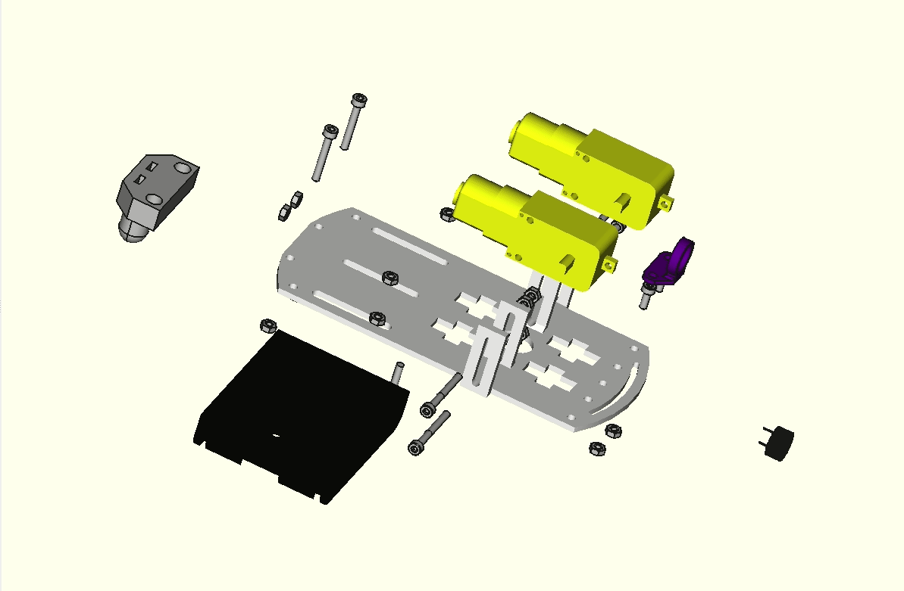
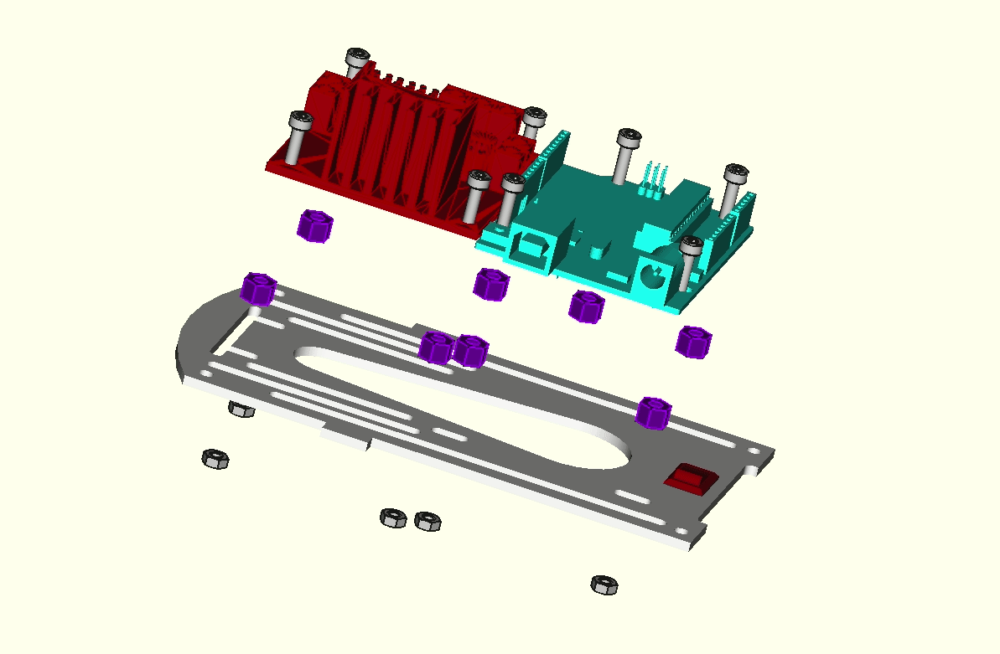
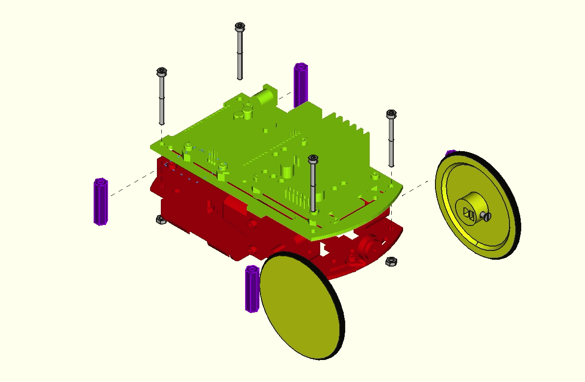
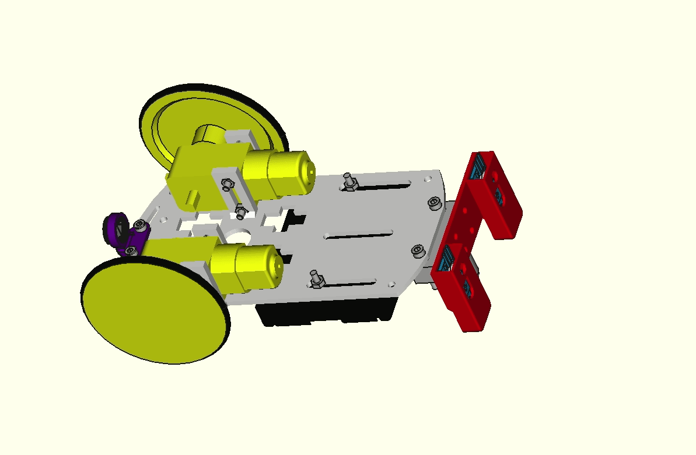

# Ejemplos de ensamblajes del robot
A continuación están los enlaces a los archivos fuente de ensamblado con FreeCAD y a sus correspondientes animaciones.

* **Motores, portapilas, buzzer y ballcaster**

| Fuente | Animación |
|:-:|:-:|
| [Ensamble motores, portapilas, buzzer y ballcaster](../ensamblesFreeCAD/src/ensamble1.FCStd) |  |

* **Driver L298 y placa UNO**

| Fuente | Animación |
|:-:|:-:|
| [Ensamble L298 y UNO](../ensamblesFreeCAD/src/ensamble2.FCStd) |  |

* **Plataformas inferior y superior y ruedas**

| Fuente | Animación |
|:-:|:-:|
| [Ensamble Plataformas y ruedas](../ensamblesFreeCAD/src/ensamble3.FCStd) |  |

* **Sensor de infrarrojos**

| Fuente | Animación |
|:-:|:-:|
| [Ensamble sensor IR](../ensamblesFreeCAD/src/ensamble4.FCStd) |  |

Si quieres verlos en FreeCAD debes tener instalado el banco de trabajo **Exploded Assembly**
