# Ficheros 3D para impresoras de alta precisión
***
En este apartado se incluyen los enlaces a los archivos originales de diseño y los archivos en formato stl y step.

Los archivos disponibles en este apartado están diseñados pensando en imprimir en una impresora del tipo [Prusa MK3S, MK3S+, Prusa Mini o Prusa Mini+](https://www.prusa3d.es/) Originales. Estas impresoras, además de tener una calidad de impresión muy buena, están optimizadas para que las impresiones finales tengan muy poca tolerancia, en lo que respecta a dimensiones, con relación a las medidas originales de diseño. Es muy posible,si no disponemos de impresoras como estas o de calidades similares, que al imprimir estos diseños tengamos algún problema a la hora de ensamblar nuestro robot y tengamos que retocar a mano ciertas partes. Ejemplos típicos de esto que se no han dado son el ajuste del eje de los motores a la ranura de la rueda o el encaje de las tuercas empotradas en su alojamientos.

**Si no dispones de una impresora como las citadas, o similar, te aconsejamos que utilices los archivos que se suministran en el apartado [3D precisión media](./ficheros-media.md)** para las piezas incluidas en dicho apartado.

## **Archivos fuente de diseño**
Creados con [FreeCAD](https://www.freecadweb.org/) que puedes modificar, cambiar según necesidades o utilizar para aprender el manejo de esta potente herramienta.

| Archivo | Comentarios |
|---|---|
| [plataforma-base-src.FCStd](../img/3D/src/plataforma-base-src.FCStd) | Para colocar el portapilas, los motores DC, el zumbador y el ballcaster o punto de apoyo estilo rueda loca |
| [soporte-zumbador-src.FCStd](../img/3D/src/soporte-zumbador-src.FCStd) | Para colocar un zumbador pasivo. Esta pieza también se puede colocar en la plataforma superior |
| [soporte-sensores-IR-ballcaster.FCStd](../img/3D/src/soporte-sensores-IR-ballcaster.FCStd) | Contiene dos piezas, el ballcaster y el soporte de los sensores verticales de IR |
| [soportes-ultrasonidos.FCStd](../img/3D/src/soportes-ultrasonidos.FCStd) | Contiene los soporte fijo y móvil para el sensor HC-SR04 |
| [plataforma-superior-src.FCStd](../img/3D/src/plataforma-superior-src.FCStd) | Para colocar cualquiera de las placas, el interruptor y sujetar el servo del brazo |
| [ruedas.FCStd](../img/3D/src/ruedas.FCStd) | Rueda con una sola junta tórica y dos versiones para dos juntas, una con esta juntas y la otra separadas. |
| [base-servo-src.FCStd](../img/3D/src/base-servo-src.FCStd) | Pieza para sujetar un servo tipo SG90 |
| [brazo-src.FCStd](../img/3D/src/brazo-src.FCStd) | Brazo aparta objetos con alojamiento para la pala del servo |
| [separadores-src.FCStd](../img/3D/src/separadores-src.FCStd) | M3x5 para placa UNO y driver y M3x28 para unir plataformas base y superior |
| [soporte-pruebas.FCStd](../img/3D/src/soporte-pruebas.FCStd) | Pieza pensada para poner encima el robot y poder hacer pruebas sin que este se mueva del sitio |
| [disco-encoder.FCStd](../img/3D/src/disco-encoder.FCStd) | Disco de 23 mm de diámetro con 20 ranuras para acoplable a eje de motor para encoder optico |
| [conjunto-src.FCStd](../img/3D/src/conjunto-src.FCStd) | Muestra la colocación de los distintos elementos en fase de diseño |
| [Todo en un archivo zip](../img/3D/src.zip) | Para descargar todos los archivos en un clic |

## **Archivos STL y STEP**
* Archivos en formato **stl**, listos para llevar a tu programa de laminación preferido y hacerlos realidad con tu impresora.

La configuración de impresión debe adaptarse en cada caso a la impresora disponible, aunque hacemos las siguientes recomendaciones:

- Balsas: No
- Soportes de impresión: No
- Resolución: 0,2 mm
- Relleno: 15 - 20%
- Marca de filamento: cualquiera
- Color del filamento: el preferido
- Material: PLA

* Archivos en formato **step**, para poder cargarlos en otros programas de diseño CAD.

En la tabla siguiente están los enlaces a estos dos tipos de ficheros.

| Imagen | Archivo STL | Archivo STEP |
|:-:|---|---|
| 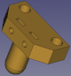 | [ballcaster.stl](../img/3D/stl/ballcaster.stl) | [ballcaster.step](../img/3D/step/ballcaster.step) |
| 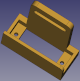 | [base-servo.stl](../img/3D/stl/base-servo.stl) | [base-servo.step](../img/3D/step/base-servo.step) |
| 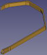 | [brazo.stl](../img/3D/stl/brazo.stl) | [brazo.step](../img/3D/step/brazo.step) |
| 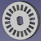 | [disco-encoder.stl](../img/3D/stl/disco-encoder.stl) | [disco-encoder.step](../img/3D/step/disco-encoder.step) |
| 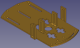 | [plataforma-base.stl](../img/3D/stl/plataforma-base.stl) | [plataforma-base.step](../img/3D/step/plataforma-base.step) |
| 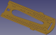 | [plataforma-superior.stl](../img/3D/stl/plataforma-superior.stl) | [plataforma-superior.step](../img/3D/step/plataforma-superior.step) |
|  | [rueda-una-junta.stl](../img/3D/stl/rueda-una-junta.stl) | [rueda-una-junta.step](../img/3D/step/rueda-una-junta.step) |
|  | [rueda-dos-juntas.stl](../img/3D/stl/rueda-dos-juntas.stl)| [rueda-dos-juntas.step](../img/3D/step/rueda-dos-juntas.step) |
|  | [rueda-dos-juntas-ancha.stl](../img/3D/stl/rueda-dos-juntas-ancha.stl)| [rueda-dos-juntas-ancha.step](../img/3D/step/rueda-dos-juntas-ancha.step) |
| 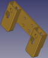 | [porta-sensores-IR.stl](../img/3D/stl/porta-sensores-IR.stl) | [porta-sensores-IR.step](../img/3D/step/porta-sensores-IR.step) |
| 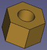 | [separador-M3x5.stl](../img/3D/stl/separador-M3x5.stl) | [separador-M3x5.step](../img/3D/step/separador-M3x5.step) |
| 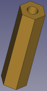 | [separador-M3x28.stl](../img/3D/stl/separador-M3x28.stl) | [separador-M3x28.step](../img/3D/step/separador-M3x28.step) |
| 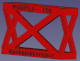 | [soporte-para-pruebas.stl](../img/3D/stl/soporte-para-pruebas.stl) | [soporte-para-pruebas.step](../img/3D/step/soporte-para-pruebas.step) |
| 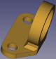 | [soporte-zumbador.stl](../img/3D/stl/soporte-zumbador.stl) | [soporte-zumbador.step](../img/3D/step/soporte-zumbador.step) |
| 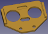 | [ultrasonidos-fijo.stl](../img/3D/stl/ultrasonidos-fijo.stl) | [ultrasonidos-fijo.step](../img/3D/step/ultrasonidos-fijo.step) |
| 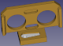 | [ultrasonidos-movil.stl](../img/3D/stl/ultrasonidos-movil.stl) | [ultrasonidos-movil.step](../img/3D/step/ultrasonidos-movil.step) |
| Todos los archivos en un zip | [Todos los stl en un zip](../img/3D/stl.zip) | [Todos los step en un zip](../img/3D/step.zip) |

