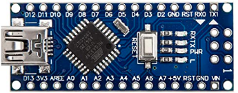
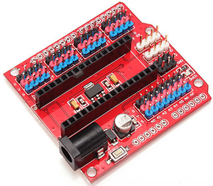
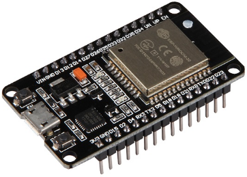
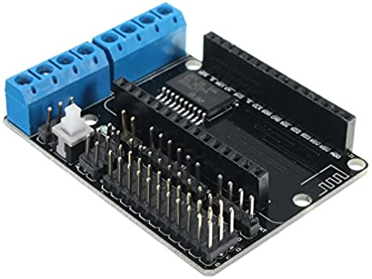

# MASAYLO - CRG
MASAYLO-CRG es un robot creado a partir de la idea de Antonio Gómez (https://github.com/agomezgar/masaylo) del que se van a desarrollar las tres versiones que se exponen a continuación

## **MASAYLO-CRG-UNO**
Esta versión, basada en la placa [Keyestudio UNO](https://wiki.keyestudio.com/Ks0172_keyestudio_UNO_with_Pin_Header_Interface) está pensada para que el alumnado de los últimos cursos de primaria y los del primer ciclo de ESO trabajen los temas STEAM. En la imagen siguiente vemos el aspecto que presenta el robot MASAYLO-CRG-UNO en fase de diseño. La programación de este modelo la podemos realizar a partir del IDE de Arduino (instalando la librería correspondiente) o a partir del entorno gráfico MASAYLOBLOCKLY.

| Aspecto general de MASAYLO-CRG-UNO |
|:|
|  |

## **MASAYLO-CRG-NANO** 
Se trata de un modelo totalmente similar al anterior pero que en esta ocasión va a utilizar una placa tipo Arduino Nano con una shield que permite también disponer de pines de conexionado rápido. En la imagen de la izquierda vemos la placa y en la de la derecha la shield. El aspecto del robot una vez montado es totalmente similar al de la imagen anterior con la salvedad del cambio de placa.

| Aspecto placa Nano | Aspecto de la shield para placa Nano |
|:|:|
|  |  |

## **MASAYLO-CRG-IoT** 
En este caso el modelo se implementa a partir de una placa Node MCU ESP32 con shield que incluye los drivers para motores. Este modelo se dirige a los últimos cursos de ESO, bachillerato y Ciclos Formativos y su principal objetivo, sin dejar atrás la sencillez del robot, es trabajar, además de los temas STEAM, el Internet Of Thing (IoT) o internet de las cosas. Básicamente el robot va dotado de conexión WiFi con todo lo que ello conlleva. La idea principal es poder programarlo a partir de un entorno de programación por bloques, poder desarrollar APPs para móviles o tablets para su control a partir de un entorno gráfico como Blocky, montando nuestro propio servidor para tal fin. Otro objetivo de este robot es poder realizar colaboraciones a distancia consistentes en, por ejemplo, ejercer el control de un robot situado en cualquier parte del mundo desde el lugar en el que el alumnado está trabajando con la APP. En la imagen siguiente a la izquierda vemos el aspecto de la placa ESP32 y a la derecha el de la shield. El aspecto del robot una vez montado es totalmente similar al montado para la versión UNO con la salvedad del cambio de placa y que el driver de motores está integrado en la shield.

| Aspecto placa Node MCU ESP32 de 30 pines | Aspecto de la shield para placa ESP32 |
|:|:|
|  |  |

  
El propósito principal es que sea un robot sencillo de imprimir y de construir y que pueda servir para iniciar en el tema STEAM al alumnado desde los últimos cursos de educación primaria hasta bachillerato y ciclos formativos pasando por las distintas etapas de la ESO.

Se ha pretendido que los diseños 3D sean fácilmente imprimibles, sin necesidad de soportes y aconsejamos una altura de capa de 0.2mm. Se ha procurado que los tiempos de impresión sean lo más cortos posible pero al mismo tiempo versátiles para las posibles diferencias entre las distintas placas a utilizar. En el apartado de descripción del hardware se pondrán algunos enlaces recomendados para adquisición del material aunque, como no podía ser de otra manera, cada quien lo puede adquirir donde mejor le parezca.

Cualquiera de los modelos puede ser utilizado para otra etapa formativa u objetivo y lo podremos adaptar a nuestras necesidades, siendo esto posible porque se suministran los archivos fuente de diseño y programación y para ello solamente tenemos que cumplir con los requisitos establecidos en las [licencias](./Miscelanea/lic.md).
