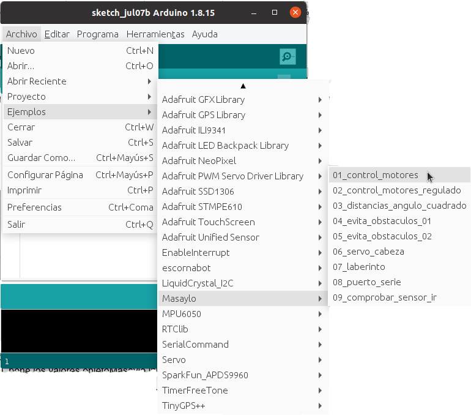

# Ejemplos de Masaylo
La librería de *Masaylo* incorpora una serie de ejemplos para poder aplicar al robot de forma directa, para ello vamos al menú Archivo > Ejemplos > Masaylo, y escogemos el ejemplo que nos interese.

| Ejemplos de *Masaylo* |
|:|
|  |

