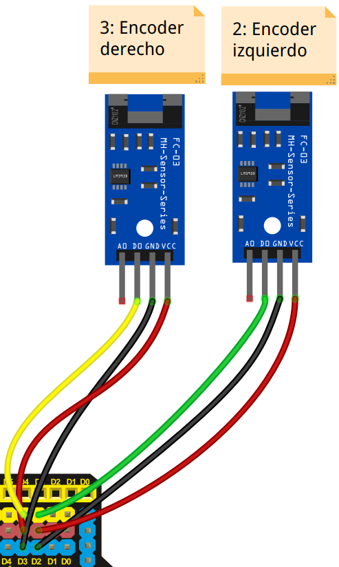
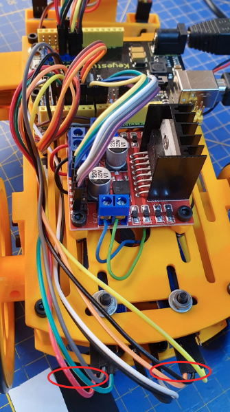
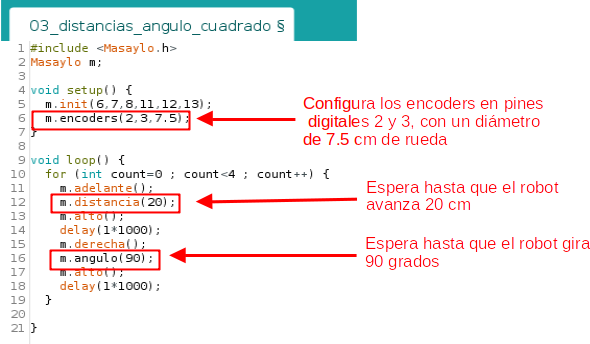

# Encoders y Masaylo
Masaylo puede incorporar dos sensores de infrarrojos tipo encoder, uno en cada una de las ruedas del mismo. Estos dispositivos sirven para poder determinar de forma optica el ángulo de giro que se desplaza cada rueda, y por tanto también somos capaces de conocer los desplazamientos del robot. Con estos elementos podemos girar un determinado ángulo nuestro robot o bien moverlo una cierta distancia.

| Encoders esquema | Encoders foto |
|:|:|
|  |  |

Las órdenes que tenemos para controlar los encoders son las siguientes:

* ***objetoMasaylo.encoders (pinIzdoEncoder, pinDchoEncoder, diametro cm)***: Configura los pines de los sensores infrarrojos de los encoders y el diámetro en cm de las ruedas. Si no pasas parámetros *objetoMasaylo.encoders()*, pone los valores *objetoMasaylo.encoders(2,3,7.8)*, por tanto se asigna el pin digital 2 al sensor izquierdo y el 3 al derecho, además configura un diámetro de rueda de 7.8 cm. Recordar que esta instrucción al ser de configuración debe estar en el setup de nuestro programa. En el ejemplo *m.encoders (2,3,7.8)*.
* ***objetoMasaylo.distancia (distancia cm)***: Espera hasta que ambas ruedas del robot se han movido la cantidad de cm que le hemos pasado. En el ejemplo *m.distancia (20)*.
* ***objetoMasaylo.angulo (angulo grados)***: Espera hasta que ambas ruedas del robot han girado el angulo pasado. En el ejemplo *m.angulo (90)*.
* ***objetoMasaylo.vueltas (n_vueltas)***: Espera hasta que ambas ruedas del robot Masaylo han girado el numero de vueltas indicadas.

En el ejemplo que presentamos a continuación (ejemplo 3 de la librería), hacemos un bucle for para repetir cuatro veces el desplazamiento del robot 20 cm y el giro hacia derechas de 90º, por tanto el robot debe realizar un desplazamiento en forma de cuadrado. 

| Uso de encoders |
|:|
|  |

