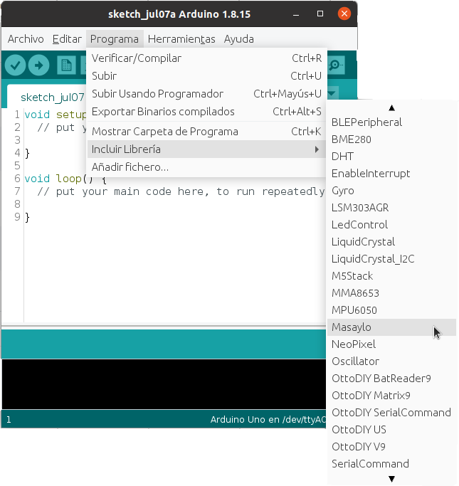
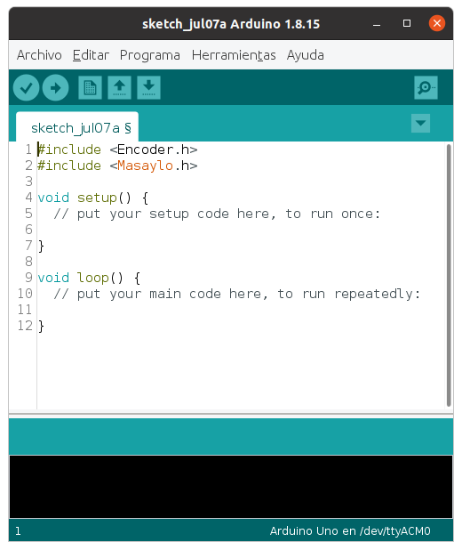

# Incorporar la librería en un programa
El siguiente paso es que las instrucciones para controlar nuestro robot, que están dentro de la librería, estén disponibles, por eso debemos incluir la librería en nuestro código, para ello: Menú Programa > Incluir librería > Masaylo

| Escoger la librería una vez instalada |
|:|
|  |

En el código aparecen en las dos primeras líneas:
~~~
#include <Encoder.h>
#include <Masaylo.h>
~~~
Estas dos líneas de código son las que incorporan la librería a nuestro programa para poder controlar el robot.

| Librería incorporada |
|:|
|  |

