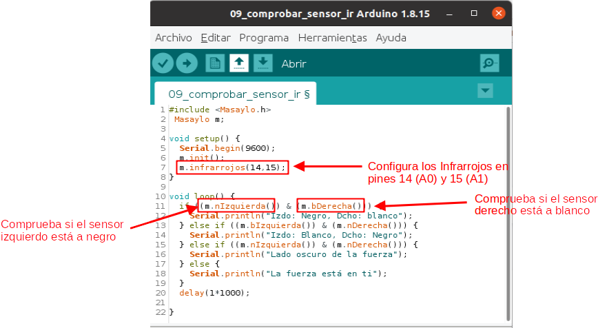

# Infrarrojos y Masaylo
Masaylo incorpora dos sensores de infrarrojos alojados en sendos portasensores en la parte delantera cercanos al suelo, el objeto de los mismos es detectar reflexión o no de luz infrarroja sobre una superficie, pudiendo distinguir entre superficies que reflejan (blanco) y otras que no lo hacen (negro).

| Infrarrojos |
|:|
|  |

Las órdenes que tenemos para controlar los sensores de infrarrojos son las siguientes:

* ***objetoMasaylo.infrarrojos (pinIzdoIr,pinDchoIr)***: Configura los pines de los sensores infrarrojos de suelo del robot. Si no pasas parámetros *objetoMasaylo.infrarrojos()*, pone los valores *objetoMasaylo.infrarrojos(14,15)*, asociando el sensor izquierdo al pin 14 (A0), y el derecho al pin 15 (A1), esta instrucción debe estar en el setup de nuetro programa. En nuestro caso del ejemplo *m.infrarrojos (14,15)*.
* ***objetoMasaylo.nIzquierda ()***: Nos devuelve "true" si el sensor de infrarrojos izquierdo está a negro y "false" si no lo está. En nuestro ejemplo *m.nIzquierda()*.
* ***objetoMasaylo.nDerecha ()***: Nos devuelve "true" si el sensor de infrarrojos derecho está a negro y "false" si no lo está. En nuestro ejemplo *m.nDerecha()*.
* ***objetoMasaylo.bIzquierda ()***: Nos devuelve "true" si el sensor de infrarrojos izquierdo está a blanco y "false" si no lo está. En nuestro ejemplo *m.bIzquierda()*.
* ***objetoMasaylo.bDerecha ()***: Nos devuelve "true" si el sensor de infrarrojos derecho está a blanco y "false" si no lo está. En nuestro ejemplo *m.bDerecha()*.

En el ejemplo que presentamos a continuación (ejemplo 9 de la librería), se configura el sensor de infrarrojos, y posteriormente, con varios condicionales, se comprueba todas las combinaciones posibles de estados de blanco y negro de los sensores, para mostrar el estado actual de los mismos en la pantalla del ordenador a través de comunicación serie.

| Uso de infrarrojos |
|:|
|  |

