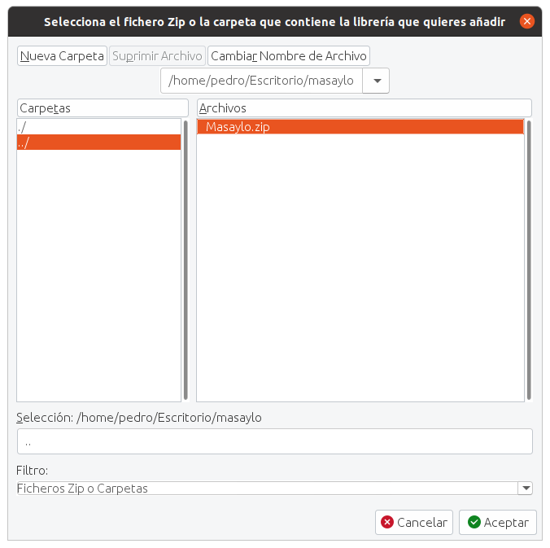

# Instalación de la librería para Arduino
La librería se instala como cualquier librería de arduino:

* Descargamos la [Librería](https://github.com/clubroboticagranada/masaylo/blob/main/libraries/Masaylo.zip).
* Abrimos el IDE de Arduino (entorno de desarrollo de Arduino). Para instalarlo si no lo tienes, lo puedes descargar en la dirección: [https://www.arduino.cc/en/software](https://www.arduino.cc/en/software)
* Nos dirigimos al Menú Programa > Incluir librería > Añadir biblioteca .ZIP ...

| Incluir librería añadir .zip|
|:|
|  |

* En la siguiente ventana elegimos la ruta de la biblioteca o librería a instalar, que en nuestro caso es Masaylo.zip, habrá que recordar dónde la descargamos previamente.

| Incluir librería elegir .zip|
|:|
|  |

