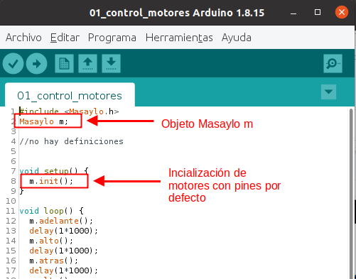
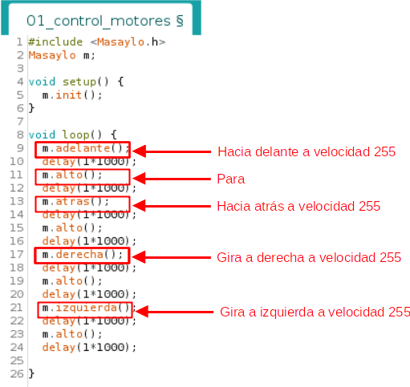
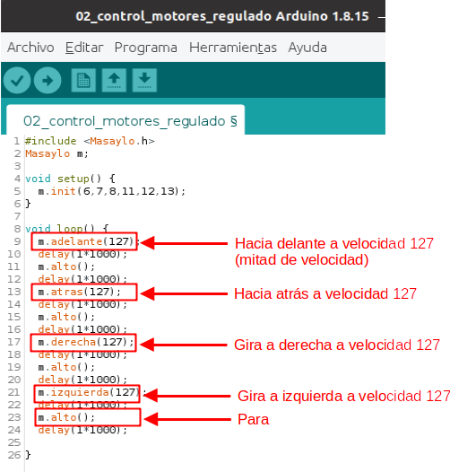

# Controlar motores de Masaylo
Lo primero que debemos hacer es crear un objeto tipo robot Masaylo, para ello pondremos la línea antes de void setup(), *Masaylo objetoMasaylo*, en nuestro caso *Masaylo m* (nuestro robot Masaylo se llama m).

| Crear objeto Masaylo|
|:|
|  |

En la función setup(), ya sabéis que se ejecuta una sóla vez, vamos a definir los pines de los motores se puede hacer de dos maneras:

* Sin pasar parámetros (sin colocar nada entre los paréntesis), *objetoMasaylo.init()*, en nuestro caso de ejemplo *m.init()*: con esta orden indicamos que los pines de los motores son los que trae por defecto *objetoMasaylo.init(6,7,8,11,12,13)*, siendo el orden de los pines definidos de izquierda a derecha,  pin de control de velocidad de giro (PWM) del motor izquierdo, pin A del motor izquierdo,  pin B del motor izquierdo, pin de control de velocidad de giro (PWM) del motor derecho, pin A del motor derecho,  pin B del motor derecho.
* Pasando parámetros de pines (colocándolos entre paréntesis), *objetoMasaylo.init (pinPWMMotorIzdo,pinAMotorIzdo,pinBMotorIzdo,pinPWMMotorDcho,pinAMotorDcho,pinBMotorDcho)*, de esta manera podríamos conectar nuestros motores a los pines que deseemos, un ejemplo de podría ser m.init(6,7,8,11,12,13).

Pasamos a explicar las instrucciones para mover el robot:

* *objetoMasaylo.adelante (velocidad)*: Mueve el robot Masaylo hacia delante, le podemos pasar el valor de la velocidad a la que lo hace (entre 0 y 255), si no pasamos valor, paréntesis sin valor, lo hace a 255. En nuestro caso del ejemplo *m.adelante()*.
* *objetoMasaylo.atras (velocidad)*: Mueve el robot Masaylo hacia atrás, le podemos pasar el valor de la velocidad a la que lo hace (entre 0 y 255), si no pasamos valor,  paréntesis sin valor, lo hace a 255. En nuestro caso del ejemplo *m.atras()*.
* *objetoMasaylo.izquierda (velocidad)*: Gira (pivota) el robot Masaylo hacia la izquierda, le podemos pasar el valor de la velocidad a la que lo hace (entre 0 y 255), si no pasamos valor, paréntesis sin valor, lo hace a 255. En nuestro caso del ejemplo *m.izquierda()*.
* *objetoMasaylo.derecha (velocidad)*: Gira (pivota) el robot Masaylo hacia la derecha, le podemos pasar el valor de la velocidad a la que lo hace (entre 0 y 255), si no pasamos valor, paréntesis sin valor, lo hace a 255. En nuestro caso del ejemplo *m.derecha()*.
* *objetoMasaylo.alto ()*: Para el robot Masaylo. En nuestro caso del ejemplo *m.alto()*.

A continuación vemos estas órdenes reflejadas en el ejemplo 01 de la librería:

| Ejemplo 01 de la librería |
|:|
|  |

En el ejemplo 02 vemos como se pasan valores a la velocidad a los movimientos de nuestro robot:

| Ejemplo 02 de la librería |
|:|
|  |

