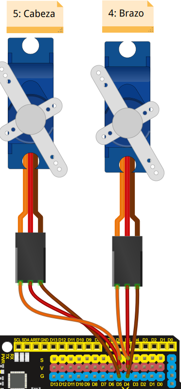

# Servomotores y Masaylo
Masaylo incorpora dos servomotores, uno que nos sirve para girar el sensor de ultrasonidos situado en la zona delantera del robot, y otro para girar el brazo que sirve para capturar objetos. Los servomotores que presenta Masaylo son los microservos *SG-90* que permiten un giro entre 0º y 179º.

| Servomotores |
|:|
|  |

Las órdenes que tenemos para controlar los servomotores son:

* ***objetoMasaylo.servos (pin servocabeza, pin servobrazo)***: Configura los pines de los servos de la cabeza y del brazo respectivamente. Si no pasas parámetros *objetoMasaylo.servos()*, pone los valores *objetoMasaylo.servos(5,4)*, por tanto el servo de la cabeza (ultrasonidos) es asignado al pin digital 5 y el servo del brazo al pin digital 4, esta instrucción debe estar en el setup de nuestro programa. En el ejemplo *m.servos(5,4)*.
* ***objetoMasaylo.giracabeza (grados)***: Gira el servo de la cabeza un ángulo dado entre 0º y 179º. En el ejemplo *m.giracabeza (i)*, siendo i una variable en este caso.
* ***objetoMasaylo.girabrazo (grados)***: Gira el servo del brazo un ángulo dado entre 0º y 179º.
  
En el ejemplo que presentamos a continuación (ejemplo 6 de la librería) se configura los pines de los servomotores, para posteriormente producir un movimiento giratorio alternativo del sensor de ultrasonidos, moviéndolo con un microservo de 10º a 170º y de 170º a 10º.

| Control de servomotores |
|:|
|  |

