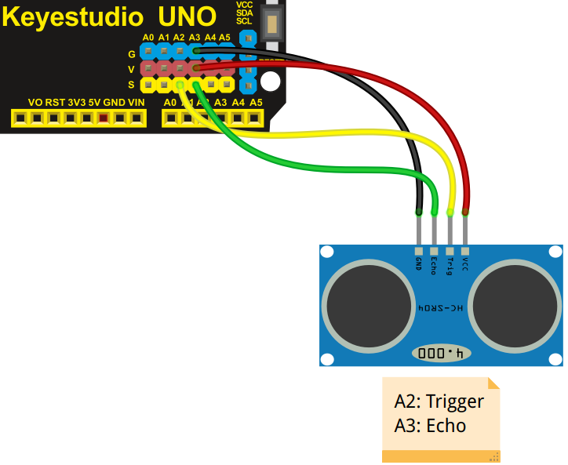

# Ultrasonidos y Masaylo
Masaylo incorpora un sensor de ultrasonidos en su parte delantera, que nos servirá para medir distancias a los objetos que pueda encontrar en su camino.

| Sensor de Ultrasonidos |
|:|
|  |

Las órdenes que tenemos para controlar el sensor de ultrasonidos son:

* ***objetoMasaylo.ultrasonidos (pinTrigger,pinEcho)***: Configura los pines trigger y echo del sensor de ultrasonidos. Si no pasas parámetros *objetoMasaylo.ultrasonidos()*, pone los valores *objetoMasaylo.ultrasonidos(16,17)*, de esta forma el pin del Trigger es el 16 (A2), y el pin del Echo es el 17 (A3), esta instrucción debe estar en el setup de nuestro programa. En nuestro caso del ejemplo *m.ultrasonidos (16,17)*.
* ***objetoMasaylo.distancia ()***: Nos devuelve la distancia en cm entre el sensor de ultrasonidos y el objeto que tenga enfrentado. En nuestro caso del ejemplo *m.distancia()*.
  
En el ejemplo que presentamos a continuación (ejemplo 8 de la librería), se configura el sensor de ultrasonidos, para mostrar por el puerto serie la distancia a la que se encuentra un objeto enfrentado al robot masaylo.

| Uso de ultrasonidos |
|:|
|  |

