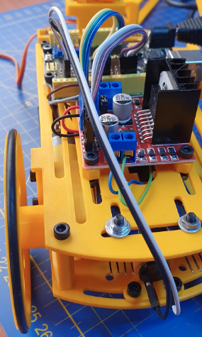

# Sonidos y Masaylo (Zumbador)
Masaylo incorpora un zumbador piezoeléctrico en su parte trasera, que nos servirá para reproducir sonidos y/o melodías.

| Zumbador |
|:|
|  |

Las órdenes que tenemos para controlar el zumbador son las siguientes:

* ***objetoMasaylo.buzzer (pin buzzer)***: Configura el pin del buzzer. Si no pasas parámetros *objetoMasaylo.buzzer()*, pone los valores *objetoMasaylo.buzzer(1)*, por tanto habría que conectarlo al pin digital 1. Esta orden como es de configuración debe estar en el setup de nuestro programa. En el ejemplo *m.buzzer(1)*.
* ***objetoMasaylo.tono (frecuencia Hz, duración ms)***: emite un sonido en el zumbador configurado anteriormente, de una cierta frecuencia en Hz y duración en ms. En el ejemplo hay varias apliacciones como *m.tono (re,duracion)*, siendo re y duración constantes con valores enteros.

En el siguiente ejemplo (ejemplo 10 de la librería), se implementa una escala musical, creando constantes con las frecuencias de las notas de la escala, y constantes con la duración en ms de la nota y el retardo entre nota y nota.

~~~
#include <Masaylo.h>
Masaylo m;

const int do2 = 261;
const int re = 293;
const int mi = 329;
const int fa = 349;
const int sol = 392;
const int la = 440;
const int si = 493;
const int duracion = 500;
const int retardo = 100;

//no hay definiciones

void setup() {
  m.init();
  m.buzzer(1);

}

void loop() {
  m.tono(do2,duracion);
  delay(retardo);
  m.tono(re,duracion);
  delay(retardo);
  m.tono(mi,duracion);
  delay(retardo);
  m.tono(fa,duracion);
  delay(retardo);
  m.tono(sol,duracion);
  delay(retardo);
  m.tono(la,duracion);
  delay(retardo);
  m.tono(si,duracion);
  delay(retardo);

}
~~~