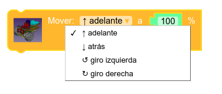
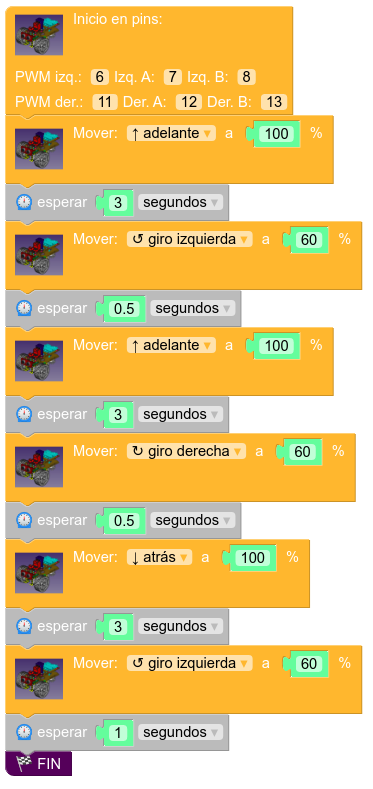

# Control de velocidad. Uso de PWM

## **¿En qué consiste la técnica del PWM?**

Si bien los microcontroladores en que se basan nuestras Arduino pueden **leer** entradas analógicas (señales que pueden tomar infinitos valores de modo variable entre un valor mínimo y uno máximo, normalmente 0 V y 5 V) en algunos de sus pines, no es menos cierto que no pueden **escribir** de este modo en ninguna salida. Ello dificulta en un principio el control de velocidad de robots como Masaylo, que utiliza motores DC cuya velocidad es proporcional al voltaje que  se les aplica. Tal como se explica en el [análisis de elementos de la versión UNO](../../conexionado-pruebas/UNO/elementos/#motores-dc-3-a-6v), la velocidad de dichos motores puede oscilar entre las 125 rpm y las 230 rpm (sin carga) según la tensión varíe entre 3 y 6 V.

Un enfoque del control de movimientos usando salidas digitales sólo permitiría soluciones del tipo todo-nada:

| Pin de control 1 | Pin de control 2 | Movimiento del motor |
| :---: | :---: | :--- |
| 0 | 0 | Paro |
| 0 | 1 | Sentido de las agujas del reloj MÁXIMA VELOCIDAD |
| 1 | 1 | Sentido contrario al de las agujas del reloj MÁXIMA VELOCIDAD |
| 1 | 1 | Paro |

La técnica PWM (Pulse Width Modulation, modulación por anchura de pulso) consiste en EMULAR un valor determinado de tensión en un pin alternando los valores mínimo y máximo (0 V/5 V, normalmente) en el tiempo de modo que el equilibrio entre ambos de como resultado final la tensión buscada.

| Emulación de salidas analógicas por PWM. Imagen de Wikimedia Commons, obra de *Thewrightstuff* |
| :-: |
|  |

Esta técnica se puede utilizar en algunos pines (no en todos) de nuestras tarjetas microcontroladoras, utilizando el comando *analogWrite(pin,valor)* en el IDE de Arduino en lenguaje C++, siendo *pin* la patilla conectada a nuestro motor y *valor* un número entre 0 (0 V) y 255 (5 V)

## **Control de velocidad en MasayloBlockly**

Afortunadamente para el estudiante primerizo, con MasayloBlockly **no necesitaremos conocimiento alguno de PWM** para modificar la velocidad de los motores de nuestro Masaylo. En el bloque de opciones correspondiente, disponemos de una única pieza en la que podemos elegir el movimiento (adelante, atrás, izquierda, derecha) y su velocidad en %:

| Pieza de control de velocidad de movimiento en MasayloBlockly |
| :-: |
|  |

Simplemente haciendo click en la entrada de la pieza referida a la velocidad, podremos modificarla sin problemas a un valor entre 0 % y 100 %
Ello hace infinitamente más fácil programar la secuencia de movimientos de nuestro robot a velocidad controlada en nuestras primeras aproximaciones a la robótica educativa (si bien, obviamente, recomendamos al estudiante avanzado que se familiarice con el control PWM en el IDE de Arduino a través de *analogWrite()*);

## **Objetivos de la práctica**

Imitando al programa anterior, buscamos ahora la siguiente secuencia de movimientos:

+ Adelante a 100 % durante 3 segundos.
+ Giro a izquierda a 60 % durante 0.5 segundos.
+ Adelante de nuevo a 100 % durante 3 segundos.
+ Giro a derecha a 60 % durante 0.5 segundos.
+ Movimiento hacia atrás a 100 % durante 3 segundos.
+ Giro a izquierda a 60 % durante 1 segundo.
+ Fin de la secuencia.

### **Programa: movimientos a velocidad variable**

Procedemos de nuevo a crear un programa que cumpla con los objetivos marcados por la práctica, utilizando siempre la misma pieza y eligiendo en cada momento el sentido del movimiento y su potencia, tal y como indica la próxima ilustracion. (Nota: este programa está disponible en el botón de Ejemplos del menú principal, con el el título "Utiliza PWM para controlar la velocidad de movimientos del Masaylo").

| Programa: secuencia de movimientos a velocidad variable |
|:-:|
|  |

