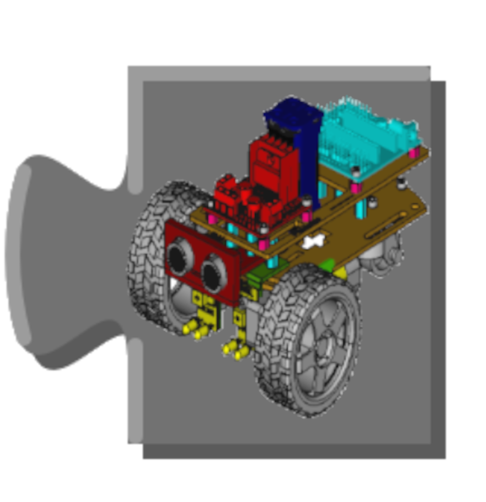
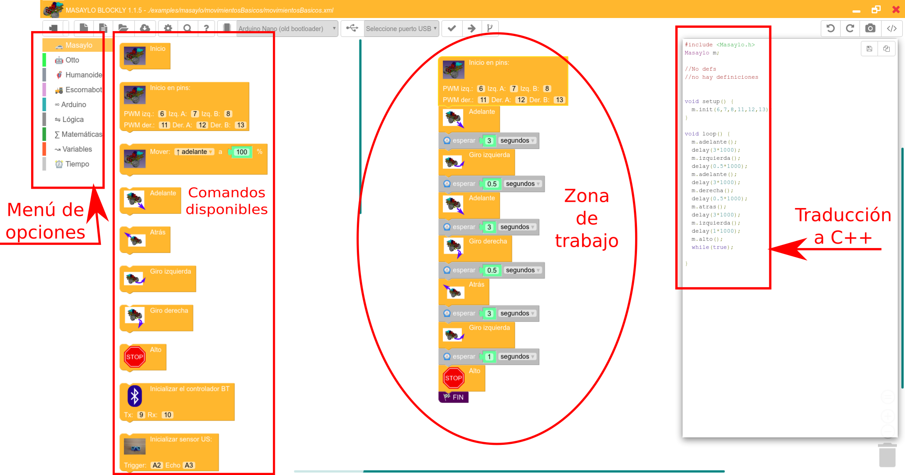
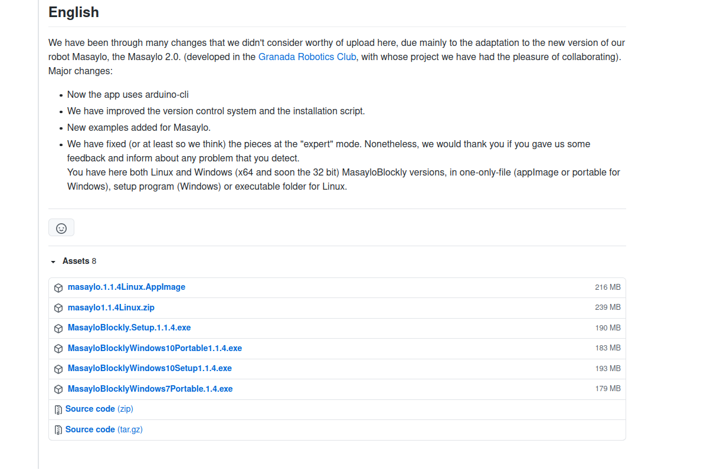

# Instalación de MasayloBlockly

A lo largo de las próximas secciones presentaremos una pequeña introducción a **MasayloBlockly**, un software de programación de sistemas de control basados en Arduino, ESP8266 y ESP32. Si bien no es una herramienta imprescindible para programar el robot Masaylo, sí que puede suponer una ayuda para el lego que desea introducirse a este mundillo de la Robótica Educativa y que no está familiarizado con el IDE de Arduino que se utiliza normalmente en estos menesteres.

  

A grandes rasgos, la utilidad de MasayloBlockly es ofrecer al usuario un entorno gráfico en el que puede arrastrar distintas "piezas" de puzzle, cada una de las cuales supone un comando, función, lectura de parámetro, etc... en el lenguaje C++ que utiliza el IDE de Arduino para programar sus tarjetas. Esta filosofía de trabajo permite crear programas sencillos (o complejos) y volcarlos en robots o sistemas de control basados en estos tipos de microcontrolador. Como se verá en los próximos apartados, se trata de un proceso muy intuitivo y amigable, pero extremadamente potente.

| Zonas de trabajo de MasayloBlockly|
|:-:|
|  |

## **Origen de MasayloBlockly**

MasayloBlockly ha sido diseñado por [Antonio Gómez](https://twitter.com/antoniotecnocr) y [María Dolores Nogueras Atance](https://casadelaciencia.es/equipo/), ambos profesores de Tecnología en Educación Secundaria, con el objetivo de facilitar al máximo el trabajo con robots educativos como Masaylo, [OttoDIY](https://wikifactory.com/+OttoDIY/otto-diy/files), [OttoDIY versión Humanoide](https://wikifactory.com/+OttoDIY/humanoid/files) y [Escornabot](https://escornabot.com/es/index), entre otros.

Según la experiencia en taller de ambos profesores a lo largo de los años, la programación directa de este tipo de sistemas (léase lenguaje C++ en el caso del IDE de Arduino), se hace muy difícil y confusa para alumnos de cursos inferiores a 4º de ESO. Esta herramienta pretende posibilitar la programación directa de sistemas de control que trabajen con sensores y actuadores simples a los alumnos más jóvenes de nuestro sistema educativo, separando este ámbito de trabajo del aprendizaje directo de lenguajes de programación complejos como C++, que implica un pensamiento abstracto y una madurez intelectual asociada a niveles superiores.
Apilando piezas de puzzle al más puro estilo Scratch, el alumnado (o el simple aficionado) puede construir algoritmos sencillos explicando al ordenador cómo pretende que trabaje el sistema de control que está programando (robótico o no) sin un conocimiento directo del lenguaje implicado.

Este software es una adaptación de [Blocklino](https://github.com/fontainejp/blocklino), obra de [Jean Philippe Fontaine](https://github.com/fontainejp), que a su vez es una adaptación/integración/mejora de trabajos como [BlocklyDuino](https://github.com/BlocklyDuino/BlocklyDuino) o [ArduBlockly](https://github.com/carlosperate/ardublockly). Esta es la magia del software libre. La colaboración y la libre difusión del conocimiento es lo que está impulsando con tanta intensidad el conocimiento y el enriquecimiento del mundo académico estos últimos años.

El motor gráfico de la aplicación está basado en la librería en JavaScript [Google Blockly](https://github.com/google/blockly), que permite insertar un editor visual de código en webs y apps móviles.

## **Descarga e instalación del software**

MasayloBlockly, como sus antecesores, es software libre con licencia [Creative Commons Zero v1.0 Universal](https://github.com/agomezgar/masayloBlockly/blob/master/LICENSE.md). En su [repositorio](https://github.com/agomezgar/masayloBlockly) está disponible por completo el código fuente que integra este entorno de programación. En su apartado [*releases*](https://github.com/agomezgar/masayloBlockly/releases) están disponibles para descargar todas las versiones que sus creadores han ido liberando a lo largo del ciclo de vida de este software.
###[Aquí están disponibles para descarga las distintas versiones para Windows y Linux de MasayloBlockly](https://github.com/agomezgar/masayloBlockly/releases)

Normalmente, cada versión de MasayloBlockly está disponible para Windows 10 (64 bits), Ubuntu (64 bits), así como una versión de 32 bits para versiones anteriores de Windows, que trata de dar respuesta a la limitación de medios informáticos en algunos centros educativos. En cada caso, se ofrece una versión portable (formato appImage en Linux, archivo *.exe en Windows), un instalador para Windows y la carpeta comprimida para Linux.

| Hay distintas versiones de MasayloBlockly para diversos sistemas operativos |
|:-:|
|  |

En Linux hay que proporcionar permisos de ejecución al archivo appImage descargado, si optamos por esta posibilidad. Si preferimos descargarnos la carpeta completa, hay que ejecutar el archivo *masaylo* , preferiblemente por consola:

> usuario@equipo:~/Descargas/masayloBlockly$/.masaylo

Si todo va bien, la aplicación arrancará, mostrándonos una pantalla parecida a ésta:

| Apariencia de la aplicación en el primer arranque |
|:-:|
|  |

Queda aún pendiente la [instalación de librerías](../instalacion) que MasayloBlockly necesita para poder volcar el código en C++. No obstante, es aconsejable primero hacer un pequeño recorrido sobre sus características para que el usuario adquiera cierta seguridad en su utilización. Demos, pues, nuestros primeros pasos por este entorno.

## **Vídeo explicativo: descarga e instalación de MasayloBlockly**

<iframe width="560" height="315" src="https://www.youtube.com/embed/XZpgklcsbIM" title="YouTube video player" frameborder="0" allow="accelerometer; autoplay; clipboard-write; encrypted-media; gyroscope; picture-in-picture" allowfullscreen></iframe>

