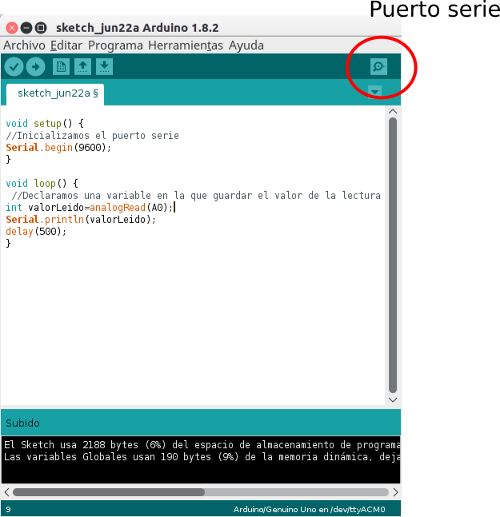
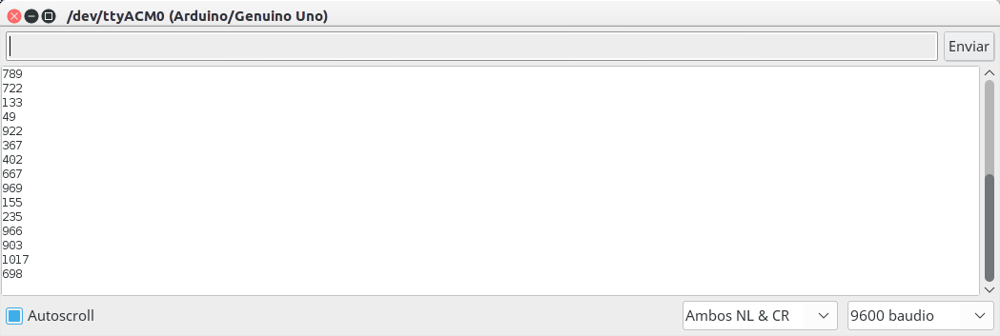
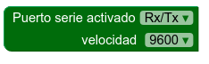
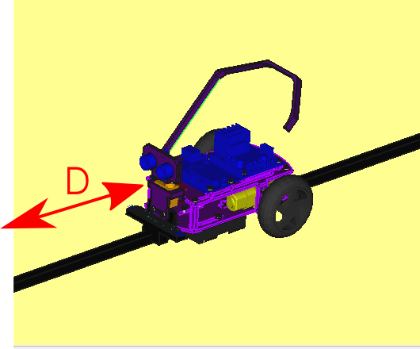
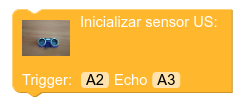
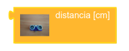
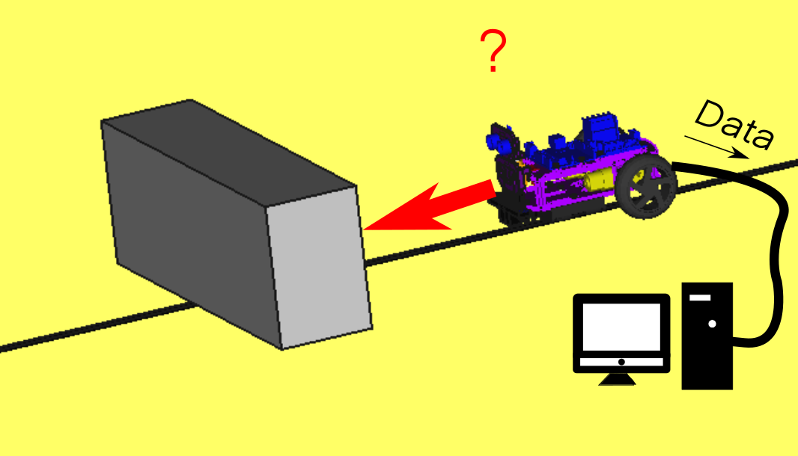
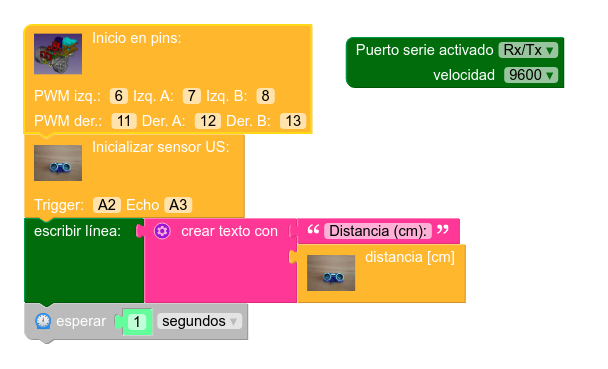
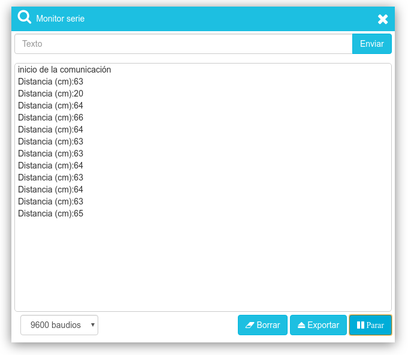
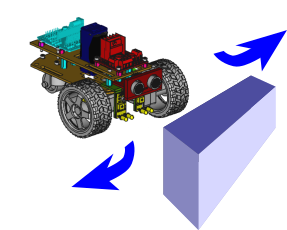

# Detección de obstáculos. Uso del puerto serie

En esta práctica aprenderemos a inicializar el sensor de ultrasonidos HC-SR04 del robot Masaylo y utilizarlo para detectar obstáculos, calcular la distancia a la que se encuentran y enviar dicho dato a nuestro ordenador para que podamos leerlo de manera directa a través del *monitor del puerto serie*

## **¿Qué es el monitor del puerto serie?**

El puerto serie es el canal de comunicación que utiliza Arduino para comunicarse con nuestro ordenador a través de nuestro cable USB, para cargar los programas compilados a través del IDE o enviar y recibir información. Los pines digitales 0 (Rx) y 1 (Tx) del microcontrolador son los encargados de realizar dicha comunicación, razón por la que se aconseja dejar ambas patillas sin conectar en nuestro sistema de control si vamos a necesitar comunicación o en el momento de cargar un nuevo programa.

El IDE de Arduino nos facilita dicha comunicación utilizando los comandos *Serial.begin(velocidad)* (la velocidad estándar suele ser de 9600 baudios), y los comandos *Serial.print(texto)* para escribir, *Serial.println(texto)* para escribir con retorno de carro, o *Serial.read(dato)* para recibir información. Para abrir este canal de comunicación, dicha IDE nos ofrece un icono muy característico.

| Icono de apertura del puerto serie en el IDE de Arduino |
| :-: |
|  |

Al hacer click en dicho icono, se abre una nueva ventana en la que Arduino imprimirá la correspondiente información a medida que transcurra el programa.

| Ventana del puerto serie en el IDE |
| :-: |
|  |

Como siempre, MasayloBlockly nos facilitará esta tarea. Dentro del conjunto de bloques de programación asignados a "modo experto" (alcanzable, como el lector recordará, a través del icono de preferencias  ),podemos incluir en la zona de opciones el grupo "Puerto Serie", del que utilizaremos, en esta actividad de iniciación, las siguientes piezas:

| Icono|Función |
|---|---|
 |  | Inicializar el puerto serie a la velocidad en baudios indicada (9600 por defecto, configurable) |
 |  | Arduino escribirá en el puerto serie el texto o dato que le indiquemos (incluye un texto editable por defecto, pero lo sustituiremos por la lectura del sensor) |

 **NOTA: LA PIEZA DE INICIALIZACIÓN DEL PUERTO SERIE NO ESTÁ PREPARADA PARA ENCAJAR CON LAS OTRAS, PUESTO QUE HACE REFERENCIA A UNA TAREA DE CONFIGURACIÓN PREVIA AL HILO GENERAL QUE DESARROLLARÁ EL PROGRAMA. NO HAY PROBLEMA EN DEJARLA EN EL ESPACIO DE TRABAJO DE MODO INDEPENDIENTE DE LAS DEMÁS**
 
 **OTRA NOTA: POR MOTIVOS DE CONFIGURACIÓN, EL MONITOR DEL PUERTO SERIE DE MASAYLOBLOCKLY SÓLO DEVUELVE LECTURAS DESPUÉS DE LEER UN RETORNO DE CARRO. ESO SIGNIFICA QUE SI UTILIZAMOS LA PIEZA *ENVIAR A PUERTO SERIE* SIN COMPLETAR CON *ESCRIBIR LÍNEA*, NO APARECERÁ INFORMACIÓN ALGUNA EN LA VENTANA DE DICHO MONITOR**
 

 Como actividad de ampliación, sugerimos al lector que utilice el bloque de opciones "Textos" disponible en el menú de preferencias para combinar textos con el resultado medido, tal y como podrá ver en la solución final que ofrecemos.

## **Uso del sensor de ultrasonidos como detector de obstáculos**

En la sección de [análisis de elementos de la versión UNO](../../conexionado-pruebas/UNO/elementos/#sensor-de-distancia-hc-sr04) se explica sobradamente las características y el conexionado del sensor de ultrasonidos. En MasayloBlockly es muy fácil inicializar el sensor de ultrasonidos indicando los pines a que hemos conectado ***ECHO*** y ***TRIGGER***, y obtener lecturas periódicas de la distancia a cualquier obstáculo que se pueda encontrar en el rango de alcance de dicho sensor.

| El sensor de ultrasonidos puede detectar obstáculos y medir su distancia |
| :-: |
|  |

Las piezas que utilizaremos para tal fin serán:

| Icono|Función |
|---|---|
 |  | Inicializar el sensor de ultrasonidos indicando los pines TRIGGER y ECHO (por defecto, A2 y A3, pero la pieza es editable) |
 |  | Esta pieza devuelve la lectura en cm indicada por el sensor en su última lectura |

## **Objetivos de la práctica**

Como ya hemos explicado, queremos mostrar el uso del puerto serie al usuario no avezado de un modo sencillo, utilizándolo como canal de comunicación para obtener las distancias obtenidas por el sensor de distancia en lecturas periódicas. Podemos, pues, establecer los siguientes objetivos:

+ Inicializar el puerto serie del robot Masaylo estableciendo una velocidad estándar (9600 baudios).
+ Inicializar el robot Masaylo indicando, en su caso, los pines de control de motores.
+ Inicializar el sensor de ultrasonidos indicando los pines de conexión a **TRIGGER** y **ECHO**, en caso de ser distintos a los establecidos por defecto.
+ Realizar una lectura de distancia y pasarla al puerto serie para su lectura por parte del usuario.
+ Esperar un segundo.
+ Repetir el bucle.

| Práctica: lectura de distancias a través del puerto serie |
|:-:|
|  |

### **Programa: lectura de distancias medidas por el sensor US a través del puerto serie**

La siguiente imagen desarrolla el programa utilizado (Nota: este programa está disponible en el botón de Ejemplos del menú principal, con el título "Envía la distancia al obstáculo detectado al puerto serie de tu ordenador").

| Programa: envío de los datos de distancia al puerto serie |
|:-:|
|  |

### **Resultado: lectura de distancias a través del puerto serie**

Para abrir el monitor del puerto serie, sólo hay que hacer doble click en el icono  para abrir la ventana del monitor y hacer click en el botón ***Arrancar** (debe asegurarse de que la velocidad estipulada es 9600) para iniciar la comunicación con el sistema de control del Masaylo:

| Lectura de los datos de distancia usando el monitor de MasayloBlockly |
|:-:|
|  |

### **Ejercicio de ampliación: programar un sistema de desplazamiento que evite obstáculos**

Con lo mostrado hasta aquí, el lector debería ya estar suficientemente capacitado para programar a Masaylo de modo que éste se mueva de forma autónoma evitando los obstáculos que se presenten. En el botón de Ejemplos del menú principal hay precisamente un algoritmo que cumple este objetivo, llamado "Aprende a detectar obstáculos con el sensor US y a esquivarlos mediante movimientos aleatorios".

| Ejercicio de ampliación: movimiento autónomo con detección y evasión de obstáculos |
|:-:|
|  |

## **Vídeo explicativo: uso del puerto serie para leer distancias a obstáculos detectados**

<iframe width="560" height="315" src="https://www.youtube.com/embed/zfkvxzSqDQE" title="YouTube video player" frameborder="0" allow="accelerometer; autoplay; clipboard-write; encrypted-media; gyroscope; picture-in-picture" allowfullscreen></iframe>