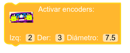
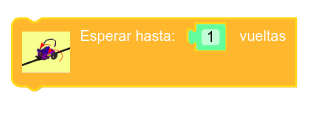
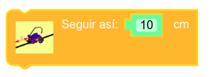
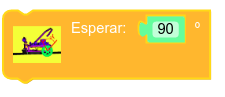
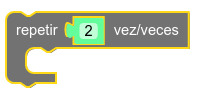
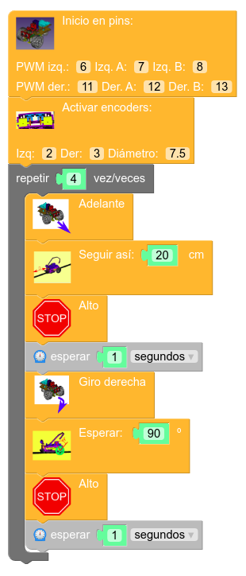

# Trabajo con encoder. Control básico de distancias y ángulos

Masaylo nos ofrece también la posibilidad de instalar dos encoder modelo  [FC-03](../../conexionado-pruebas/UNO/elementos/#encoder-infrarrojos-fc-03), que permiten un cierto control sobre el ángulo de giro de los motores DC de desplazamiento. Estos sensores, de por sí, son de difícil manejo para los aficionados maker con una cierta experiencia en la implementación de sistemas con Arduino. Además, precisan del manejo de **interrupciones** por parte del microprocesador, concepto éste reservado para estudiantes más avanzados. No obstante, la librería de Masaylo resuelve con cierta elegancia todos estos inconvenientes, permitiendo un control, si no perfecto, sí bastante adecuado de distancias recorridas y ángulos de desplazamiento.
**Nota: al contrario que en el resto de sensores, los pines de conexión de los encoder no son opcionales. Deben ser forzosamente 2 y 3, aunque puedan intercambiarse entre sí. Esto se debe a que la librería gestiona el funcionamiento de estos sensores basándose en el uso de interrupciones, que en las tarjetas Arduino UNO y NANO deben ser forzosamente estas patillas**

Repetimos que el uso de estos encoder en Arduino es bastante complicado, por lo que el lector no debería esperar resultados perfectos. Si sujetamos a Masaylo en el aire, es decir, probamos los programas en vacío, obtendremos el funcionamiento más aproximado. Una vez en el suelo, dependiendo del estado de las pilas, podemos encontrar errores más o menos aproximados. 

## **Control de distancias y ángulos en MasayloBlockly**

MasayloBlockly aprovecha al máximo las características de la librería de Masaylo para ofrecernos el siguiente despliegue de opciones:

| Icono| Función |
|:-:|---|
|  | Inicializar los encoder indicando sus pines a izquierda y derecha. El diámetro hace referencia al de las ruedas de Masaylo. Si el usuario modificara dicho tamaño, debe especificarlo para el correcto cálculo de distancias recorridas. |
|  | Cuando Masaylo está en marcha hacia adelante, espera a que sus ruedas hayan dado el número de vueltas especificado antes de pasar a la siguiente orden|
|  | Cuando Masaylo está en marcha hacia adelante, espera a haber avanzado la distancia indicada antes de pasar a la siguiente orden|
|  | Cuando Masaylo está girando, espera a haber avanzado el ángulo marcado por el usuario antes de pasar a la siguiente orden|

## **Objetivos de la práctica**

En esta ocasión, nos proponemos utilizar los encoder para hacer que Masaylo haga un recorrido que dibuje un cuadrado de 20 cm. 
Nuestro programa deberá cumplir los siguientes objetivos:

+ Inicializar el robot Masaylo indicando, en su caso, los pines de control de motores.
+ Inicializar los encoder, indicando la patilla a que están conectados (forzosamente deben ser los pines digitales 2 y 3).
+ Repetir en bucle cuatro veces el siguiente conjunto de órdenes:
    + Ir hacia adelante
    + Esperar 20 cm
    + Parar durante 1 segundo
    + Girar a la derecha
    + Esperar a haber completado los 90 º
    + Parar durante 1 segundo
+ Fin del programa. Interrumpir ciclo de trabajo.

### **Nuevo bloque de control de flujo: uso de bucles**

Aprovechando que hay que repetir conjuntos de órdenes, presentaremos otra de las piezas importantes dentro de la opción **Lógica** de MasayloBlockly: el comando *Repetir x veces*

| Comando de control de flujo: repetir x veces|
|:-:|
|  |

### **Programa: recorrer un cuadrado perfecto**

La imagen siguiente presenta la solución a la práctica propuesta(Nota: este programa está disponible en el botón de Ejemplos del menú principal, con el título "Aprende a usar los encoder de ranura para recorrer un cuadrado perfecto").

| Práctica: recorrer un cuadrado perfecto |
|:-:|
|  |

