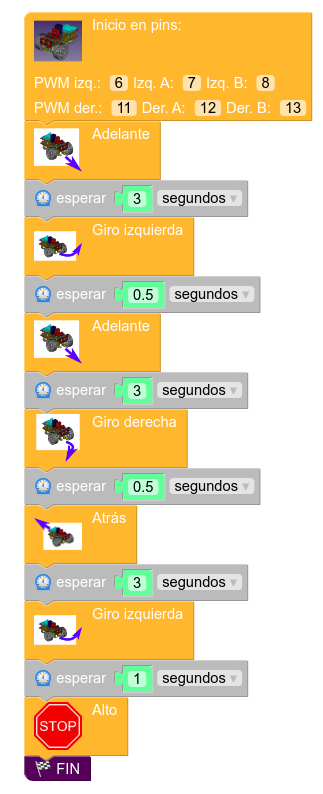

# Mi primer programa: movimientos básicos de Masaylo

## **Objetivos de la práctica**

Muy bien. Ya hemos instalado nuestra aplicación, hemos instalado nuestras librerías y archivos de características de microcontroladores y estamos preparados para realizar nuestra primera prueba práctica. Para ello, vamos a programar a nuestro Masaylo para que haga **una única vez** (ya explicamos en la sección [Primeros pasos](primerospasos.md) cómo introducir un punto de interrupción de programa con la tecla "Fin") la siguiente secuencia de movimientos:

+ Moverse hacia adelante durante 3 segundos.
+ Girar hacia la izquierda 0.5 segundos.
+ Mover hacia adelante otros 3 segundos.
+ Girar hacia la derecha durante 0.5 segundos.
+ Ir hacia atrás 3 segundos.
+ Girar hacia la izquierda durante 1 segundo.
+ Paro. Fin del programa.

## **Creación del programa en MasayloBlockly**

Todas las piezas que vamos a utilizar las obtendremos de los siguientes bloques de opciones:

+  para todos los comandos de movimiento del robot
+  (como es obvio) para los comandos de espera
+  (en modo primerizo si utilizamos el icono de preferencias del menú principal) para insertar la pieza "Fin" que introducirá el punto de interrupción del programa.

### **Inicialización de un robot en Arduino**

Por norma, todos los programas referidos a robots en Arduino y derivados implican el uso de librerías especializadas inspiradas en la filosofía de la programación orientada a objetos (POO) que exigen, al principio del programa, que se declare e inicialize un objeto de la clase que integra las características del robot referido. En todos los casos, la pieza referida a la inicialización del robot estará siempre al principio del desplegable de cada bloque de opciones:

| Icono|Función |
|---|---|
 |  | Inicializar un [Escornabot](https://escornabot.com/es/index) |
 |  | Inicializar un [OttoDIY](https://wikifactory.com/+OttoDIY/otto-diy/files) |
 |  | Inicializar un [Otto Humanoide](https://wikifactory.com/+OttoDIY/humanoid/files) |
  |  | Inicializar un robot Masaylo estándar|
  |  | Inicializar un Masaylo que no lleva las conexiones por defecto que se aconsejan en la documentación (esto es, está personalizado)|

### **Programa: movimientos básicos**

Procedemos, pues, a crear nuestro programa con el objetivo de lograr los objetivos estipulados. Por esta vez, no nos pararemos a matizar la velocidad a la que queremos hacer cada movimiento (para lo que, obviamente, también disponemos del correspondiente comando en formato gráfico) y nos limitaremos a crear el siguiente programa (Nota: este programa está disponible en el botón de Ejemplos del menú principal, con el el título "Aprende a controlar los movimientos básicos del robot Masaylo").

| Mi primer programa: movimientos básicos |
|:-:|
|  |

## **Vídeo explicativo: mi primer programa: secuencia de movimientos simples**

<iframe width="560" height="315" src="https://www.youtube.com/embed/RyXe9oCyVEE" title="YouTube video player" frameborder="0" allow="accelerometer; autoplay; clipboard-write; encrypted-media; gyroscope; picture-in-picture" allowfullscreen></iframe>