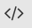

# Primeros pasos. Vista general de MasayloBlockly

## **Organización general del escritorio**
El entorno de programación nos ofrece un escritorio dividido en cuatro grandes zonas:

+ Menú principal
+ Menú de opciones de programación (desplegará un submenú con distintos comandos según la opción elegida)
+ Zona principal de trabajo
+ Zona de traducción simultánea a C++ (desplegable o no a elección del usuario)

| Organización general del entorno de trabajo |
|:-:|
|  |

## **Menú principal**

El menú principal ofrece las siguientes opciones, simbolizadas por iconos:

+  **Modo gráfico/modo texto** Hacer click en este icono conmutará la barra de la zona de opciones de programación por el código en modo texto del algoritmo en el que estamos trabajando, a semejanza de lo que ocurre en la zona de traducción a C++, pero con la opción añadida de **poder editar el código generado** (no es recomendable para usuarios inexpertos), de modo que podamos introducir pequeñas variaciones a nuestro gusto.
+  **Nuevo** abre un nuevo programa en blanco, reiniciando el flujo de trabajo (obviamente)
+  **Ejemplos** ofrece una selección de programas precargados, principalmente (en el momento de escribir estas líneas) para *Escornabot* y *Masaylo*
+  **Cargar programa** abre un programa guardado previamente. Los programas se guardan en formato XML con extensión *.block*
+  **Guardar programa** guarda nuestro trabajo en el directorio que indiquemos.
+  **Preferencias** abre una subventana que nos permite, entre otras cosas, elegir los bloques de comandos de que queremos disponer y el idioma en que queremos trabajar (inglés, francés y español, aunque de momento sólo está garantizado el funcionamiento en español).
+  **Monitor puerto serie** abre una subventana con acceso al monitor del puerto serie.
+  **Tarjetas disponibles** despliega una selección con las tarjetas que MasayloBlockly puede programar. **Importante: debe elegirse ANTES de empezar a programar, o grabar nuestro programa antes de cambiar de tarjeta, pues cualquier cambio provocará un borrado de la zona de trabajo**
+  **Elección de puerto USB** en este desplegable aparecerán los puertos USB disponibles. El usuario deberá indicar el puerto (normalmente, sólo habrá uno disponible) en que ha conectado la tarjeta Arduino.
+  **Compilar** Este botón dará la orden de iniciar el proceso de compilación del programa. Si todo es correcto, un mensaje de confirmación lo indicará. De lo contrario, se indicará qué fallo se ha cometido en un mensaje de pop-up. Este proceso no es obligatorio (basta con pinchar directamente en la opción de volcado), **pero es un hábito aconsejable**.
+  **Cargar** Una vez compilado (aunque, repetimos, no es un paso obligatorio), el siguiente paso es cargar el programa en el sistema de control (robótico o no) que hayamos conectado, previa selección del puerto USB. Al cabo de unos segundos, si se ha elegido correctamente el tipo de tarjeta utilizada y el puerto conectado, un mensaje de confirmación nos indicará que todo el proceso se ha realizado correctamente. Acabamos de volcar nuestro programa en la tarjeta Arduino.
+  **Exportar** Después de la compilación, se nos ofrece la oportunidad de guardar el programa compilado en binario en nuestro disco duro, con fines educativos o académicos.
+  **Cargar** Una vez compilado (aunque, repetimos, no es un paso obligatorio), el siguiente paso es cargar el programa en el sistema de control (robótico o no) que hayamos conectado, previa selección del puerto USB. Al cabo de unos segundos, si se ha elegido correctamente el tipo de tarjeta utilizada y el puerto conectado, un mensaje de confirmación nos indicará que todo el proceso se ha realizado correctamente. Acabamos de volcar nuestro programa en la tarjeta Arduino.
+  **Deshacer** Deshace el último paso.
+  **Rehacer** Rehace el último paso.
+  **Tomar instantánea** Graba el programa en su versión gráfica en formato *.png en la carpeta que indique el usuario.
+  **Desplegar la zona de código** Abre o cierra la zona de traducción simultánea a C++ del programa que el usuario está generando.

## **Menú de opciones de programación**

De manera muy intuitiva, las distintas agrupaciones de comandos utilizables se ofrecen de manera ordenada en la zona izquierda de la pantalla. Dichos comandos pueden combinarse entre sí (es decir, si por ejemplo empezamos a trabajar con el bloque *Masaylo*, ello no quiere decir que no podamos utilizar piezas de la agrupación *Tiempo* o *Estructura*).

Hay dos modos de trabajo, elegibles desde el icono de Preferencias , perfectamente configurables: *"Primerizo"* o *"Experto"*.  Cada uno de ellos nos permite elegir qué agrupaciones de piezas deseamos que aparezca en este menú. Podemos elegir todas las disponibles, o por el contrario podemos especificar sólo las que vamos a necesitar, al objeto de no enfrentarnos a un conjunto excesivo de opciones que pueda hacer el trabajo con este entorno demasiado confuso.

| Apariencia de la subventana de configuración |
|:-:|
|  |

Obsérvese la presencia del botón **"Vaciar memoria caché"**. Si en algún momento la aplicación ofrece algún comportamiento extraño, o el usuario detecta corrupción o mal funcionamiento en la plantilla que organiza la apariencia de la aplicación, esta opción reseteará al programa a sus opciones de inicio.

## **Zona principal de trabajo y espacio de traducción simultánea**

En esta zona, inicialmente en blanco, iremos "encajando" las distintas piezas que representen las órdenes que queremos incluir en nuestro programa. 

A medida que vamos especificando las órdenes que queremos añadir al programa, y si hemos activado la zona de traducción simultánea con el icono , podremos acceder a la redacción del programa equivalente en lenguaje C++ que causaría el mismo efecto en el sistema de control si utilizaramos el IDE de Arduino.

| Espacio de traducción Simultánea a C++ | 
|:-:|
|  |

La zona de traducción simultánea no es editable y por lo tanto no se puede modificar.. Si queremos editar el código necesitaremos utilizar la herramienta  **Conmutación a modo texto**

El espacio de traducción simultánea incorpora, a su vez, dos herramientas útiles, representadas por sus respectivos iconos:

+ **Guardar sketch** Permite guardar el sketch con extensión *.ino (la extensión estándar para el IDE de Arduino) en la carpeta señalada por el usuario con el nombre que desee.
+ **Copiar sketch** Guarda el texto del sketch en memoria para utilizarlo en funciones de copia y pega en otros programas.

## **Conmutación a modo texto**

Como se ha explicado al principio de esta sección, el icono  tiene la función de desactivar el modo gráfico en el que trabaja, haciendo desaparecer el editor visual de código, tornándolo por el texto en lenguaje C++, al estilo de lo que se ve en la *zona de traducción simultánea*, pero con la característica particular de que el usuario puede editar y modificar el código (asumiendo el riesgo correspondiente).

| La conmutación a modo texto nos permite editar el código |
|:-:|
|  |

## **Nota interesante: estructura de un programa en Arduino**

Si bien la meta de MasayloBlockly es permitir a sus usuarios programar sus propios robots/sistemas de control sin tener conocimiento de C++, esta información sobre los códigos *.ino sí que puede resultarle útil.

Por definición, cualquier código en Arduino tiene, COMO MÍNIMO (obviando la inclusión de librerías y la declaración de variables globales), dos funciones generales en las que se introducen las órdenes correspondientes a cada "pieza" de nuestra zona de trabajo:

+ **Función de configuración** ***(setup)***. En esta función introducimos todos los comandos referentes a la configuración (entradas, salidas, uso digital/analógico...) del sistema. **ESTA FUNCIÓN SE EJECUTA AL ARRANCAR EL PROGRAMA, UNA ÚNICA VEZ. AL LLEGAR A LA ÚLTIMA ORDEN, DA PASO A *loop()*** Para repetir esta función, habría que reiniciar la tarjeta o apagar y volver a encender el sistema.
+ **Función principal** ***(loop)***. Empieza después de ejecutarse la función ***setup()***. Esta función contiene los comandos generales que regirán el comportamiento de nuestro robot o sistema de control, gobernados por nuestra tarjeta controladora, sea ésta Arduino, ESP8266 o ESP32. **ESTA FUNCIÓN SE REPITE INVARIABLEMENTE. CADA VEZ QUE LLEGA A LA ÚLTIMA ORDEN QUE CONTIENE Y LA EJECUTA, VOLVERÁ DE NUEVO AL COMIENZO. ES LO QUE SE CONOCE COMO UN BUCLE**. Dependiendo del programa, el conjunto de comandos que contiene esta función puede llegar a ejecutarse <ins>varias veces por segundo</ins>.

¿Qué implica esta filosofía de programación?. Que el usuario novel puede cometer un fallo como el del siguiente ejemplo: supongamos que queremos programar a un robot **Masaylo** para que al arrancar, vaya hacia adelante durante un segundo, y luego se pare. Eso supone dar tres órdenes (nos pararemos con más detalle sobre las características de este programa en próximas secciones). El problema es que dichas órdenes se estipulan (como puede verse en la ilustración) dentro de la función *loop()*. Según lo que acabamos de explicar, ello supone que al llegar a la última orden **(ALTO)**, el bucle se reiniciará, ejecutando inmediatamente de nuevo la orden **ADELANTE**, que obviamente anula el paro de los motores. El resultado práctico es que nuestro Masaylo empezará un movimiento hacia adelante continuo, sin que podamos percibir que el robot se detenga nunca.

| Ejemplo de programa con resultado inesperado debido a la repetición en bucle de las órdenes |
|:-:|
|  |

¿Significa ello que no podemos crear programas que se ejecuten una única vez?. No, por supuesto. Para ello podemos utilizar una pieza especial denominada FIN, disponible en el bloque **Arduino** en el modo Primerizo, y en el bloque **Estructura** en el modo Experto, que allá donde la pongamos (nota para usuarios más expertos) insertará un bucle eterno de tipo *while(true);*, paralizando a partir de ahí la ejecución del resto del código.

| Ejecución de un programa una única vez con la pieza Fin |
|:-:|
|  |

## **Preparándonos para crear nuestro primer programa**

Esta introducción, aunque mínima, debería ser suficiente para que el usuario se mueva con cierta soltura por todas las características que ofrece este entorno gráfico de programación. Como hemos comentado ya aún tenemos pendiente un último paso, que es el de la [instalación de librerías](../instalacion), y que se llevará a cabo una vez creemos nuestro primer programa y tratemos de compilarlo o volcarlo directamente en el micro de nuestro robot.

## **Vídeo explicativo: características generales de MasayloBlockly**

<iframe width="560" height="315" src="https://www.youtube.com/embed/Z_kqKgx22EM" title="YouTube video player" frameborder="0" allow="accelerometer; autoplay; clipboard-write; encrypted-media; gyroscope; picture-in-picture" allowfullscreen></iframe>

