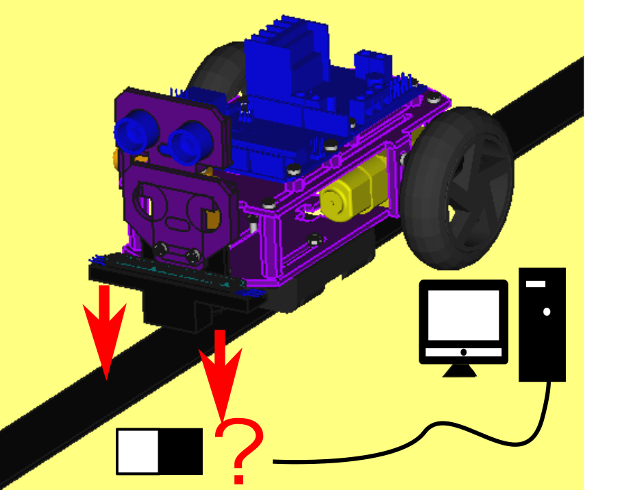
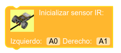
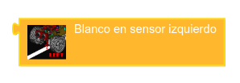
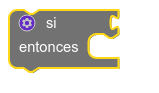
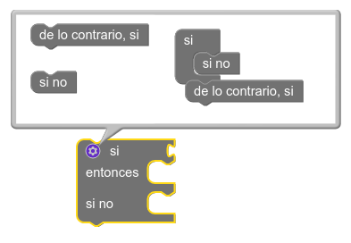
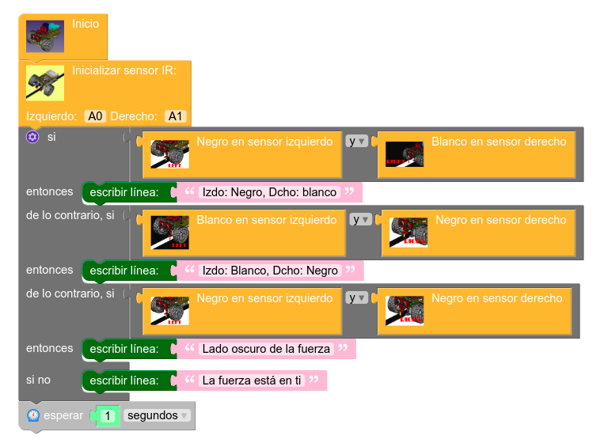
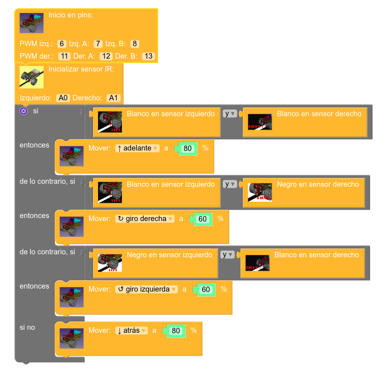

# Introducción a los bloques lógicos. Uso de sensores de infrarrojos

Pasamos a continuación a familiarizarnos con el uso de los sensores de infrarrojos [FC-51](../../conexionado-pruebas/UNO/elementos/#sensores-de-infrarrojos), que pueden funcionar como sensores de obstáculos a pequeñas distancias o, como es el caso de Masaylo, para discriminar el color negro del blanco, lo que permite la creación de robots siguelíneas.

En esta práctica aprenderemos a inicializar los sensores de infrarrojos, también llamados IR, de Masaylo y utilizarlos para indicar si el robot detecta blanco o negro tanto a su derecha como a su izquierda a medida que éste avanza. Esta información se procesará y se ofrecerá al usuario a través del monitor del puerto serie, al estilo de la práctica anterior con el sensor de ultrasonidos.

| Práctica: lectura de sensores de infrarrojos a través del puerto  serie|
| :-: |
|  |

## **Presentación de nuevos bloques. Uso de la lógica en programación. Bloques si/si no**

Para utilizar los sensores de infrarrojos en MasayloBlockly, seguimos la misma filosofía de trabajo que con el sensor de ultrasonidos: inicializar ambos sensores y recoger su lectura, aunque en este caso el abanico de piezas es algo más amplio:

| Icono| Función |
|:-:|---|
 |  | Inicializar los sensores IR indicando sus pines a izquierda y derecha |
 |  | Devuelve *verdadero* si pisa negro por la izquierda, y *falso* si pisa blanco |
 |  | Devuelve *verdadero* si pisa negro por la derecha, y *falso* si pisa blanco |
 |  | Devuelve *verdadero* si pisa blanco por la izquierda, y *falso* si pisa negro |
 |  | Devuelve *verdadero* si pisa blanco por la derecha, y *falso* si pisa negro |

 Pero lo realmente importante en esta sección, es que por primera vez vamos a presentar de modo específico el trabajo con bloques lógicos, que si bien han aparecido ya en algún ejemplo de ampliación, no han sido aún tratados con cierta rigurosidad. Dichos bloques están agrupados en la opción **Lógica ** de la zona de bloques de opciones. Como creemos sinceramente en el concepto del aprendizaje significativo, en esta ocasión sólo vamos a trabajar con dos de los bloques de esta agrupación, que permitirán al lector comprender su papel en programación a través de su uso en esta práctica:

| Icono|Función |
|:-:|---|
 |  | Bloque de control de flujo SI (si se cumple la condición, se ejecutará el bloque de comandos que se introduzca dentro de este bloque)|
 |  | Compara dos elementos y devuelve *verdadero* si la condición de comparación se cumple (A *y* B, A *o* B, etc...) |

 El bloque SI, como algunas otras piezas disponibles en MasayloBlockly, incluye un pequeño icono azul de un engranaje en su parte superior izquierda que permite personalizarlo y añadirle funcionalidades (en el caso de la imagen, podemos crear bloques SI/SI NO, SI/DE LO CONTRARIO SI, etc...).

 

| Algunos bloques incluyen un pequeño icono de personalización para complementar su significado|
| :-: |
|  |

## **Objetivos de la práctica**

Nuestro programa deberá cumplir los siguientes objetivos:

+ Inicializar el puerto serie del robot Masaylo estableciendo una velocidad estándar (9600 baudios).
+ Inicializar el robot Masaylo indicando, en su caso, los pines de control de motores.
+ Inicializar los sensores de infrarrojos, indicando la patilla a que están conectados (por defecto, los pines analógicos A0 y A1).
+ Realizar la lectura de ambos sensores.
+ Pasar el estado de ambos sensores por el puerto serie. Si ambos están en negro, lanzaremos el mensaje "Lado oscuro de la fuerza". Si ambos están en blanco, el mensaje será "La fuerza está en tí" (un guiño del programador a los lectores boomer).
+ Esperar un segundo y repetir el bucle.

Como el usuario pronto comprobará, la personalización del bloque lógico SI nos facilitará mucho el trabajo.

| Práctica: lectura de distancias a través del puerto serie |
|:-:|
|  |

### **Programa: comprobación de sensores IR a través del puerto serie**

Presentamos a continuación la solución a la práctica propuesta(Nota: este programa está disponible en el botón de Ejemplos del menú principal, con el título "Envía al puerto serie de tu ordenador la medición (blanco/negro) de tus sensores IR").

| Programa: envío de la información de los sensores IR al puerto serie |
|:-:|
|  |

### **Ejercicio de ampliación: programar un robot siguelíneas**

La programación de siguelíneas (normalmente, una línea negra sobre un fondo blanco) es un clásico en la pedagogía de la Robótica Educativa. El uso de motores DC como los de Masaylo, baratos y accesibles de muy difícil control, complica bastante esta tarea. No obstante, presentamos a continuación una propuesta que puede suponer un buen punto de partida. Dependiendo de las distintas condiciones del circuito y del propio robot, será seguramente necesario adaptarla a dichas circunstancias, moderando las velocidades propuestas.

| Ejercicio de ampliación: Masaylo siguelíneas |
|:-:|
|  |

## **Vídeo explicativo: uso del puerto serie para leer sensores de infrarrojos**

<iframe width="560" height="315" src="https://www.youtube.com/embed/EG4oevlr-Z8" title="YouTube video player" frameborder="0" allow="accelerometer; autoplay; clipboard-write; encrypted-media; gyroscope; picture-in-picture" allowfullscreen></iframe>