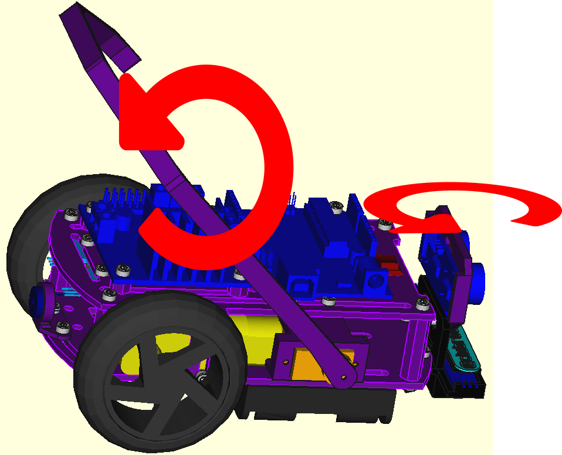
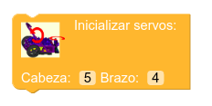
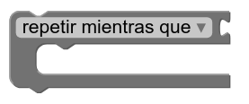
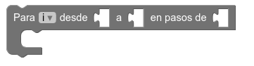
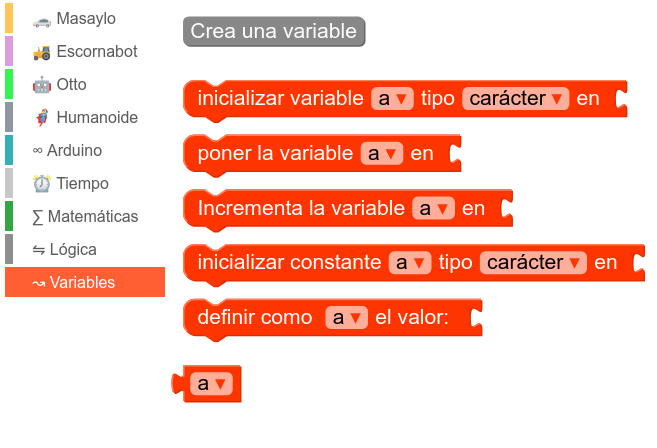
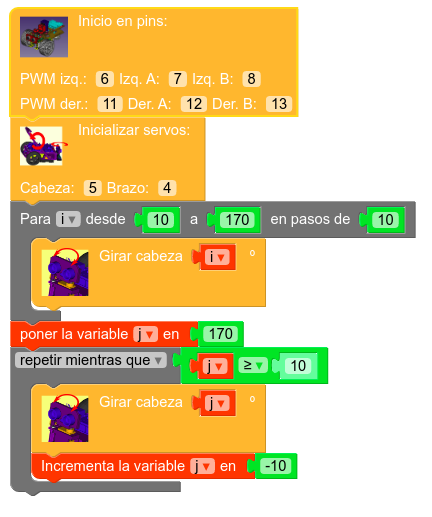

# Uso de servomotores en brazo y cabeza

Como se suele decir en inglés, "last but no least", por último, pero no por ello menos importante, Masaylo nos ofrece también la opción de utilizar servomotores de posición de modelo SG-90 o similar que permiten el movimiento angular, si así lo deseamos, del sensor de ultrasonidos (aunque también se nos ofrece la opción de dejarlo fijo) y de un brazo auxiliar que posibilitaría la captura y/o desplazamiento de pequeños obstáculos.

| Masaylo puede incorporar dos servomotores que agreguen movilidad a algunas partes|
|:-:|
|  |

## **Inicialización y uso de los servomotores**

En MasayloBlockly podemos encontrar las siguientes piezas de programación para controlar estos servomotores:

| Icono| Función |
|:-:|---|
|  | Inicializar los servomotores indicando sus pines para cabeza (sensor de US) y brazo. Si no se va a respetar el conexionado por defecto, es aconsejable utilizar patillas con PWM |
|  | Indicar el ángulo al que queremos girar el sensor de ultrasonidos. 90 º constituye la posición central|
|  | Cuando Masaylo está en marcha hacia adelante, espera a haber avanzado la distancia indicada antes de pasar a la siguiente orden|
|  | Indicar el ángulo al que queremos girar el brazo auxiliar. 90 º constituye la posición central|

## **Objetivos de la práctica**

Limitémonos en esta ocasión a probar el servomotor del cabezal del sensor de ultrasonidos (el brazo auxiliar obedecería exactamente del mismo modo) de acuerdo a la siguiente pauta:

+ Inicializar el robot Masaylo.
+ Inicializar ambos servos, especificando el pin al que va conectado cada uno.
+ Partiendo de 10 º, realizar el giro hasta una posición de 170 º, con variaciones de 10 º a cada cambio
+ Invertir el proceso y girar progresivamente de 170 º a 10 º
+ Repetición del bucle

### **Más bloques lógicos: *repetir hasta que* y *repetir por intervalos* . Trabajo con variables**

Seguimos aprovechando para enriquecer nuestro acervo de comandos lógicos, tan necesarios en programación. En esta ocasión, utilizaremos dos nuevas piezas que permiten la repetición en bucle de conjuntos de órdenes conforme al cumplimiento de determinadas condiciones. Además, aunque no es necesario para este programa, utilizaremos variables por primera vez:

| Icono| Función |
|:-:|---|
|  | Esta pieza nos permite insertar en su seno un conjunto de órdenes que se repetirán **MIENTRAS SE ESTÉ CUMPLIENDO LA CONDICIÓN QUE ESTIPULEMOS**|
|  | De comprensión algo más compleja, pero de suma utilidad para el programador, esta pieza cuenta con una variable a la que dar un *valor inicial*, un *valor final* y un *valor de variación*. Los comandos que albergue en su interior se irán repitiendo en bucle mientras dicha variable se encuentre entre su valor inicial y su final, añadiéndole el valor de variación a cada finalización del bucle. Permite crear algoritmos que repiten ciertas secuencias que se repiten progresivamente con ligeros cambios asociados a dicha variable|

Aunque no es el objetivo de estas líneas hacer un estudio exhaustivo de todas las características de cualquier lenguaje de programación, no está de más saber que es común trabajar con variables. A este respecto, MasayloBlockly también presenta su correspondiente bloque de opciones que empieza con el botón **Crear variable** (indicar su nombre en la ventana emergente que aparecerá) para a continuación ampliar el abanico a las siguientes posibilidades:

| Menú de trabajo con variables en MasayloBlockly|
|:-:|
|  |

###  **Programa: giro progresivo a izquierda y derecha** 

La imagen siguiente presenta la solución a la práctica propuesta(Nota: este programa está disponible en el botón de Ejemplos del menú principal, con el título "Gira el cabezal del sensor de ultrasonidos").

Conviene aclarar dos cosas:

1. En condiciones normales, en los bucles que atañen a los movimientos de servomotores, se debe establecer un intervalo mínimo de pausa para no dañar el motor. La librería de Masaylo los incluye ya de serie, por lo que no es necesario, pero en otros robots esto debe ser tenido en cuenta.
2. No es necesario el uso de variables en la segunda parte del programa (habría bastado volver a utilizar una pieza ***Repetir por intervalos***)

| Práctica: giro del cabezal del sensor de US|
|:-:|
|  |

## **Vídeo explicativo: control de los servomotores de Masaylo**

<iframe width="560" height="315" src="https://www.youtube.com/embed/d8RRcyau6k8" title="YouTube video player" frameborder="0" allow="accelerometer; autoplay; clipboard-write; encrypted-media; gyroscope; picture-in-picture" allowfullscreen></iframe>