# Mejoras en algunos diseños
***
En este apartado se incluyen los enlaces a los archivos originales de diseño y los archivos en formato stl y step de algunas partes en las que se ha detectado una posible mejora de los diseños originales, todos ellos sin perder la base de la que se partió.

## **Brazo aparta objetos**
Se ha detectado un debilidad estructural en la parte circular del alojamiento para la pala del servo que es debida fundamentalmente a dos cosas: la primera es porque es muy fino y la segunda está en la forma en que se imprime, que provoca una debilidad por estar en el sentido de las capas. También se ha reforzado la anchura de la pala para hacer un poco mas consistente.

A continuación se ponen los enlaces a todos los archivos.

| Archivo | Comentarios |
|---|---|
| [brazo-reformado-src.FCStd](../img/3D/modificados/src/brazo-modificado-src.FCStd) | Brazo aparta objetos con alojamiento para la pala del servo reforzado y con mas anchura de pala |

| Imagen | Archivo STL | Archivo STEP |
|:-:|---|---|
| 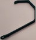 | [brazo-modificado.stl](../img/3D/modificados/stl/brazo-modificado.stl) | [brazo-modificado.step](../img/3D/modificados/step/brazo-modificado.step) |

En las imágenes siguientes vemos el brazo en tiempo de diseño, impreso en 3D y un detalle de la parte del alojamiento de la pala donde se aprecia mucho mejor el detalle del refuerzo.

| Captura | Imagen | Detalle |
|---|---|---|
| 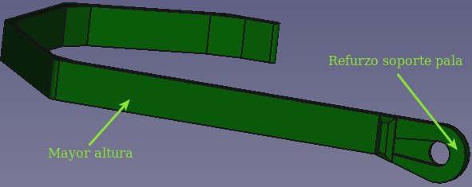 | 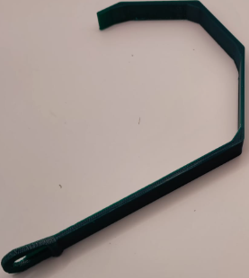 | 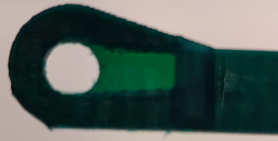 |

## **Ballcaster**
Se ha detectado un problema de falta de deslizamiento en determinadas superficies lo que provoca que el robot no se mueva todo lo bien que debiera en esos casos. A título de ejemplo indicaremos que sobre un determinado tipo de suelo de vinilo se mueve de forma correcta pero sobre otro suelo vinílico de otra marca ya no lo hace. Esto nos ha llevado a diseñar dos nuevos modelos para el ballcaster, uno se basa en un tornillo de cabeza perdida de M6 de 30 mm de longitud y el otro en poner la clásica canica como superficie de contacto.

A continuación se ponen los enlaces a todos los archivos.

| Archivo | Comentarios |
|---|---|
| [soportes-ballcaster-modificados.FCStd](../img/3D/modificados/src/soportes-ballcaster-modificados.FCStd) | Archivo fuente con el diseño de los dos tipos de ballcaster |

| Imagen | Archivo STL | Archivo STEP |
|:-:|---|---|
| 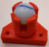 | [soporte-ballcaster-canica.stl](../img/3D/modificados/stl/soporte-ballcaster-canica.stl) | [soporte-ballcaster-canica.step](../img/3D/modificados/step/soporte-ballcaster-canica.step) |
|  | [soporte-ballcaster-cabeza-perdida.stl](../img/3D/modificados/stl/soporte-ballcaster-cabeza-perdida.stl) | [soporte-ballcaster-cabeza-perdida.step](../img/3D/modificados/step/soporte-ballcaster-cabeza-perdida.step) |

En las imágenes siguientes vemos ambos modelos en tiempo de diseño, impresos en 3D y un detalle del elemento ya montado.

| Captura | Imagen | Montaje |
|---|---|---|
| 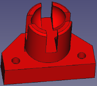 | 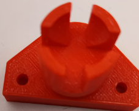 | 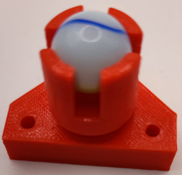 |
| 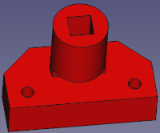 | 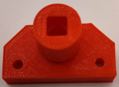 | 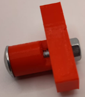 |

